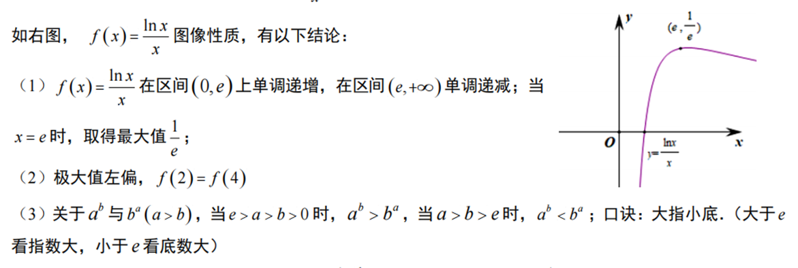
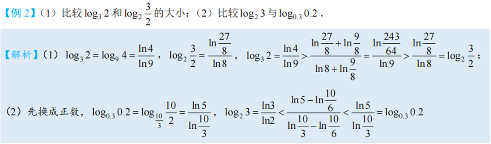

## 1基本不等式

调和＜几何＜算术＜平方  （调几算平方）

要记就记多维均值不等式

## 2排序不等式

若$a_1 ≤ a_2 ≤ \dots ≤ a_n$；$b_1 ≤ b_2 ≤ \dots ≤ b_n$ 为实数，对于$(a_1, a_2, \dots, a_n)$ 的任何排列$(x_1, x_2, \dots, x_n)$，都有下列不等式：

**$a_1b_1 + a_2b_2 + \dots + a_nb_n ≥ x_1b_1 + x_2b_2 + \dots + x_nb_n ≥ a_nb_1 + a_{n-1}b_2 + \dots + a_1b_n$**  

其中，$a_1b_1 + a_2b_2 + \dots + a_nb_n$ 称正序和，$a_nb_1 + a_{n-1}b_2 + \dots + a_1b_n$ 称反序和，$x_1b_1 + x_2b_2 + \dots + x_nb_n$ 称乱序和。

**正序和 ≥ 乱序和 ≥ 反序和**

## 3柯西不等式

1.设$a_1, a_2, \dots, a_n, b_1, b_2, \dots, b_n$ 为实数，则：

$(a_1^2 + \dots + a_n^2)(b_1^2 + \dots + b_n^2) ≥ (a_1b_1 + \dots + a_nb_n)^2$  

2.推论1：设$a_1, a_2, \dots, a_n ≥ 0, b_1, b_2, \dots, b_n ≥ 0$，则：

$\sqrt{(a_1 + a_2 + \dots + a_n)(b_1 + b_2 + \dots + b_n)} ≥ \sqrt{a_1b_1} + \sqrt{a_2b_2} + \dots + \sqrt{a_nb_n}$   

3.推论2：设$a_1, a_2, \dots, a_n ≥ 0, b_1, b_2, \dots, b_n ≥ 0$，则：

$\frac{a_1^2}{b_1} + \frac{a_2^2}{b_2} + \dots + \frac{a_n^2}{b_n} ≥ \frac{(a_1 + a_2 + \dots + a_n)^2}{b_1 + b_2 + \dots + b_n}$   （权方和不等式）

## 4琴生不等式

## 5贝努利不等式

$(1+x)^n ≥ 1 + nx$  $(x > -1, n为正整数)$

当$n$为大于1的实数时贝努利不等式也成立.

## 6绝对值不等式

$||a|-|b|| ≤|a±b|≤|a|+|b|$

此公式在选修题的应用较多

## 7不等式求最值问题

### ①地位等价法

一般当所有变量地位等价时，令所有变量地位相等就可以得到最值（不万能）

### ②万能K法

在题目给定关于x, y的一个二次式，要求另一个代数式的值，直接令此式子等于k，然后用y表示x，代入原式，得到一个关于x的一元二次方程，利用判别式大于等于零，得到一个不等式，解出k的范围。此方法，称之为万能k法。（不万能）

若实数x,y满足$x^2 + y^2 + xy = 1$, 则$x + y$的最大值是$\frac{2\sqrt{3}}{3}$

法一：

$\because x^2 + y^2 + xy = 1, \dots (x+y)^2 = 1 + xy$

$\therefore xy ≤ (\frac{x+y}{2})^2, \dots (x+y)^2 ≤ 1 + (\frac{x+y}{2})^2$

故可知$x + y$的最大值是$\frac{2\sqrt{3}}{3}$

法二：万能法

令$x + y = k$, 则$x = k - y$

代入题干 $(k-y)^2 + y^2 + (k-y)y = 1$

整理得 $y^2 - ky + k^2 - 1 = 0$

$\Delta = k^2 - 4(k^2 - 1) ≥ 0$, 得$k^2 ≤ \frac{4}{3}$, 故$-\frac{2\sqrt{3}}{3} ≤ k ≤ \frac{2\sqrt{3}}{3}$

法三：地位等价法

$x^2 + y^2 + xy = 1$

$y^2 + x^2 + xy = 1$

题目不变，令$x = y$, 代入题干，得$3x^2 = 1$, 得$x = ±\frac{\sqrt{3}}{3}$

$\therefore (x+y)_{max} = \frac{2\sqrt{3}}{3}$

### ③常见形式

模型一：$mx + \frac{n}{x} ≥ 2\sqrt{mn} (m > 0, n > 0)$, 当且仅当$x = \sqrt{\frac{n}{m}}$时等号成立.

模型二：$mx + \frac{n}{x-a} = m(x-a) + \frac{n}{x-a} + ma ≥ 2\sqrt{mn} + ma (m > 0, n > 0)$, 当且仅当$x - a = \sqrt{\frac{n}{m}}$时等号成立.

模型三：$\frac{x}{ax^2 + bx + c} = \frac{1}{ax + b + \frac{c}{x}} ≤ \frac{1}{2\sqrt{ac} + b} (a > 0, c > 0)$, 当且仅当$x = \sqrt{\frac{c}{a}}$时等号成立.

模型四：$x(n - mx) = \frac{mx(n - mx)}{m} ≤ \frac{1}{m} \cdot (\frac{mx + n - mx}{2})^2 = \frac{n^2}{4m} (m > 0, n > 0, 0 < x < \frac{n}{m})$, 当且仅当$x = \frac{n}{2m}$时等号成立.

模型五：$m(a+b) + nab = c$，其中$a, b, m, n, c ∈ R^*$因为$a + b ≥ 2\sqrt{ab} => ab ≤ \frac{(a+b)^2}{4}$，可以转化为$2m\sqrt{ab} + nab ≤ c$ 或 $m(a+b) + n\frac{(a+b)^2}{4} ≥ c$从而求出$a + b$及$ab$的取值范围。若出现$ma + nb$取值范围，先将式子$m(a+b) + nab = c$因式分解为$(a+x)(b+y) = z$形式，再用基本不等式求出$ma + nb$最大值。也可以考虑用柯西不等式解题，先进行因式分解$(a+x)(b+y) = z$，再用柯西不等式分析。

### ④拉格朗日乘数法

 设函数$f(x_1, x_2, \dots, x_n)$在实数空间的$I ∈ R$连续可导，且$g_i(x_1, x_2, \dots, x_n) = 0$，其中($i = 1, 2, \dots, k$)如果有k个约束条件，则$f(x_1, x_2, \dots, x_n)$的极值出现在I区间边界或内部。

导数(函数)为$L = f - \sum_{i=1}^{k}λ_ig_i$ 全部为零的点上。

偏导数（见同济大学《高等数学》下册第九章“多元函数微分法及应用”）简单来讲是多变量函数中以某一变量作为自变量求导后得到的导数

## 8比大小问题专项

### ①比大小问题常用方法

### ②糖水原理（与换底公式结合）

