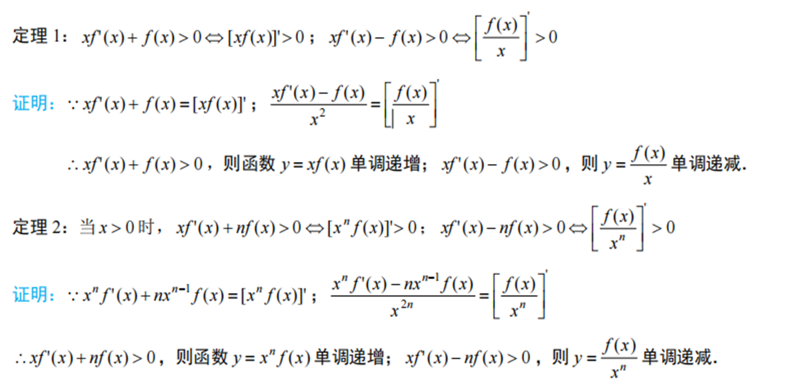
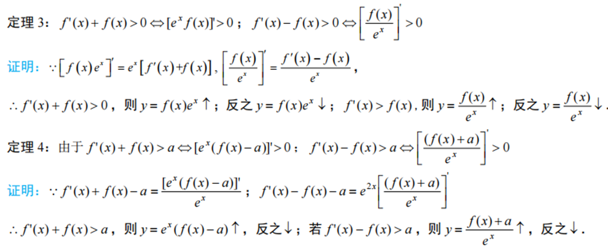
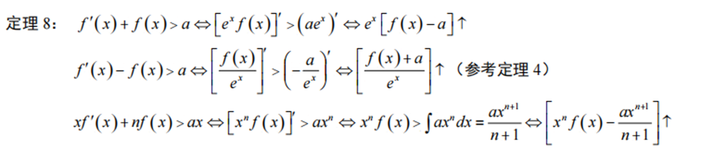
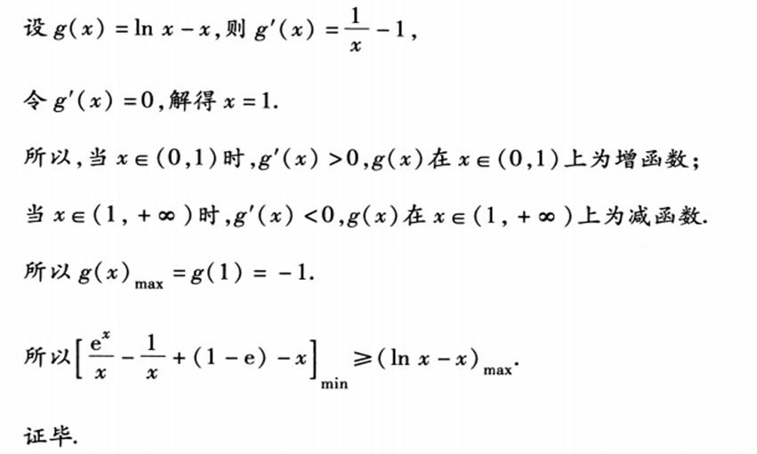
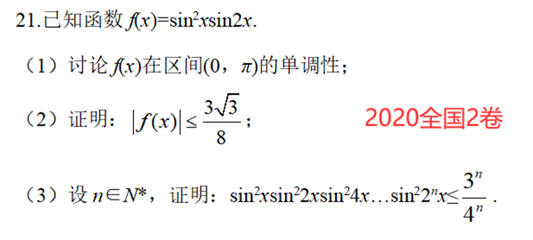
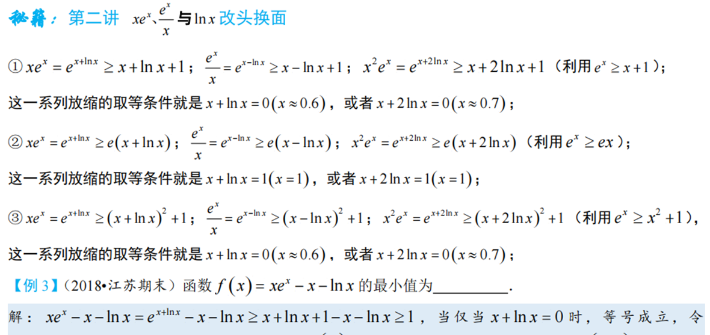

导数作为高中数学知识的重要组成部分，经常出现在高考试卷的压轴题中，且一般具有一定的难度。一直以来,对导数压轴题的处理，有人认为导数压轴题的第二或第三小问可能难度过大,因此在考试必要时，学生可以放弃导数压轴题的第二或第三小问,转而保证拿到前面试题的基础分数。客观地讲，这一观点在某种程度上是很中肯的，但是也有其不科学之处。试想，如果养成了放弃导数压轴题第二成第三小问的习惯，那么在考试时有可能会因为题目难度的降低而错失很多分数,这样就使“总分最大化”的策略在一定程度上失效了，目前来看，高考导数压轴题的难度正在趋向中等，并不像一些模拟题那样难以控制难度。以全国卷中的导数压轴题为例，可以发现全国导数试题依然以函数不等式为主线，重点考查零点取点问题，恒成立问题、函数性质问题等。而这几个问题都是在日常训练及各类模拟题中经常出现的。通过学校课程学习、教辅材料强化，课外习题巩固，考生基本上可以较为系统地掌握以上命题的重点。因此，放弃压轴题之论，实则不足为训。同学们的上佳之选就是平时正常训练，努力克服畏难情绪，多见题型，在考试时主动尝试解决问题。

## 1.求导法则

几种常见函数的导数

(1)  $C' = 0$  (C为常数).

(2)  $(x^n)' = nx^{n-1} (n \in Q)$.

(3)  $(\sin x)' = \cos x$.

(4)  $(\cos x)' = -\sin x$.

(5)  $(\ln x)' = \frac{1}{x}$； $(\log_a x)' = \frac{1}{x}\log_a e$.

(6)  $(e^x)' = e^x$； $(a^x)' = a^x \ln a$.

导数的运算法则

(1) $(u \pm v)' = u' \pm v'$.

(2) $(uv)' = u'v + uv'$.

(3) $(\frac{u}{v})' = \frac{u'v - uv'}{v^2} (v \ne 0)$.

## 2.三次函数

## 3.切线放缩问题

**指数：**$e^x \ge x + 1$

① $e^{x-1} \ge x$. (用$x-1$替换x，切点横坐标是$x=1$)，通常表达为$e^x \ge ex$.

② $e^{x+a} \ge x + a + 1$. (用$x+a$替换x，切点横坐标是$x=-a$)，平移模型，找到切点是关键.

③ $xe^x \ge x + \ln x + 1$. (用$x + \ln x$替换x，切点横坐标满足$x + \ln x = 0$)，常见的指对数函数结合的.  线的方程是按照函数给出的.

④ $e^x \ge \frac{e^2}{4}x^2 > x^2 (x > 0)$ (用$\frac{x}{2}$替换x，切点横坐标是$x=2$)； 通常有$e^x \ge e \cdot \frac{x^n}{n}(x>0)$的构造模型.

⑤ $x=0$处的相切构造：$e^x \ge x^2 + 1$； $e^x \ge \frac{1}{2}x^2 + x + 1$.

⑥ $x=1$处的相切构造：$e^x \ge ex + (x-1)^2 (x \ge 0)$.

**对数：**$\ln(x+1) \le x$

① $\ln x \le \frac{x}{e}$. (用$\frac{x}{e}$替换x，切点横坐标是$x=e$)，表示过原点与$f(x) = \ln x$的切线为$y = \frac{x}{e}$.

② $\ln x \le 1 - \frac{1}{x}$. (用$1 - \frac{1}{x}$替换x，切点横坐标$x=1$)，或者记为$x \ln x \le x - 1$.

③ $\ln x \le x^2 - x$. (由$\ln x \le x - 1$及$x - 1 \le x^2 - x$切点横坐标是$x=1$)，或者记为$\frac{\ln x}{x} \le x - 1$.

④ $\ln x \le \frac{1}{2}(x^2 - 1)$. (由$\ln x \le x - 1 \le \frac{1}{2}(x^2 - 1)$)，即在点$(1, 0)$处三曲线相切.

⑤ $\frac{1}{2}(x - \frac{1}{x}) < \ln x < \frac{2(x-1)}{x+1}$, $x \in (0, 1)$； $\frac{2(x-1)}{x+1} \le \ln x \le \frac{1}{2}(x - \frac{1}{x})$, $x \in [1, +\infty)$.

## 4.函数构造问题

关键是熟练与观察能力的结合（此处仅给出部分）

## 5.指对函数处理技巧

因指数函数和对数函数导函数各自独特的特性，特有“对数独行侠，指数找朋友”的技巧

证明：$e^x - 2x > x^2 \ln x$.

● 解析

证明：

法一（指数处理技巧）：

$e^x - 2x > x^2 \ln x$ 等价于 $e^x - (x^2 \ln x + 2x) - 1 < 0$.

设$f(x) = e^x - (x^2 \ln x + 2x) - 1$, $f'(x) = e^x - (-x^2 \ln x - x + 2x \ln x + 2) = e^x - (2 - x)(x \ln x + 1)$,

又$x \ln x + 1 > 0$ (证明略),

令$2 - x = 0$，解得$x = 2$.

所以，当$x \in (0, 2)$时，$f'(x) > 0$，$f(x)$在$x \in (0, 2)$上为增函数；

当$x \in (2, +\infty)$时，$f'(x) < 0$，$f(x)$在$x \in (2, +\infty)$上为减函数.

所以$f(x)_{max} = f(2) = e^2 - (4 + 4\ln 2) - 1 < \frac{7}{e^2} - 1 < 0$.

综上所述，$e^x - 2x > x^2 \ln x$.

法二（对数处理技巧）：

$e^x - 2x > x^2 \ln x$ 等价于 $\frac{e^x}{x^2} - \frac{2x}{x^2} - \ln x > 0$.

设$f(x) = \frac{e^x}{x^2} - \frac{2}{x} - \ln x$, $f'(x) = (\frac{e^x}{x^2})' - (\frac{2}{x})' - (\ln x)' = \frac{(e^x - x)(x-2)}{x^3}$,

又$e^x - x > 0$ (证明略),

令$x - 2 = 0$，解得$x = 2$.

所以，当$x \in (0, 2)$时，$f'(x) < 0$，$f(x)$在$x \in (0, 2)$上为减函数；

当$x \in (2, +\infty)$时，$f'(x) > 0$，$f(x)$在$x \in (2, +\infty)$上为增函数.

所以$f(x)_{min} = f(2) = e^2 - \frac{4}{4} - 4\ln 2 > \frac{e^2 - 7}{4} > 0$.

综上所述，$e^x - 2x > x^2 \ln x$.

## 6.偏移问题策略与对数均值不等式

极值点偏移问题在2016年全国一卷首次出现，在2021新高考一卷再次考察，模拟题出现次数较多，但因为其解题套路相对固定使得在高考中考察较少

极值点偏移问题还衍生出一类形式相似的双变量问题如2021新高考一卷导数（一般使用切线夹放缩或割线放缩）.另外,有一类与极值点偏移相关的题型,称为拐点偏移

### ①偏移问题策略多

处理方式一般有两个:构造新形式通过单调性解决问题（对称化构造）,或者通过换元构造新函数解决问题.其中换元又可以分成两种方法:将不等号左边的两个变量替换为同一个新变量,或是将不等号右边的常数(或参数)变成左边两变量的形式,找到变量间的关系,而后换元处理。（比值或作差代换）

实际情况中，需要依据题目情况确定解法

### ②对数均值不等式

事实上，在多数换元构造新函数解法中最后其实就是对此不等式的证明，所以其证明方法应掌握熟练

## 7.同构 

陈永清老师对同构式的评价及总结:

同构解题，观察第一，同构新天地，单调大舞台.

明确提示要同构，五脏俱全立同构，无中生有再同构，放缩有方可同构!

同构法常常应用于导数中指数对数幂函数混合型问题，（指对跨阶）往往起到四两拨千斤的效果。学习同构，重要的是学习同构思想与练习同构思路。

## 8.恒成立求参问题

常见的方法有分离变量法、直接讨论法、必要探路法、指数对数处理技巧法。所有方法的关键在于要讨论的是哪个函数

## 9.洛必达法则与隐零点护航

洛必达法则多应用在分离变量的方法中，特点是可以较快地写出答案。其不能在高考中使用（除非迫不得已），但可用隐零点护航法完善步骤以达满分

## 10.取点

一种解题方法.为了证明函数有零点,需要找到合适的区间[a,b],并证明f(a) f(b)<0.取点指的是找到该合适区间的上下界点或区间上符合题意的点，所取的点可以是常数,也可以是-一个关于参数的代数式.极限即可但扣分，取点更加严谨

 

此处仅举一例

## 11.双变量问题

此类问题关键是把双变量问题转换成单变量问题（主元法），一般都含有参数，所以首先要求出参数的范围，极值点偏移属于特殊的双变量问题

## 12.凹凸反转

## 13.必要性探路

一种解题方法，可应用于一类带参数的恒成立问题.求参数范围时,从满足题意的自变量范围内选择一

个数,代人求得一个参数范围,此时这个范围是题意的必要条件.之后再设法证明该必要条件也是题意的充分条件，（不一定，但一般都是）或者讨论别的点.若充分性也成立,则该范围是题意的充要条件,即为所求的范围.这种方法需从逻辑条件上进行理解,因为先得到的是必要条件，故称为必要探路法.

 

与传统的恒成立问题解法,如求导讨论、分离参数、构造函数等相比,必要探路法具有过程简捷、逻辑严

谨、技巧性强等特点.各地模拟题、高考题仍将恒成立问题作为考查的重点之一,必要探路法也作为一种正式的解法成为标准答案的一员.因此，了解并掌握这种方法、进而熟练应用,对我们解题大有裨益。（数学小丸子）

## 14.与正整数N有关问题

导数与数列结合，最常见的就是在第一问让证明一个不等式或求最值，第二问要证的一定用到第一问的式子放缩（有时与裂项结合）

## 15.导数与三角函数

在2019年全国一卷出现导数与三角函数交汇题目，且近几年未考，所以再次考察概率较大（在函数构造小题中也时有出现）

此类题目难处在于“三角函数求导之后仍是三角函数”所以主要方法是分类讨论搭配使用三角函数的有界性来解决问题

## 16.端点效应与矛盾区间

端点效应指端点值为0的恒成立问题，一般是结合端点值讨论参数范围，符合的区间证明成立，不符合的寻找矛盾区间（有时需要搭配取点叙述更加严谨）

## 17.局部不等式（局部放缩）

此法一般应用于形式极为复杂的函数，将一段式子直接采用最值放缩。掌控难度较大

## 18.函数之改头换面

牛马函数改头换面重新做人！！！实质上为切线放缩

## 19.分而治之

分而治之多用于证明函数不等式中，其主要思路是将要证式转换为两边两个函数，下为例题

