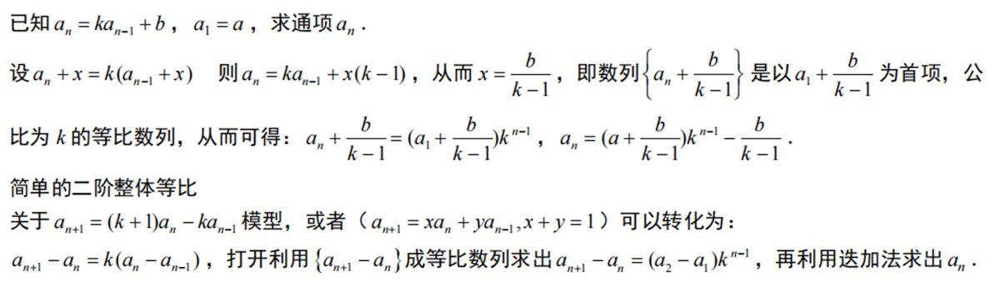
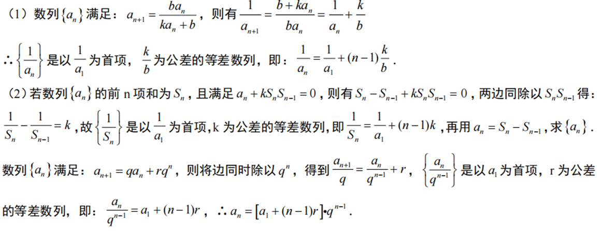
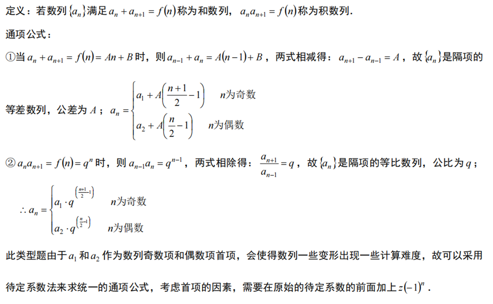
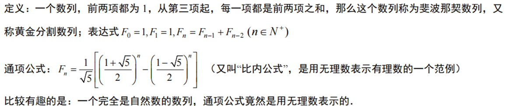
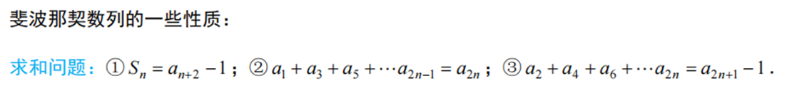

数列是高中数学的重要内容，也是高等数学学习的必备基础，数列在高考中有着重要的地位，高考对数列的考察也比较全面。

 

## 1关于数列的见解

数列给人印象就是计算与结论多，并且数列题时常搭配应用题出现，所以在学习数列时一定要进行系统地归类。结论多，重在自己系统整理归纳，数列题，算为先。结论只是辅助。认真尝试与计算才是王道

## 2数列的性质

在多数数列题目中，类比函数的形式记忆数列通项公式和前n项和公式，往往起到事半功倍的效果

- 等差数列通项公式，当$d≠0$时，这是关于$n$的一次函数

$a_n = a_1 + (n-1)d$

$= dn + (a_1 - d)$

- 等差数列的前n项和公式，这是关于$n$的二次函数

$S_n = \frac{n(a_1 + a_n)}{2}$

$S_n = na_1 + \frac{1}{2}n(n-1)d$

$= \frac{d}{2}n^2 + (a_1 - \frac{d}{2})n$

当d≠0时，这是关于n的一个一次函数。

关于n的二次函数

## 3数列求通项方法

应熟练掌握常见形式求通项

数列求通项还有很多，但不需特别记忆，要依据具体题目来定，离不开递推与迭代的思想（有时也可采用待定系数法）

## 4数列求和方法

### ①倒序相加法

（等差数列前n项和公式的推导）

### ②错位相减法

$T_n = (A+B)q + (2A+B)q^2 + (3A+B)q^3 + \dots + (An+B)q^n$ ①

$qT_n = (A+B)q^2 + (2A+B)q^3 + (3A+B)q^4 + \dots + (An+B)q^{n+1}$ ②

①$-$②得：$(1-q)T_n = (A+B)q - (An+B)q^{n+1} + A(q^2 + q^3 + \dots + q^n)$.

整理得：$T_n = \left( \frac{An}{q-1} + \frac{B}{q-1} - \frac{A}{(q-1)^2} \right) q^{n-1} - \left( \frac{B}{q-1} - \frac{A}{(q-1)^2} \right) q$.

在写完后常常采用带入特值检验的方法

### ③裂项相消法

- 常见的等差数列与裂项相消:

① $a_n = \frac{1}{(An+B)(An+A+B)} = \frac{1}{A} \left( \frac{1}{An+B} - \frac{1}{A(n+1)+B} \right)$ (接龙型)

$S_n = \frac{1}{A} \left( \frac{1}{A+B} - \frac{1}{A(n+1)+B} \right) = \frac{n}{(A+B)[A(n+1)+B]}$

② $a_n = \frac{1}{(An+B)(An+2A+B)} = \frac{1}{2A} \left( \frac{1}{An+B} - \frac{1}{A(n+2)+B} \right)$ (隔项型)

$S_n = \frac{1}{2A} \left( \frac{1}{A+B} + \frac{1}{2A+B} - \frac{1}{A(n+1)+B} - \frac{1}{A(n+2)+B} \right)$

③ $a_n = \frac{1}{\sqrt{An+B} + \sqrt{A(n+1)+B}} = \frac{1}{A} (\sqrt{A(n+1)+B} - \sqrt{An+B})$ (根式型)

$S_n = \frac{1}{A} (\sqrt{A(n+1)+B} - \sqrt{A+B})$

- 特殊等差数列与裂项相消:

①$a_n = \frac{(-1)^{n-1}(2An+A+2B)}{(An+B)[A(n+1)+B]} = (-1)^{n-1} \left( \frac{1}{An+B} - \frac{1}{A(n+1)+B} \right)$

②$S_n = \left( \frac{1}{A+B} + \frac{1}{2A+B} \right) - \left( \frac{1}{2A+B} + \frac{1}{3A+B} \right) + \dots + (-1)^{n-1} \left( \frac{1}{An+B} - \frac{1}{A(n+1)+B} \right) = \frac{1}{A+B} + (-1)^{n-1} \left( \frac{1}{An+B} - \frac{1}{A(n+1)+B} \right)$

- 带有等比数列的裂项相消:

①$a_n = \frac{q^n}{(q^n+m)(q^{n+1}+m)} = \frac{1}{q-1} \left( \frac{1}{q^n+m} - \frac{1}{q^{n+1}+m} \right)$ (其中 $m \in R$，$q \ne 1$)

②$S_n = \frac{1}{q-1} \left( \frac{1}{q+m} - \frac{1}{q^{n+1}+m} \right)$

在地方卷（如浙江）常在数列压轴题中采用放缩+裂项相消的做法

## 5数列不动点

1. 数列${x_n}$满足 $x_{n+1} = ax_n + b$  ($a \in {0, 1}$), 且a是函数 $f(x) = ax + b$ 的不动点, 则 $x_{n+1} - a = a(x_n - a)$.

2. 数列${x_n}$满足 $x_{n+1} = \frac{ax_n + b}{cx_n + d}$ ($c \ne 0, ad - bc \ne 0$), 函数 $f(x) = \frac{ax+b}{cx+d}$, 且预设 $x_1 \ne f(x_1)$：若$f(x)$有两个相异不动点$\alpha, \beta$, 则 $\frac{x_{n+1} - \alpha}{x_{n+1} - \beta} = \frac{\alpha - \alpha}{\beta - \alpha} \frac{x_n - \alpha}{x_n - \beta}$;若$f(x)$只有一个不动点$\alpha$, 且$a \ne -d$, 则 $\frac{1}{x_{n+1} - \alpha} = \frac{2c}{a+d} + \frac{1}{x_n - \alpha}$.

## 6和数列与积数列

## 7数列与应用题的结合

### ①斐波拉契数列

### ②题目长，信息多的实际应用题

如2020全国2卷天坛题目

 
