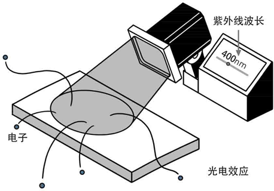
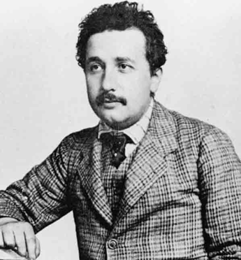
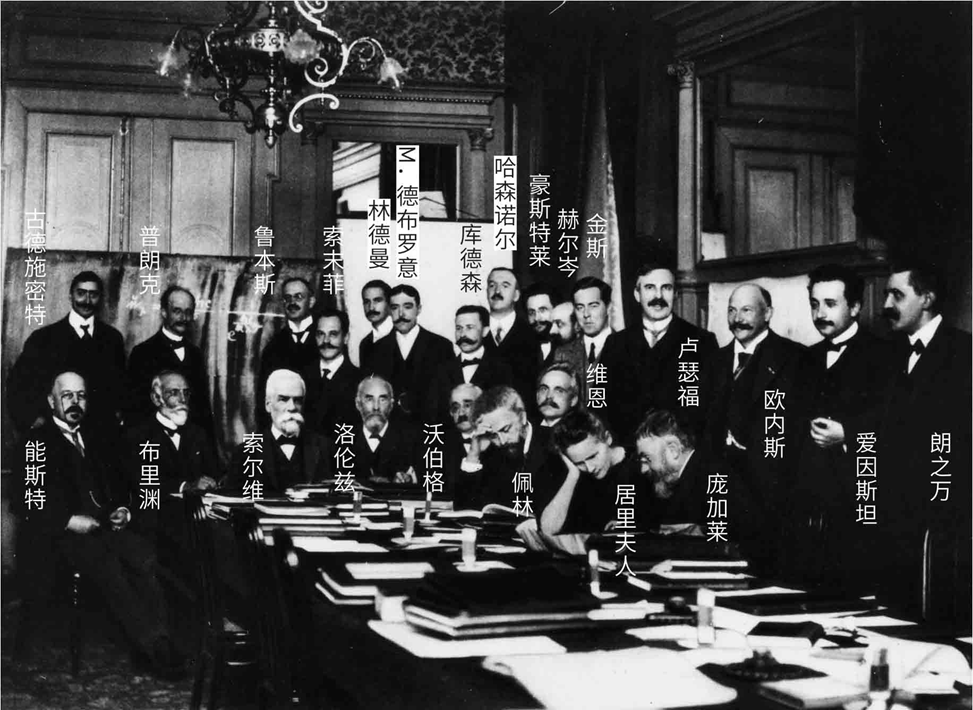
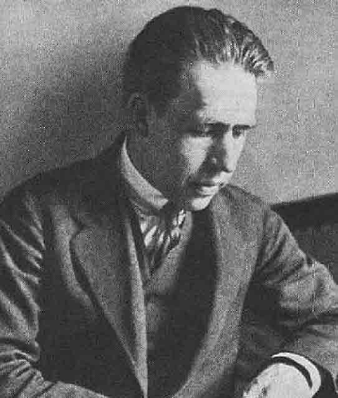
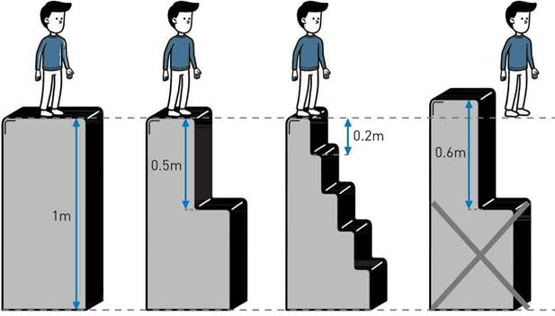

# Falling Fireball 火流星

在量子初生的那些日子里，物理学的境遇并没有得到明显改善。这个叛逆的小精灵被它的主人所抛弃，不得不在荒野中颠沛流离，积蓄力量以等待让世界震惊的那一天。在这段长达四年多的惨淡岁月里，人们带着一种鸵鸟心态来使用普朗克的公式，却掩耳盗铃般地不去追究那公式背后的意义。然而在他们的头上，浓厚的乌云仍然驱之不散，反而越来越逼人，一场荡涤世界的暴雨终究不可避免。

而预示这种巨变到来的，如同往常一样，是一道劈开天地的闪电。在混沌中，电火花擦出了耀眼的亮光，代表了永恒不变的希望。光和电这两种令神祇也敬畏的力量纠缠在一起，瞬间开辟出一整个新时代。

说到这里，我们还是要不厌其烦地回到第一章的开头，再去看一眼赫兹那个意义非凡的实验。正如我们已经提到过的那样，赫兹接收器上电火花的爆跃，证实了电磁波的存在，但他同时也发现，一旦有光照射到那个缺口上，电火花便会出现得容易一些。

赫兹在论文里对这个现象进行了描述，但没有深究其中的原因。在那个激动人心的伟大时代，要做的事情太多了，而且赫兹英年早逝，他也没有闲暇来追究每一个遇到的问题。但是别人随即在这个方面进行了深入的研究，不久事实就很清楚了。原来是这样的：当光照射到金属上的时候，会从它的表面打出电子来。原本束缚在金属表面原子里的电子，不知是什么原因，暴露在一定光线之下的时候，便如同惊弓之鸟纷纷往外逃窜，就像见不得光线的吸血鬼家族。对于光与电之间存在的这种饶有趣味的现象，人们给它取了一个名字，叫作“光电效应”。

光电效应

很快，关于光电效应的一系列实验就在各个实验室被验证。虽然在当时来说，这些实验都是非常粗糙和原始的，但种种结果依然都表明了光和电现象之间的一些基本性质。人们不久便知道了两个基本事实：首先，对于某种特定的金属来说，光是否能够从它的表面打击出电子来，这只和光的频率有关。频率高的光线（比如紫外线）便能够打出能量较高的电子，而频率低的光（比如红光、黄光）则一个电子也打不出来。其次，能否打击出电子，和光的强度无关。再弱的紫外线也能够打击出金属表面的电子，而再强的红光也无法做到这一点。增加光线的强度，能够做到的只是增加打击出电子的数量。比如强烈的紫光相对微弱的紫光来说，可以从金属表面打击出更多的电子来。

总而言之，对于特定的金属，能不能打出电子，由光的频率说了算。而打出多少电子，则由光的强度说了算。

猎兔人的奇遇

但科学家们很快就发现，他们陷入了一个巨大的困惑中。因为......这个现象没有道理，它似乎不应该是这样的啊。

我们都已经知道，光是一种波动。对于波动来说，波的强度便代表了它的能量。我们都很容易理解，电子是被某种能量束缚在金属内部的，如果外部给予的能量不够，便不足以将电子打击出来。但是按理说，如果我们增加光波的强度，那便是增加它的能量啊，为什么对于红光来说，再强烈的光线都无法打击出哪怕是一个电子来呢？而频率，频率是什么东西呢？无非是波振动的频繁程度而已。如果频率高的话，便是说波振动得频繁一点，那么按理说频繁振动的光波应该打击出更多数量的电子才对啊。然而所有的实验都指向相反的方向：光的频率，而不是强度，决定它能否从金属表面打出电子来；光的强度，而不是频率，则决定打出电子的数目。这不是开玩笑吗？

想象一个猎人去打兔子，兔子都躲在地下的洞里，轻易不肯出来。猎人知道，对于狡猾的兔子来说，可能单单敲锣打鼓不足以把它吓出来，而一定要采用比如说水淹的手法才行。也就是说，采用何种手法决定了能否把兔子赶出来的问题。再假设本地有一千个兔子洞，那么猎人有多少助手，可以同时向多少洞穴行动这个因素便决定了能够吓出多少只兔子的问题。但是，在实际打猎中，这个猎人突然发现，一切都翻了个个儿，兔子出不出来不在于采用什么手法，而是有多少助手同时下手。如果只对一个兔子洞行动，哪怕天打五雷轰都没有兔子出来。相反，有多少兔子被赶出来，这和我们的人数没关系，而莫名其妙地，只和采用的手法有关系。哪怕我有一千个人同时对一千个兔子洞敲锣打鼓，最多只有一个兔子跳出来。而只要十个人一起灌水，就会有一千只兔子四处乱窜。要是画漫画的话，这个猎人的头上一定会冒出一颗很大的汗珠。

科学家们发现，在光电效应问题上，他们面临着和猎人一样的尴尬处境。麦克斯韦的电磁理论在光电上显得一头雾水，它不断地揉着自己的眼睛，却总是啼笑皆非地发现实验结果和自己的预言正好相反。搞什么鬼，难道上帝无意中把两封信装错了？

问题绝不仅仅是这些。种种迹象都表明，光的频率和打出电子的能量之间有着密切的关系。每一种特定频率的光线，它打出的电子的能量有一个对应的上限。打个比方，如果紫外光可以激发出能量达到20电子伏的电子来，换了紫光可能就最多只有10电子伏。这在波动看来，是非常不可思议的。而且，根据麦克斯韦理论，一个电子被击出，如果是建立在能量吸收上的话，它应该是一个连续的过程，这能量可以累积。也就是说，如果用很弱的光线照射金属的话，电子必须花一定的时间来吸收，才能达到足够的能量从而跳出表面。这样的话，在光照和电子飞出这两者之间就应该存在一个时间差。但是，实验表明，电子的跃出是瞬时的。光一照到金属上，立即就会有电子飞出，哪怕再暗弱的光线，也是一样，区别只是在于飞出电子的数量多少而已。

咄咄怪事。

对于可怜的物理学家们来说，万事总是不遂他们的愿。好不容易有了一个基本上完美的理论，实验却总是要搞出一些怪事来搅乱人们的好梦。这个该死的光电效应正是一个令人丧气和扫兴的东西。高雅而尊贵的麦克斯韦理论在这个小泥塘前面大大地犯难，如何跨越过去而不弄脏自己那华丽的衣裳，着实是一件伤脑筋的事情。

然而，更加不幸的是，人们总是小看眼前的困难。有着洁癖的物理学家们还在苦思冥想着怎样可以把光电现象融入麦克斯韦理论之中而不损害它的完美，他们却不知道这件事情比他们想象的要严重得多。很快人们就会发现，这根本不是袍子干不干净的问题，而是一个牵涉整个物理体系基础的根本性困难。赫兹当年无意安排下的那个神秘的诅咒，现在已经从封印的瓶子里飞出，降临到了麦克斯韦理论的头上。不过在当时，对于物理学家们来说，麦克斯韦的方程组仍然像黄金刻出的《圣经》章句一样，每个字母都显得那样神圣而不可侵犯。没有最天才和最大胆的眼光，又怎能看出它已经末日临头？

可是，无巧不成书。科学史上最天才和最大胆的传奇人物，恰恰生活在那个时代。

1905年，在瑞士的伯尔尼专利局，一位26岁的小公务员，三等技师职称，留着乱蓬蓬头发的年轻人，他的眼睛在光电效应的这个问题上停留了一下。这个人的名字叫作阿尔伯特·爱因斯坦。

于是在一瞬间，闪电划破了夜空。暴风雨终于要到来了。

## Part. 2

位于伯尔尼的瑞士专利局如今是一个高效和现代化的机构，为人们提供专利、商标的申请和查询服务。漂亮的建筑和完善的网络体系使得它如同商业大公司一样，呈现出一种典型的现代风格。其实，作为纯粹的科学家来说，一般很少会与专利局打交道，因为科学无国界，也没有专利可以申请。科学的大门，终究是向全世界开放的。

爱因斯坦在专利局

爱因斯坦Albert Einstein 1879---1955

不过对于科学界来说，伯尔尼的专利局却意味着许多。它在现代科学史上的意义，不啻于伊斯兰文化中的麦加城，有一种颇为神圣的光辉在里边。这都是因为在100多年前，这个专利局“很有眼光”地雇用了一位小职员，他的名字就叫作阿尔伯特·爱因斯坦。这个故事再一次告诉我们，小庙里面有时也会出大和尚。

1905年，对爱因斯坦来讲，坏日子总算都已经过去得差不多了。那些个为了工作和生计到处奔波彷徨的日子已经结束，不用再为自己的一无所成而自怨自艾。专利局给他提供了一个稳定的职位和收入，虽然只是三等技师―而他申请的是二等―好歹也是个正式的公务员了。三年前父亲的去世对爱因斯坦是个不小的打击，但他很快从妻子那里得到了安慰和补偿。他的老同学，塞尔维亚姑娘米列娃·玛利奇（Mileva Maric）在第二年（1903）答应嫁给这个常常显得心不在焉的冒失鬼，两人不久便有了一个儿子，取名汉斯。

现在，爱因斯坦每天在他的办公室里工作8小时，摆弄那堆形形色色的专利图纸，然后他赶回家，推着婴儿车到伯尔尼的马路上散步。空闲的时候，他和朋友们聚会，大家兴致勃勃地讨论休谟、斯宾诺莎和莱辛。要是突然心血来潮了，爱因斯坦便拿出他的那把小提琴，给大家表演或是伴奏。当然，更多的时候，他还是钻研最感兴趣的物理问题，陷入沉思后，常常废寝忘食。

1905年是一个相当神秘的年份。在这一年，人类的天才喷薄而出，像江河那般奔涌不息，卷起最震撼人心的美丽浪花，以致今天我们回头去看，都不禁要惊叹激动，为那样的奇迹惊奇不已。这一年，对于人类的智慧来说，实在要算是一个极致的高峰，在那段日子里谱写出来的美妙的科学旋律，直到今天都让我们心醉神驰，不知肉味。而这一切大师作品的创作者，这个攀上天才顶峰的人物，便是我们这位伯尔尼专利局的小公务员。

1905年的一系列奇迹是从3月17日开始的。那一天，爱因斯坦写出了一篇关于辐射的论文，后来发表在《物理学纪事》杂志上，题目叫作“关于光的产生和转化的一个启发性观点”。这篇文章仅仅是爱因斯坦有生以来发表的第6篇正式论文，而就是这篇论文，将给他带来多少人终生梦寐以求的诺贝尔奖，也开创了属于量子论的一个全新时代。

爱因斯坦是从普朗克的量子假设那里出发的。大家都还记得，普朗克假设，黑体在吸收和发射能量的时候，不是连续的，而是要分成“一份一份”，有一个基本的能量单位在那里。这个单位，被他称作“量子”，其大小则由普朗克常数h来描述。我再一次把量子的计算公式写在下面，供各位复习一遍：

$$E=h\upsilon$$

在这里笔者要停下来稍微交代两句。对于我们这次量子探险之旅的某些队员，特别是那些对数学没有亲切感觉的队员来说，一再遇到公式可能会引起头晕呕吐等不良症状，还请各位多多包涵体谅。史蒂芬·霍金在他的畅销书《时间简史》里面说，插入任何一个数学公式都会使作品的销量减半，所以他考虑再三，只用了一个公式E = mc^2。我们的史话本是戏作，所以不考虑那么多，但就算列出公式，也不强求各位看客理解其数学意义。不过唯有这个E=hν，笔者觉得还是有必要清楚它的含义，这对于整部史话的理解也是有好处的。从科学意义上来说，它也绝不亚于爱因斯坦的那个E = mc^2。所以还是不厌其烦地重复一下这个方程的描述：E代表一个量子的能量，h是普朗克常数（6.626×10^-34 焦耳/秒），ν是辐射频率。最后宣布一个好消息：除此之外，读者在后面的旅途中如果对任何其他公式有不适反应，简单地跳过它们就是，这对于故事的整体影响不大。

回到我们的史话中来。1905年，爱因斯坦阅读了普朗克的那些早已被大部分权威和他本人冷落到角落里的论文，量子化的思想深深地打动了他。凭着一种深刻的直觉，他感到，对于光来说，量子化也是一种必然的选择。虽然有天神一般的麦克斯韦理论高高在上，但爱因斯坦叛逆一切，并没有为之止步不前。相反，他倒是认为麦氏理论只能对于一种平均情况有效，而对于瞬间能量的发射、吸收等问题，麦克斯韦理论是与实验相矛盾的。从光电效应中已经可以看出端倪。

让我们再重温一下光电效应和电磁理论的不协调之处：

电磁理论认为，光作为一种波动，它的强度代表了它的能量，增强光的强度应该能够打击出更高能量的电子。但实验表明，增加光的强度只能打击出更多数量的电子，而不能增加电子的能量。要打击出更高能量的电子，则必须提高照射光线的频率。

提高频率，提高频率。爱因斯坦突然灵光一闪：E=hν，提高频率，不正是提高单个量子的能量吗？而更高能量的量子，不正好能够打击出更高能量的电子吗？另外，提高光的强度，只是增加量子的数量罢了，所以相应的结果自然是打击出更多数量的电子！一切在突然之间，显得顺理成章起来。

爱因斯坦写道：“……根据这种假设，从一点所发出的光线在不断扩大的空间中传播时，它的能量不是连续分布的，而是由一些数目有限的、局限于空间中某个地点的‘能量子’所组成的。这些能量子是不可分割的，它们只能整份地被吸收或发射。”

组成光的能量的这种最小的基本单位，爱因斯坦后来把它们叫作“光量子”。一直到1926年，美国物理学家刘易斯才把它换成了今天常用的名词―“光子”。

从光量子的角度出发，一切变得非常简明易懂了。频率更高的光线，比如紫外光，它的单个量子要比频率低的光线含有更高的能量，因此当它的量子作用到金属表面的时候，就能够激发出拥有更高动能的电子来。而量子的能量和光线的强度没有关系，强光只不过包含了更多数量的光量子而已，所以能够激发出更多数量的电子来。但是对于低频光来说，它的每一个量子都不足以激发出电子，那么，含有再多的光量子也无济于事。

我们把光电效应想象为一场有着高昂入场费的拍卖。每个量子是一个顾客，它所携带的能量相当于一个人拥有的资金。要进入拍卖现场，每个人必须先缴纳一定数量的入场费，而在会场内，一个人只能买一件物品。

一个光量子打击到金属表面的时候，如果它带的“钱”足够（能量足够高），它便有资格进入“拍卖现场”。至于它能够买到多好的物品，那要取决于它付了入场费后还剩下多少钱。频率越高，代表了一个人的钱越多，像紫外线这样的大款，可以在轻易付清入场费后还买得起非常贵的货物，而频率低一点的光线就没那么阔绰了。

但是，一个人有多少资金，和一个“代表团”总共能够买到多少物品是没有关系的。能够买到多少数量的东西，只和“代表团”的人数有关系，而和每一个人有多少钱没关系。如果我有一个500人的代表团，每个人都有足够的钱入场，那么我就能买到500样货品回来，而你一个人再有钱，你也只能买一样东西。至于买到的东西有多好，那是另一回事。话又说回来，假如你一个代表团里每个人的钱都太少，以致没人付得起入场费，那么哪怕你人数再多，也是一样东西都买不到的，因为规矩是你只能以个人的身份入场，没有连续性和积累性，大家的钱不能凑在一起使用。

爱因斯坦推导出的方程和我们的拍卖是一个意思：

$$\frac{1}{2}m\nu^2=h\upsilon-P$$

$$\frac{1}{2}m\nu^2$$是激发出电子的最大动能，也就是我们说的，能买到“多好”的货物。hν是单个量子的能量，也就是你总共有多少钱。P是激发出电子所需要的最小能量，也就是“入场费”。所以这个方程告诉我们的其实很简单：你能买到多好的货物取决于你的总资金减掉入场费用。

这里面关键的假设就是：光以量子的形式吸收能量，没有连续性，不能累积。一个光量子激发出一个对应的电子。于是实验揭示出来的效应的瞬时性难题也迎刃而解：量子作用本来就是瞬时作用，没有积累的说法。

但是，大家从这里面嗅到些什么没有？光量子，光子，光究竟是一种什么东西呢？难道我们不是已经清楚地下了结论，光是一种波动吗？光量子是一个什么概念呢？

仿佛宿命一般，历史在转了一个大圈之后，又回到起点。关于光的本性问题，干戈再起，“第三次波粒战争”一触即发。而这次，导致的后果是全面的世界大战，天翻地覆，一切在毁灭后才得到重生。

## 饭后闲话：奇迹年

如果站在一个比较高的角度来看历史，一切事物都是遵循特定轨迹的，没有无缘无故的事情，也没有不合常理的发展。在时代浪尖上弄潮的英雄人物，其实都只是适合了那个时代的基本要求，这才得到了属于他们的无上荣耀。

但是，如果站在庐山之中，把我们的目光投射到具体的那个情景中去，我们也能够理解一个伟大人物为时代所带来的光荣和进步。虽然不能说失去了这些伟大人物，人类的发展就会走向歧途，但是也不能否认英雄和天才们为这个世界所作出的巨大贡献。

在科学史上就更是这样。整个科学史可以说就是以天才的名字来点缀的灿烂银河，而有几颗特别明亮的星辰，它们所发射出的光芒穿越了整个宇宙，一直到达时空的尽头。他们的智慧在某一个时期散发出如此绚烂的辉煌，令人叹为观止。一直到今天，我们都无法找出更加适合的字句来加以形容，而只能冠以“奇迹”的名字。

科学史上有两个年份，便符合“奇迹”的称谓，而它们又是和两个天才的名字紧紧相连的。这两年分别是1666年和1905年，那两个天才便是牛顿和爱因斯坦。

1666年，23岁的牛顿为了躲避瘟疫，回到乡下的老家度假。在那段日子里，他一个人独立完成了几项开天辟地的工作，包括发明了微积分，完成了光分解的实验分析，以及对于万有引力定律的开创性思考。在那一年，他为数学、力学和光学三大学科分别打下了基础，而其中的任何一项工作，都足以让他名列有史以来最伟大的科学家之列。很难想象，一个人的思维何以能够在如此短的时间内涌动出如此多的灵感，人们只能用一个拉丁文annus mirabilis来表示这一年，也就是“奇迹年”。

1905年的爱因斯坦也是这样，在专利局里蜗居的他在这一年写了6篇论文：3月18日，是我们上面提到过的关于光电效应的文章，成为量子论的奠基石之一。4月30日，关于测量分子大小的论文为他赢得了博士学位。5月11日和后来的12月19日，两篇关于布朗运动的论文，成为分子论的里程碑。6月30日，题为《论运动物体的电动力学》的论文，这个不起眼的题目后来被加上了一个如雷贯耳的名称，叫作“狭义相对论”，它的意义就不用我多说了。9月27日，关于物体惯性和能量的关系，这是狭义相对论的进一步说明，并且在其中提出了著名的质能方程 E=mc^2。

单单这一年的工作，便至少配得上3个诺贝尔奖。相对论的意义是否是诺贝尔奖所能评价的，还很难说。而这一切也不过是在专利局的办公室里，一个人用纸和笔完成的而已。的确很难想象，这样的奇迹还会不会再次发生，因为实在是太不可思议了。后来的1932年在原子物理领域也可称为“奇迹年”，但荣誉已经不再属于一个人，而是由许多物理学家共同分享。随着科学进一步高度细化，今天已经无法想象，单枪匹马能够在如此短时间内作出如此巨大的贡献。当时的庞加莱已经被称为数学界的“最后一位全才”，而爱因斯坦的相对论也可能是最后一个富有个人英雄主义传奇色彩的物理理论了吧？这是我们的幸运，还是不幸呢？

为了纪念1905年的光辉，人们把100年后的2005年定为“国际物理年”。我们的史话，也算是对它的一个小小致敬。

## Part. 3

上次说到，爱因斯坦提出了光量子的假说，用来解释光电效应中无法用电磁理论解释的现象。

然而，光量子的概念却让其他科学家非常不理解。见鬼了，光的问题不是已经被定性了吗？难道光不是已经被包括在麦克斯韦理论之内，作为电磁波的一种被清楚地描述了吗？这个光量子又是怎么一回事呢？

事实上，光量子是一个非常大胆的假设，它是在直接地向经典物理体系挑战。爱因斯坦本人也意识到这一点，在他看来，这可是他最有叛逆性的一篇论文了。在写给好友哈比希特的信中，爱因斯坦描述了他划时代的四篇论文，只有在光量子上，他才用了“非常革命”的字眼，而相对论都没有这样的描述。

光量子和传统的电磁波动图像显得格格不入。它其实就是昔日微粒说的一种翻版，假设光是离散的，由一个个小的基本单位所组成的。自托马斯·杨的时代又已经过去了一百年，冥冥中天道循环，当年被打倒在地的霸主以反叛的姿态再次登上舞台，向已经占据了王位的波动说展开挑战。这两个命中注定的对手终于要进行一场最后的决战，从而领悟到各自存在的终极意义：如果没有了你，我独自站在这里，又是为了什么？

不过，光量子的处境和当年起义的波动一样，是非常困难和不为人所接受的。波动如今所占据的地位，甚至要远远超过100年前笼罩在牛顿光环下的微粒王朝。波动的王位，是由麦克斯韦钦点，又有整个电磁王国作为同盟的。这场决战，从一开始就不再局限于光的领地之内，而是整个电磁谱的性质问题。而我们很快将要看到，十几年以后，战争将被扩大，整个物理世界都将被卷入进去，从而形成一场名副其实的世界大战。

当时，对于光量子的态度，连爱因斯坦本人都是非常谨慎的，更不用说那些可敬的老派科学绅士了。一方面，这和经典的电磁图像不相容；另一方面，当时关于光电效应的实验没有一个能够非常明确地证实光量子的正确性。微粒的这次绝地反击，一直要到1915年才真正引起人们的注意，而起因也是非常讽刺的：美国人密立根想用实验来证实光量子图像是错误的，但是多次反复实验之后，他却啼笑皆非地发现，自己已经在很大程度上证实了爱因斯坦方程的正确性。实验数据相当有说服力地展示，在所有的情况下，光电现象都表现出量子化特征，而不是相反。

如果说密立根的实验只是微粒革命军的一次反围剿成功，其意义还不足以说服所有的物理学家的话，那么1923年，康普顿则带领这支军队取得了一场决定性的胜利，把其所潜藏着的惊人力量展现得一览无余。经此一役后，再也没有人怀疑，起来对抗经典波动帝国的，原来是一支实力不相上下的正规军。

这次战役的战场是X射线的地域。康普顿在研究X射线被自由电子散射的时候，发现了一个奇怪的现象：散射出来的X射线分成两个部分，一部分和原来的入射射线波长相同，而另一部分却比原来的射线波长要长，具体的大小和散射角存在函数关系。

如果运用通常的波动理论，散射应该不会改变入射光的波长才对。但是怎么解释多出来的那一部分波长变长的射线呢？康普顿苦苦思索，试图从经典理论中寻找答案，却撞得头破血流。终于有一天，他作了一个破釜沉舟的决定，引入光量子的假设，把X射线看作能量为hν的光子束的集合。这个假定马上让他看到了曙光，眼前豁然开朗：那一部分波长变长的射线是因为光子和电子碰撞所引起的。光子像普通的小球那样，不仅带有能量，还具有冲量，当它和电子相撞，便将自己的能量交换一部分给电子。这样一来光子的能量下降，根据公式E=hν，E下降导致ν下降，频率变小，便是波长变大，证明完毕。

在粒子的基础上推导出波长变化和散射角的关系式，和实验符合得丝毫不差。这是一场极为漂亮的歼灭战，波动的力量根本没有任何反击的机会便被缴了械。康普顿总结道：“现在，几乎不用再怀疑伦琴射线是一种量子现象了……实验令人信服地表明，辐射量子不仅具有能量，而且具有一定方向的冲量。”

上帝造了光，爱因斯坦指出了什么是光，而康普顿，则第一个在真正意义上“看到”了这光。

“第三次波粒战争”全面爆发了。卷土重来的微粒军团装备了最先进的武器：光电效应和康普顿效应。这两门大炮威力无穷，令波动守军难以抵挡，节节败退。但是，波动方面军近百年苦心经营的阵地毕竟不是那么容易突破的，麦克斯韦理论和整个经典物理体系的强大后援使得它仍然立于不败之地。波动的拥护者们很快便清楚地意识到，不能再后退了，因为身后就是莫斯科！波动理论的全面失守将意味着麦克斯韦电磁体系的崩溃，但至少现在，微粒这一雄心勃勃的计划还难以实现。

波动在稳住了阵脚之后，迅速地重新评估了自己的力量。虽然在光电问题上它无能为力，但当初它赖以建国的那些王牌武器却依然没有生锈和失效，仍然有着强大的杀伤力。微粒的复兴尽管来得迅猛，但终究缺乏深度，它甚至不得不依靠从波动那里缴获来的军火来作战。比如我们已经看到的光电效应，对于光量子理论的验证牵涉频率和波长的测定，而这却仍然要靠光的干涉现象来实现。波动的立国之父托马斯·杨，他的精神是如此伟大，以致在身后百年仍然光耀着波动的战旗，震慑一切反对力量。在每一所中学的实验室里，通过两道狭缝的光仍然不依不饶地显示出明暗相间的干涉条纹来，不容置疑地向世人表明它的波动性。菲涅尔的论文虽然已经在图书馆里蒙上了灰尘，但任何人只要有兴趣，仍然可以重复他的实验，来确认泊松亮斑的存在。麦克斯韦芳华绝代的方程组仍然在每天给出预言，而电磁波也仍然温顺地按照那个优美的预言以30万公里每秒的速度行动，既没有快一点，也没有慢一点。

战局很快就陷入僵持，双方都屯兵于自己得心应手的阵地之内，谁也无力去占领对方的地盘。光子一陷入干涉的沼泽，便显得笨拙而无法自拔；光波一进入光电的丛林，也变得迷茫而不知所措。粒子还是波？在人类文明达到高峰的20世纪，却对宇宙中最古老的现象束手无策。

不过，还是让我们以后再来关注微粒和波动即将爆发的这场戏剧性的总决战。现在，按照这次旅行的时间顺序安排，先让这两支军队对垒一阵子，我们暂时回到故事的主线，也就是20世纪的第一个十年那里去。自从1905年爱因斯坦提出他的光量子概念后，量子这个新生力量终于开始被人逐渐重视，越来越多有关这一课题的论文被发表出来。普朗克的黑体公式和爱因斯坦的光电效应理论只不过是它占领的两个重要前沿阵地，而在许多其他问题，比如晶体的晶格结构，阳极射线的多普勒效应，气体分子的振动，X射线辐射等上面，它也都很快就令人刮目相看。在这样一种微妙的形势下，德国物理学家能斯特敏锐地察觉到，物理学已经来到了一个关键时刻。量子火山的每一次躁动，都使得整个物理学大地在微微颤抖，似乎预示着不久后一次总爆发的来临。也许，“量子”这个不起眼的名词，终究注定要成为一个家喻户晓的名字。

1910年春天，能斯特到布鲁塞尔访问另一位化学家古德施密特，并在那里邂逅了一位叫作索尔维的人。索尔维一直对化学和物理深感兴趣，可惜当年因病错过了大学。他后来发明了一种制造苏打的新方法，并靠此发了财。虽然自己已经错过了投身于科学的青春年华，不过索尔维仍然对此非常关心。他向能斯特提议说，自己可以慷慨解囊，赞助一个全球性的科学会议，让普朗克、洛伦兹、爱因斯坦这样出色的物理学家能够会聚一堂，讨论最前沿的科学问题。能斯特又惊又喜：这不正是一个最好的机会，可以让物理学家们认真地交流一下对量子和辐射问题的看法吗？于是两人一拍即合，能斯特随即为这件事忙碌地张罗起来。

1911年10月30日，第一届索尔维会议正式在比利时布鲁塞尔召开。24位最杰出的物理学家参加了会议，并在量子理论、气体运动理论以及辐射现象等课题上进行了讨论。遗憾的是，会议只有短短5天，物理学家们并没有取得任何突破性的进展。量子究竟意味着什么？理论背后隐藏着什么？普朗克常数h究竟将把我们带向何方？没有人确切地知道答案。爱因斯坦在会后写给洛伦兹的信里说：“‘h重症’看上去更加病入膏肓了。”

但不可否认的是，这仍然是量子发展史上的一次重大事件，因为量子问题终于在这次会议之后被推到了历史的最前沿，成为时代潮头上的一个焦点。人们终于发现，他们面对的是一个巨大的、扑朔迷离的难题。不管是光，还是热辐射，经典物理面对的都是一个难以逾越的困境。

在那些出席会议的人中，有一位叫作恩内斯特·卢瑟福。他也许不知道，自己回英国后很快就会遇上一位来自丹麦的青年，从而在自己的学生名单上添加一颗最耀眼的超级巨星。也没人注意到大会的一位秘书，来自法国的莫里斯·德布罗意公爵。他将把讨论和报告的记录带回家中，而偏巧，他有一位聪明绝顶的弟弟。对于爱因斯坦来说，他更不会想到，这个所谓的“h重症”将成为困扰他终生的最大谜题。1911年的索尔维会议仅仅是一个开始而已，未来还会有更多的索尔维会议，在历史上绘成一幅壮丽而雄奇的画卷，记录下量子论最富有传奇色彩的那一段故事。1911年的这次会议像是一个路标，历史的众多明暗伏线在这里交错汇聚，然后厘清出几条主脉，浩浩荡荡地发展下去。爱因斯坦的朋友贝索后来把1911年的会议称为一次“巫师盛会”，也许，这真的是量子魔法师在炫技前所念的最后的神奇咒语！

1911年索尔维会议

现在，各位观众，就让我们把握住会议留给我们的那条线索，一起去看看量子魔法是怎样影响了实实在在的物质―原子核和电子的。我们的历史长镜头从欧洲大陆转回不列颠岛，来自丹麦的王子粉墨登场。在他的头上，一颗大大的火流星划过这阴云密布的天空，虽然只是一闪即逝，但却在地上点燃了燎原大火，照亮了无边的黑暗。

## Part. 4

1911年9月，26岁的丹麦小伙子尼尔斯·玻尔渡过英吉利海峡，踏上了不列颠的土地。年轻的玻尔不会想到，32年后，他还要再一次来到这个岛上，却是藏在一架蚊式轰炸机的弹仓里，面临高空缺氧的考验和随时被丢进大海里的风险，九死一生后才到达目的地。那一次，是丘吉尔首相亲自签署命令，从纳粹的手中转移了这位原子物理界的泰山北斗，使得盟军在原子弹的竞争方面成功地削弱了德国的优势。这也成了玻尔一生中最富有传奇色彩、为人所津津乐道的一段经历。有些故事书甚至绘声绘色地描述说，当飞行员最终打开舱门时，玻尔还茫然不觉，沉浸在专注的物理思考中物我两忘。当然事实上玻尔并没有这样英勇，因为缺氧，他当时已经奄奄一息，差一点就送了命。

不过我们还是回到1911年，那时玻尔还只是一个有着远大志向和梦想，却默默无闻的青年。他走在剑桥的校园里，想象当年牛顿和麦克斯韦在这里走过的情形，欢欣鼓舞得像一个孩子。在草草地安定下来之后，玻尔做的第一件事情就是去拜访大名鼎鼎的J.J.汤姆逊，后者是当时富有盛名的物理学家，卡文迪许实验室的负责人，电子的发现者，诺贝尔奖得主。汤姆逊十分热情地接待了玻尔，虽然玻尔的英语烂得可以，但两人还是谈了好一阵子。汤姆逊收下了玻尔的论文，并把它放在自己的办公桌上。

玻尔Niels Henrik David Bohr 1885---1962

一切看来都十分顺利，但可怜的玻尔并不知道，在漠视学生的论文这一点上，汤姆逊是“恶名昭著”的。事实上，玻尔的论文一直被闲置在桌子上，汤姆逊根本没有看过一个字。另有一种说法是，当时不谙世故的玻尔老实不客气，当面指出了汤姆逊的著作《气体中的导电》里的一些错误，结果惹恼了这位高傲的英国人。不管怎样，剑桥对于玻尔来说，实在不是一个让人激动的地方，他自己的研究也进行得不是十分顺利。总而言之，除了在一个足球队里大显身手之外，这所举世闻名的大学似乎没有什么让玻尔觉得值得一提的事。失望之下，玻尔决定寻求一些改变。一次偶然的机会，玻尔到曼彻斯特拜访他父亲的一位朋友Lorrain Smith，后者将他介绍给了刚从第一届索尔维会议上归来的卢瑟福。

也许是命中注定的缘分，也许是一生难求的巧合，又或许那个“巫师盛会”的魔力还没有完全散尽。总之，玻尔和卢瑟福之间立刻就产生了神秘的化学反应。在促膝长谈之后，两人都觉得相见恨晚，卢瑟福很快就给了玻尔一个实验室的名额，而玻尔也很快就义无反顾地离开剑桥前往曼彻斯特。这座工业城市的天空虽然受到污染，但恩内斯特·卢瑟福的名字却使它看起来那样地金光闪耀。

说起来，卢瑟福也是J.J.汤姆逊的学生。这位出身于新西兰农场的科学家身上保持着农民那勤俭朴实的作风，对他的助手和学生永远是那样热情和关心，提供所有力所能及的帮助。再说，玻尔选择的时机真是再恰当不过了。1912年，那正是一个黎明的曙光就要来临，科学新的一页就要被书写的年份。人们已经站在了通向原子神秘内部世界的门槛上，只等玻尔来迈出这决定性的一步了。

这个故事还要从前一个世纪说起。1897年，J.J.汤姆逊在研究阴极射线的时候，发现了原子中电子的存在。这打破了从古希腊人那里流传下来的“原子不可分割”的理念，明确地向人们展示：原子是可以继续分割的，它有着自己的内部结构。那么，这个结构是怎么样的呢？汤姆逊那时完全缺乏实验证据，他于是展开自己的想象，勾勒出这样的图景：原子呈球状，带正电荷，而带负电荷的电子则一粒粒地“镶嵌”在这个圆球上。这样的一幅画面，史称“葡萄干布丁”模型，电子就像布丁上的葡萄干一样。

但是，1910年，卢瑟福和他的学生们在实验室里进行了一次名垂青史的实验。他们用α粒子来轰击一张极薄的金箔，想通过散射来确认那个“葡萄干布丁”的大小和性质。这时候，极其不可思议的现象出现了：有少数α粒子的散射角度是如此之大，以至超过90度。对这个情况，卢瑟福自己描述得非常形象：“这就像你用十五英寸的炮弹向一张纸轰击，结果这炮弹却被反弹了回来，反而击中了你自己一样。”

卢瑟福发扬了亚里士多德前辈“吾爱吾师，但吾更爱真理”的优良品格，决定修改汤姆逊的葡萄干布丁模型。他认识到，α粒子被反弹回来，必定是因为它们和金箔原子中某种极为坚硬密实的核心发生了碰撞。这个核心应该是带正电，而且集中了原子的大部分质量。但是，从α粒子只有很少一部分出现大角度散射这一情况来看，那核心占据的地方是很小的，不到原子半径的万分之一。

两种原子模型

于是，卢瑟福在次年发表了他的这个新模型。在他描述的原子图像中，有一个占据了绝大部分质量的“原子核”在原子的中心。而在这原子核的四周，带负电的电子则沿着特定的轨道绕着它运行。这很像一个行星系统，所以这个模型被理所当然地称为“行星系统”模型。在这里，原子核就像是我们的太阳，而电子则是围绕太阳运行的行星们。

但是，这个看来完美的模型却有着自身难以克服的严重困难。因为物理学家们很快就指出，带负电的电子绕着带正电的原子核运转，这个体系是不稳定的。根据麦克斯韦理论，两者之间会放射出强烈的电磁辐射，从而导致电子一点点地失去自己的能量。作为代价，它便不得不逐渐缩小运行半径，直到最终“坠毁”在原子核上为止，整个过程用时不过一眨眼的工夫。换句话说，就算世界如同卢瑟福描述的那样，也会在转瞬之间因为原子自身的坍缩而毁于一旦。原子核和电子将不可避免地放出辐射并互相中和，然后把卢瑟福和他的实验室，乃至整个英格兰、整个地球、整个宇宙都变成一团混沌。

经典理论中的电子必将坠毁

不过，当然了，虽然理论家们发出如此阴森恐怖的预言，太阳仍然每天照常升起，大家都活得好好的。电子依然快乐地围绕原子打转，没有一点失去能量的预兆。而丹麦的年轻人尼尔斯·玻尔照样安安全全地抵达了曼彻斯特，并开始谱写物理史上属于他的华丽篇章。

玻尔没有因为卢瑟福模型的困难而放弃这一理论，毕竟它有着α粒子散射实验的强力支持。相反，玻尔对电磁理论能否作用于原子这一人们从未涉足过的层面，倒是抱有相当的怀疑成分。曼彻斯特的生活显然要比剑桥令玻尔舒心许多，虽然他和卢瑟福两个人的性格是如此不同：后者是个急性子，永远精力旺盛，而玻尔则像个害羞的大男孩，说一句话都显得口齿不清，但他们显然是绝妙的一个团队。玻尔的天才在卢瑟福这个老板的领导下被充分地激发出来，很快就在历史上激起壮观的波澜。

1912年7月，玻尔完成了他在原子结构方面的第一篇论文，历史学家们后来常常把它称作“曼彻斯特备忘录”。玻尔在其中已经开始试图把量子的概念结合到卢瑟福模型中去，以解决经典电磁力学所无法解释的难题。但是，一切都只不过是刚刚开始而已，在那片还没有前人涉足的处女地上，玻尔只能一步步地摸索前进。没有人告诉他方向应该在哪里，而他的动力也不过是对卢瑟福模型的坚信和年轻人特有的巨大热情。玻尔当时对原子光谱的问题一无所知，当然也预料不到它后来对原子研究的决定性意义，不过，革命的方向已经确定，没有什么能够改变量子论即将崭露头角这个事实了。

在浓云密布的天空中，出现了一线微光。虽然后来证明那只是一颗流星，但这光芒无疑给已经僵硬而老化的物理世界注入了一种新的生机，一种有着新鲜气息和希望的活力。这光芒点燃了人们手中的火炬，引导他们去寻找真正的永恒的光明。

终于，7月24日，玻尔完成了他在英国的学习，动身返回祖国丹麦。在那里，他可爱的未婚妻玛格丽特正焦急地等待着他，而物理学的未来也即将要向他敞开心扉。在临走前，玻尔把他的论文交给卢瑟福过目，并得到了热切的鼓励。只是，卢瑟福有没有想到，这个青年将在怎样的一个程度上改变人们对世界的终极看法呢？

是的，是的，时机已到。伟大的三部曲即将问世，而真正属于量子的时代，也终于到来。

## 饭后闲话：诺贝尔奖得主的幼儿园

卢瑟福本人是一位伟大的物理学家，这是毋庸置疑的，但他同时更是一位伟大的物理导师。他以敏锐的眼光去发现人们的天才，又以伟大的人格去关怀他们，把他们的潜力挖掘出来。在卢瑟福身边的那些助手和学生，后来绝大多数都出落得非常出色，其中更包括了为数众多的科学大师。

我们熟悉的尼尔斯·玻尔，20世纪最伟大的物理学家之一，1922年诺贝尔物理奖得主，量子论的奠基人和象征。如本节所描述的那样，他在曼彻斯特跟随过卢瑟福。

保罗·狄拉克，量子论的创始人之一，同样伟大的科学家，1933年诺贝尔物理奖得主。他的主要成就都是在剑桥卡文迪许实验室做出的。狄拉克获奖的时候才31岁，他对卢瑟福说他不想领这个奖，因为他讨厌在公众中的名声。卢瑟福劝道，如果不领奖的话，那么这个名声可就更响了。

中子的发现者，詹姆斯·查德威克在曼彻斯特花了两年时间待在卢瑟福的实验室里。他于1935年获得诺贝尔物理奖。

布莱克特在“一战”后辞去了海军上尉的职务，进入剑桥跟随卢瑟福学习物理。他后来改进了威尔逊云室，并在宇宙线和核物理方面作出了巨大贡献，为此获得了1948年的诺贝尔物理奖。

1932年，沃尔顿和考克劳夫特在卢瑟福的卡文迪许实验室里建造了强大的加速器，并以此来研究原子核的内部结构。这两位卢瑟福的弟子在1951年分享了诺贝尔物理奖金。

这个名单可以继续开下去，一直到长得令人无法想象为止：英国人索迪，1921年获得诺贝尔化学奖。匈牙利人赫维西，1943年获得诺贝尔化学奖。德国人哈恩，1944年获得诺贝尔化学奖。英国人鲍威尔，1950年获得诺贝尔物理奖。美国人贝特，1967年获得诺贝尔物理奖。苏联人卡皮察，1978年获得诺贝尔化学奖。

除去一些稍微疏远的情况外，卢瑟福一生至少培养了10位诺贝尔奖得主。当然，在他的学生中还有一些没有得到诺贝尔奖但同样出色的名字，比如汉斯·盖革，亨利·莫塞莱，恩内斯特·马斯登……

卢瑟福的实验室被后人称为“诺贝尔奖得主的幼儿园”。他的头像出现在新西兰货币的最大面值――100新西兰元上面，作为国家对他最崇高的敬意和纪念。

## Part. 5

新西兰货币上的卢瑟福头像

1912年8月1日，玻尔和玛格丽特在离哥本哈根不远的一个小镇上结婚，随后他们前往英国度蜜月。当然，有一个人是万万不能忘记拜访的，那就是玻尔家最好的朋友之一，卢瑟福教授。

虽然是在蜜月期间，原子和量子的图景仍然没有从玻尔的脑海中消失。他和卢瑟福就此再一次认真地交换了看法，并加深了自己的信念。回到丹麦后，他便以百分之二百的热情投入到这一工作中去。揭开原子内部的奥秘，这一梦想具有太大的诱惑力，令玻尔完全无法抗拒。

为了能使大家跟得上我们史话的步伐，我们还是再次描述一下当时玻尔面临的处境。卢瑟福的实验展示了一个全新的原子面貌：有一个致密的核心处在原子的中央，而电子则绕着这个中心运行，像是围绕着太阳的行星。然而，这个模型面临着严重的理论困难，因为经典电磁理论预言，这样的体系将会无可避免地释放出辐射能量，并最终导致体系的崩溃。换句话说，卢瑟福的原子是不可能稳定存在超过1秒钟的。

玻尔一家（右）和卢瑟福一家（左）

玻尔面临着选择：要么放弃卢瑟福模型，要么放弃麦克斯韦和他的伟大理论。玻尔勇气十足地选择了放弃后者。他以一种深刻的洞察力预见到，在原子这样小的层次上，经典理论将不再成立，新的革命性思想必须被引入，这个思想就是普朗克的量子以及他的h常数。

应当说这是一个相当困难的任务。如何推翻麦氏理论还在其次，关键是新理论要能够完美地解释原子的一切行为。玻尔在哥本哈根埋头苦干的那个年头，门捷列夫的元素周期律已经被发现了很久，化学键理论也已经被牢固地建立。种种迹象都表明在原子内部，有一种潜在的规律支配着它们的行为，并形成某种特定的模式。原子世界像一座蕴藏了无穷财宝的金字塔，但如何找到进入其内部的通道，却是一个让人头疼不已的难题。

然而，像当年伟大的探险者贝尔佐尼一样，玻尔也有着一个探险家所具备的最宝贵的素质：洞察力和直觉。这使得他能够抓住那个不起眼，但却是唯一的稍纵即逝的线索，从而打开那扇通往全新世界的大门。1913年年初，年轻的丹麦人汉森请教玻尔，在他那量子化的原子模型里如何解释原子的光谱线问题。对于这个问题，玻尔之前并没有太多地考虑过，原子光谱对他来说是陌生和复杂的，成千条谱线和种种奇怪的效应在他看来太杂乱无章，似乎不能从中得出什么有用的信息。然而汉森告诉玻尔，这里面其实是有规律的，比如巴尔末公式就是。他敦促玻尔关心一下巴尔末的工作。

突然间，就像伊翁发现了藏在箱子里的绘着戈耳工的麻布，一切都豁然开朗。山重水复疑无路，柳暗花明又一村。在谁也没有想到的地方，量子论得到了决定性的突破。1954年，玻尔回忆道：“当我一看见巴尔末的公式，一切就都清楚不过了。”

要从头回顾光谱学的发展，又得从沃拉斯顿和夫琅和费讲起，一直说到伟大的本生和基尔霍夫，而那势必又是一篇规模宏大的文字。鉴于篇幅，我们只需要简单地了解一下这方面的背景知识，因为本史话原来也没有打算把方方面面都事无巨细地描述完全。概括来说，当时的人们已经知道，任何元素在被加热时都会释放出含有特定波长的光线，比如我们从中学的焰色实验中知道，钠盐放射出明亮的黄光，钾盐则呈紫色，锂是红色，铜是绿色……将这些光线通过分光镜投射到屏幕上，便得到光谱线。各种元素在光谱里一览无余：钠主要表现为一对黄线，锂产生一条明亮的红线和一条较暗的橙线，钾则是一条紫线。总而言之，任何元素都产生特定的唯一谱线。

但是，这些谱线呈现什么规律以及为什么会有这些规律，却是一个大难题。拿氢原子的谱线来说吧，这是最简单的原子谱线了。它就呈现为一组线段，每一条线都代表了一个特定的波长。比如在可见光区间内，氢原子的光谱线依次为：656，484，434，410，397，388，383，380……这些数据无疑不是杂乱无章的，1885年，瑞士的一位数学教师巴尔末发现了其中的规律，并总结了一个公式来表示这些波长之间的关系，这就是著名的巴尔末公式。将它的原始形式稍微变换一下，用波长的倒数来表示，则显得更加简单明了：

$$\upsilon=R(\frac{1}{2^2}-\frac{1}{n^2})$$

其中R是一个常数，称为里德伯常数。n是大于2的正整数。

在很长一段时间里，这是一个十分有用的经验公式。但没有人可以说明，这个公式背后的意义是什么，以及如何从基本理论将它推导出来。不过在玻尔眼里，这无疑是一个晴天霹雳，它像一个火花，瞬间点燃了玻尔的灵感，所有的疑惑在那一刻变得顺理成章。玻尔知道，隐藏在原子里的秘密，终于向他嫣然地展开笑颜。

我们来看一下巴尔末公式，这里面用到了一个变量n，那是大于2的任何正整数。n可以等于3，可以等于4，但不能等于3.5，这无疑是一种量子化的表述。玻尔深呼了一口气，他的大脑在急速地运转：原子只能放射出波长符合某种量子规律的辐射，这说明了什么呢？我们再回忆一下从普朗克引出的那个经典量子公式：E=hν。频率是能量的量度，原子只释放特定波长的辐射，说明在原子内部，它只能以特定的量吸收或发射能量。而原子是怎么吸收或者释放能量的呢？这在当时已经有了一定的认识，比如斯塔克就提出，光谱的谱线是由电子在不同势能的位置之间移动而放射出来的，英国人尼科尔森也有着类似的想法。玻尔对这些工作无疑都是了解的。

一个大胆的想法在玻尔的脑中浮现出来：原子内部只能释放特定量的能量，说明电子只能在特定的“势能位置”之间转换。也就是说，电子只能按照某些“确定的”轨道运行，这些轨道必须符合一定的势能条件，从而使得电子在这些轨道间跃迁时，只能释放出符合巴尔末公式的能量来。

我们可以这样来打比方。如果你在中学里好好地听过物理课，你应该知道势能的转化。一个体重100公斤的人从1米高的台阶上跳下来，他/她会获得1000焦耳的能量，当然，这些能量会转化为落下时的动能。但如果情况是这样的：我们通过某种方法得知，一个体重100公斤的人跳下了若干级高度相同的台阶后，总共释放出了1000焦耳的能量，那么我们关于每一级台阶的高度可以说些什么呢？

量子化的台阶高度

明显而直接的计算就是，这个人总共下落了1米，这就为我们台阶的高度加上了一个严格的限制。如果在平时，我们会承认一级台阶可以有任意的高度，完全看建造者的兴趣。但如果加上我们这个条件，每一级台阶的高度就不再是任意的了。我们可以假设总共只有一级台阶，那么它的高度就是1米。或者这个人总共跳了两级台阶，那么每级台阶的高度是0.5米。如果跳了3次，那么每级就是1/3米。如果你是间谍片的爱好者，那么大概你会推测每级台阶高1/39米。但无论如何，我们不可能得到这样的结论，即每级台阶高0.6米。道理是明显的：高0.6米的台阶不符合我们的观测。如果只有一级这样的台阶，那么它带来的能量就不够；如果有两级，那么总高度就达到了1.2米，导致释放的能量超过了观测值。如果要符合我们的观测，必须假定总共有1^2/3 级台阶，而这无疑是荒谬的，因为小孩子都知道，台阶只能有整数级。

在这里，台阶数“必须”是整数，就是我们的量子化条件。这个条件就限制了每级台阶的高度只能是1米，或者1/2米，或者1/3米……而不能是这其间的任何一个数字。

原子和电子的故事在道理上基本和这个差不多。我们还记得，在卢瑟福模型里，电子像行星一样绕着原子核运行。当电子离核最近的时候，它的能量最低，可以看成是在“平地”上的状态。但是，一旦电子获得了特定的能量，它就获得了动力，向上“攀登”一级或几级台阶，到达一个新的轨道。当然，如果没有了能量的补充，它又将从那个高处的轨道上掉落下来，一直回到“平地”状态为止，同时把当初的能量再次以辐射的形式释放出来。

关键是，我们现在知道，在这一过程中，电子只能释放或吸收特定的能量，而不是连续不断的。玻尔做出了合理的推断：这说明电子所攀登的“台阶”，它们必须符合一定的高度条件，而不能像经典理论所假设的那样，是连续而任意的。连续性被破坏，量子化条件必须成为原子理论的主宰。

玻尔现在清楚了，氢原子的光谱线代表了电子从一级特定的台阶跳跃到另一级台阶所释放的能量。因为观测到的光谱线是量子化的，所以电子的“台阶”必定也是量子化的，它不能连续而取任意值，而必须分成“底楼”“一楼”“二楼”等。在两层“楼”之间，是电子的禁区，它不可能出现在那里，正如一个人不能悬在两级台阶之间飘浮一样。如果现在电子在“三楼”，它的能量用W~3~表示，那么当这个电子突发奇想，决定跳到“一楼”的期间，它便释放出了W3 －W1的能量。我们要求大家记住的那个公式再一次发挥作用，W3－W~1~ ＝hν。所以这一举动的直接结果就是，一条频率为ν的谱线出现在该原子的光谱上。

玻尔所有这些思想转化成理论推导和数学表达，并以三篇论文的形式最终发表。这三篇论文，分别题名为“论原子和分子的构造”，“单原子核体系”和“多原子核体系”，于1913年3月到9月陆续寄给了远在曼彻斯特的卢瑟福，并由后者推荐发表在《哲学杂志》上。这就是在量子物理历史上划时代的文献，亦即伟大的“三部曲”。

玻尔原子中的电子跃迁

这确确实实是一个新时代的到来。如果把量子力学的发展史分为三部分，1900年的普朗克宣告了量子的诞生，那么1913年的玻尔则宣告它进入了青年时代。一个完整的关于原子的理论体系第一次被建造起来，虽然我们将会看到，这个体系还留有浓重的旧世界的痕迹，但它的意义却是无论如何不能低估的。量子第一次使全世界震惊于它的力量，虽然它的意识还有一半仍在沉睡中，虽然它自己仍然置身于旧的物理大厦之内，但它的怒吼已经无疑使整个旧世界摇摇欲坠，并动摇了延绵几百年的经典物理根基。神话中的巨人已经开始苏醒，那些藏在古老城堡里的贵族，颤抖吧！

