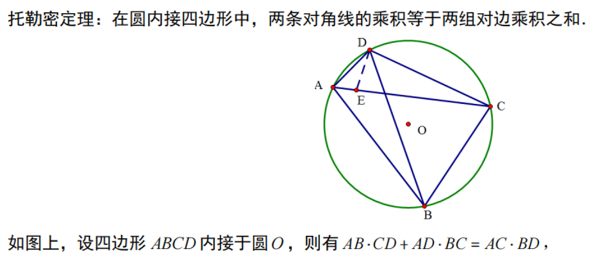
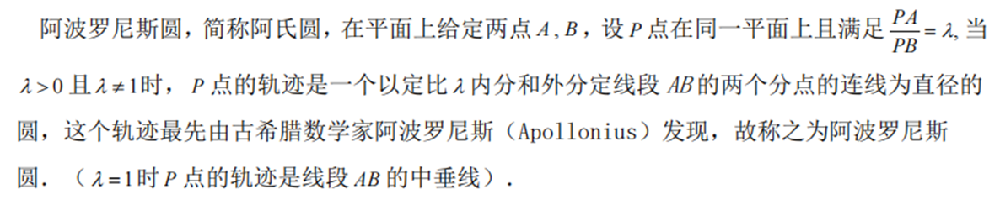
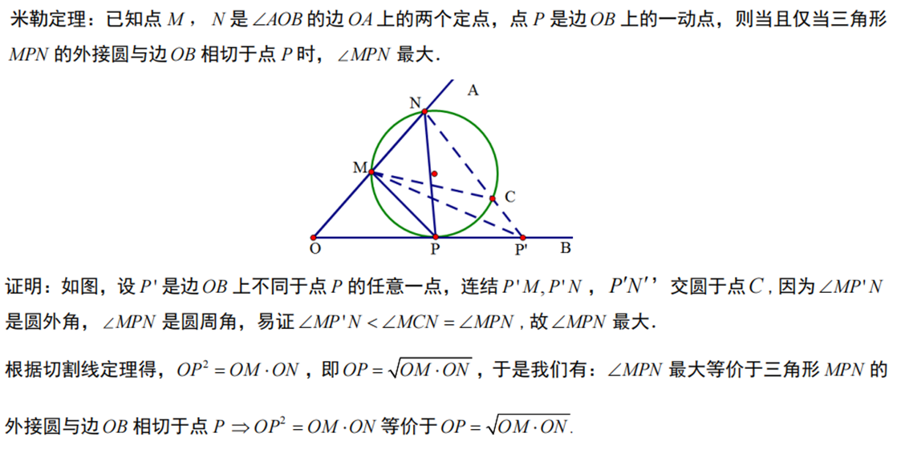
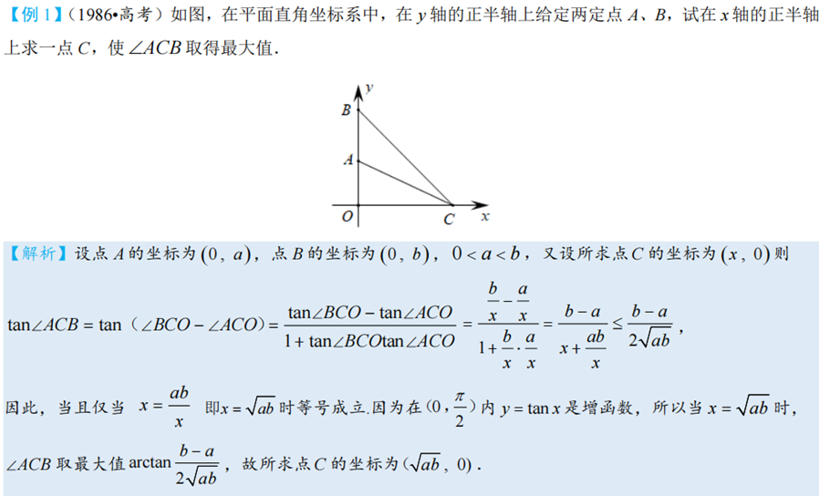
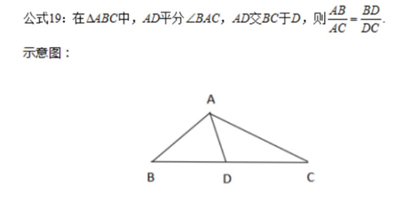
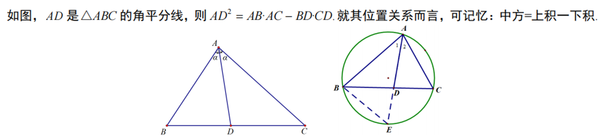
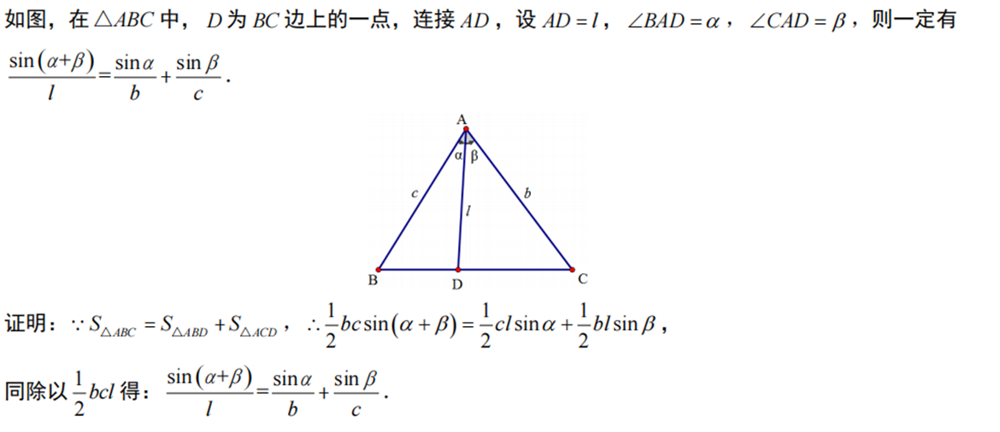
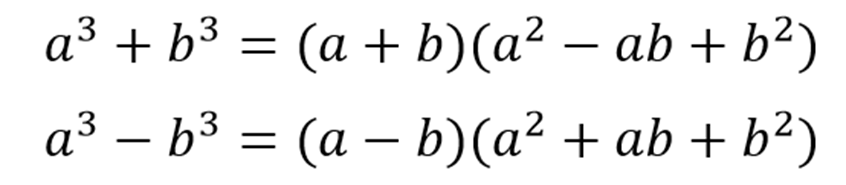
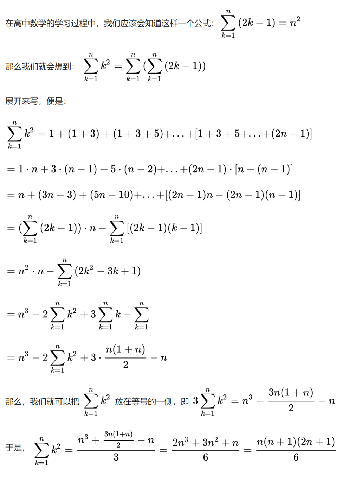

## 1.托勒密定理

## 2.阿氏圆与胡不归

两类问题常见于三角函数与向量中，主要针对系数不等的最值问题

### ①阿波罗尼斯圆模型

### ②胡不归模型

## 3.米勒定理

米勒定理也称最大张角定理，有时在模拟题中出现。除此方法外，求最大张角常常利用斜率结合倒角公式构造正切函数求解，如下例题

倒角公式：

## 4.角平分线相关

### ①角平分线定理

其逆定理也成立且此定理可以在解答题中直接应用（阿波罗尼斯圆的几何证明方法中用到）

### ②斯库顿定理

（证明可自己做外接圆尝试）

## 5.张角公式

实质上是利用爪状图形的面积相加得到的

## 6.中线定理

## 7.立方和差公式

## 8.贝努利装错信封问题（此为笔者总结）

事实上代表着排列组合中一种“锁与钥匙”的问题

## 9.蒙日圆及其姊妹圆

## 10.自然数的平方和公式

