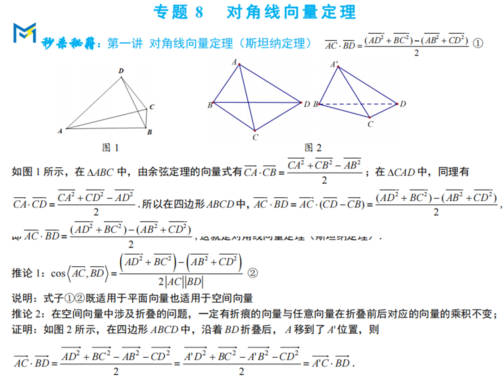
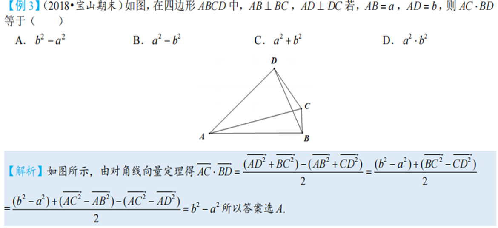

向量是一种高级语言，用向量语言可以书写新的高中数学体系。人生如向量，它与我们的人生有着很多相似之处。选择决定了人生的方向，努力决定了人生的长度。

笔者认为：小题中向量题目，无图计算，有图建系。建系法为主，基底法为辅，方可畅行无阻

## 1.向量的基底与向量共线定理

## 2.向量的极化恒等式

在△ABC中，若M是BC的中点，则$\vec{AB} \cdot \vec{AC} = \vec{AM}^2 - \frac{1}{4}\vec{BC}^2 = \vec{AM}^2 - \vec{BM}^2$.

极化恒等式是平面向量中应用最广泛的结论，其将向量的数量积全部转换到模长的运算，作用极大

## 3.平面向量与三角形的四心问题（奔驰定理）

### 重心定理：

已知$△ABC的顶点A(x₁,y₁), B(x₂,y₂), C(x₃,y₃), 则△ABC的重心坐标为G(x,y)$.

**注意：**

(1) 在$△ABC中，若O为重心$，则$\vec{OA} + \vec{OB} + \vec{OC} = \vec{0}$。

(2) 三角形的重心分中线两段线段长度比为2:1，且分开的三个三角形面积相等。

重心的向量表示：$\vec{AG} = \frac{1}{3}\vec{AB} + \frac{1}{3}\vec{AC}$

### 奔驰定理：

 $S_A\vec{OA} + S_B\vec{OB} + S_C\vec{OC} = \vec{0}$ ()，则$△AOB，△AOC，△BOC$的面积比等于是$λ₃:λ₂:λ₁$.

### **垂心定理：**

三角形三边上的高交于一点。点$O是△ABC$的垂心，则$\vec{OA}\cdot\vec{OB} = \vec{OB}\cdot\vec{OC} = \vec{OC}\cdot\vec{OA}$。

### **角平分线定理：**

 若$\vec{OA} = a\vec{a}$，$\vec{OB} = b\vec{b}$，则$∠AOB$平分线上上的向量$\vec{OM}$为$(\frac{a}{|a|} + \frac{b}{|b|})$，由$\vec{OM}$决定三个顶点的距离相等；

### **外心定理：**

**垂直平分线的交点，到三个顶点的距离相等；**

(1) $\vec{AO}\cdot\vec{AB} = \frac{1}{2}|\vec{AB}|^2$； $\vec{AO}\cdot\vec{AC} = \frac{1}{2}|\vec{AC}|^2$； $\vec{BO}\cdot\vec{BC} = \frac{1}{2}|\vec{BC}|^2$；

(2) $\vec{AO}\cdot\vec{AF} = \frac{1}{4}|\vec{AB}|^2 + \frac{1}{4}|\vec{AC}|^2$； $\vec{BO}\cdot\vec{BE} = \frac{1}{4}|\vec{AB}|^2 + \frac{1}{4}|\vec{BC}|^2$； $\vec{CO}\cdot\vec{CD} = \frac{1}{4}|\vec{BC}|^2 + \frac{1}{4}|\vec{AC}|^2$；

(3) $\vec{AO}\cdot\vec{BC} = \frac{1}{2}|\vec{AC}|^2 - \frac{1}{2}|\vec{AB}|^2$； $\vec{BO}\cdot\vec{AC} = \frac{1}{2}|\vec{BC}|^2 - \frac{1}{2}|\vec{BA}|^2$； $\vec{CO}\cdot\vec{AB} = \frac{1}{2}|\vec{BC}|^2 - \frac{1}{2}|\vec{AC}|^2$；

### 证明：

**重心定理证明：** $\vec{AG} = \frac{2}{3}\vec{AD} = \frac{2}{3}(\frac{1}{2}(\vec{AB} + \vec{AC})) = \frac{1}{3}\vec{AB} + \frac{1}{3}\vec{AC}$

**奔驰定理证明：** 令$\vec{OA_1} = \vec{OA}$，$\vec{OB_1} = \vec{OB}$，$\vec{OC_1} = \vec{OC}$，即确定$\vec{OA_1} + \vec{OB_1} + \vec{OC_1} = \vec{0}$

$S_{AOB} = \frac{1}{\lambda_3\lambda_2}$，$S_{AOC} = \frac{1}{\lambda_3\lambda_1}$，$S_{BOC} = \frac{1}{\lambda_2\lambda_1}$，故$S_{AOB}:S_{AOC}:S_{BOC} = \lambda_3:\lambda_2:\lambda_1$

**垂心定理证明：** $\vec{OA}\cdot\vec{OB} = \vec{OB}\cdot\vec{OC} => \vec{OB}\cdot(\vec{OA}-\vec{OC}) = \vec{0} => \vec{OB}\perp\vec{CA} = 0$，即OB⊥CA，以此类推。

**角平分线定理证明：** $\frac{\vec{a}}{|a|}$和$\frac{\vec{b}}{|b|}$分别为$\vec{OA}$和$\vec{OB}$方向上的单位向量，$(\frac{\vec{a}}{|a|} + \frac{\vec{b}}{|b|})$是$\vec{a}$和$\vec{b}$一线段的向量，而此平行四边形为菱形，故$(\frac{\vec{a}}{|a|} + \frac{\vec{b}}{|b|})$在∠AOB平分线上，但∠AOB平分线上向$\vec{OM}$终点的量由$\vec{OM}$决定，当λ=1时，四边形$OAMB$构成$∠AOB=120°$的菱形。

## 4.向量的等和线

## 5.向量对角线定理（斯坦纳定理）

此定理常用于空间向量中，其特点是省去了对空间关系的思考，仅用模长就可求出数量积。多应用于已知大多线段模长的定图形和折叠问题中

此处搭配例题以助理解

