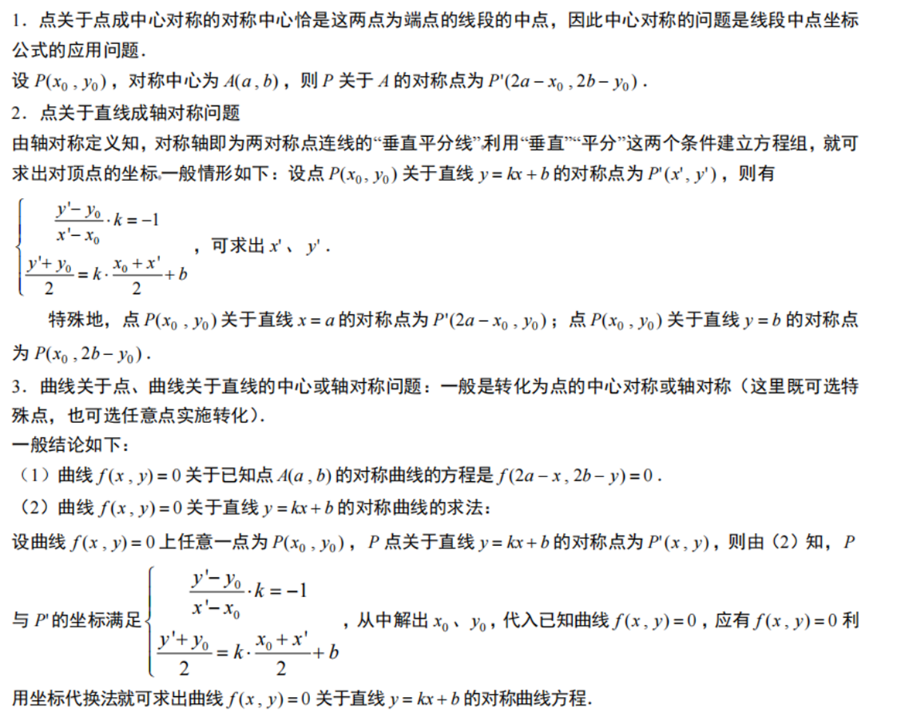
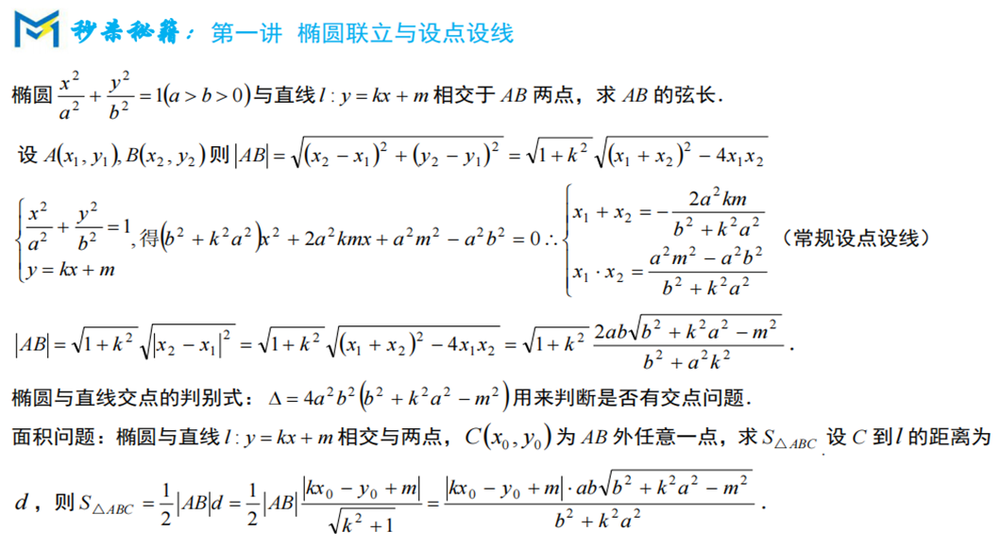
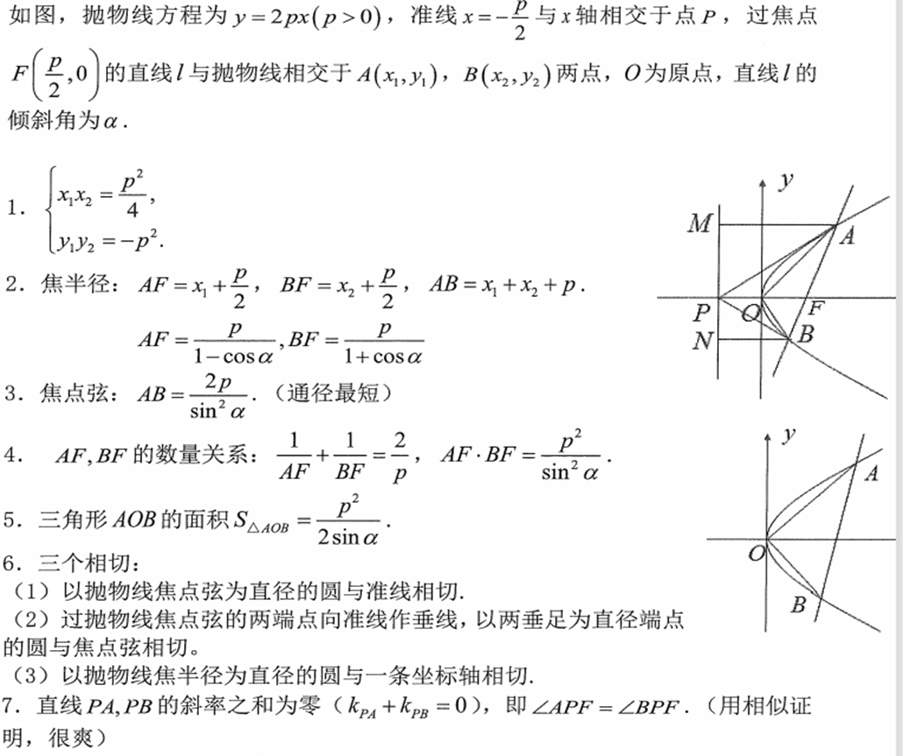
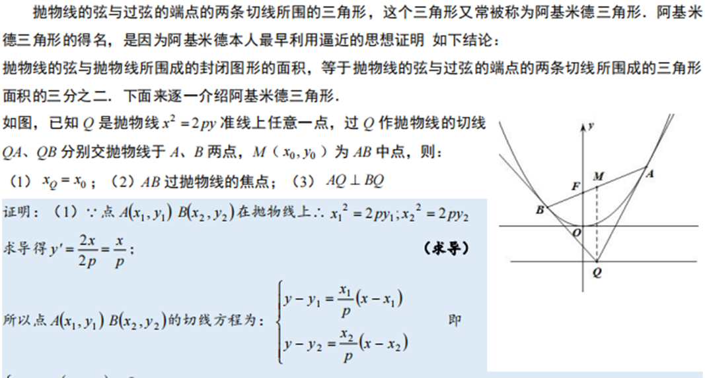
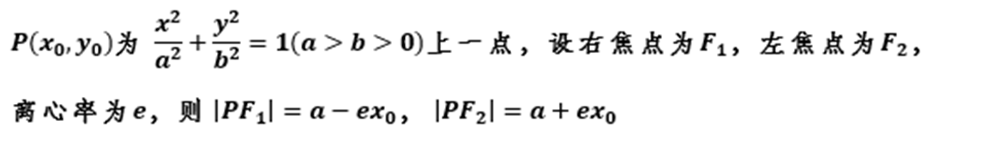

众所周知，解析几何是数学史上划时代的里程碑式的登峰造极之作。在解析几何中，方程是刻画曲线性质的代数语言，而曲线则是描绘方程特征的图像语言。数与形的高度统一，使得两者浑然一体，相得益彰。所以，解析几何是神奇的，它不仅把代数和几何融合在一起，而且把曲面与平面统一在一起。数形结合的思想在这里获得圆满的体现，在解析几何中时刻闪烁着数形结合的光芒。

数学家拉格朗日说过：“只要代数和几何分道扬镳，它们各自的发展就变得缓慢，它们的应用就变得狭窄。代数与几何两门学科一旦联袂而往，它们就会从对方吸收新鲜的活力，从而大踏步地走向各自的完美。”

解析几何把方程与曲线进行了深度捆绑。如果说方程是曲线的神圣化身，那曲线则是方程的完美舞姿。所以，有人说曲线与方程“你是风儿，我是沙，缠缠绵绵绕天涯”。

圆锥曲线的结论是高中数学最多，最繁杂的，盲目记忆仅是浪费时间与影响解题思路。推荐记忆常见思路，仅熟悉套路而不关注具体数据

## 1对称问题

### 总结：

定理1：点$A(x_0, y_0)$关于直线$l: x = m$的对称点坐标为$A'(2m - x_0, y_0)$。

点$A(x_0, y_0)$关于直线$l: y = n$的对称点坐标为$A'(x_0, 2n - y_0)$。

直线$l_1: Ax + By + C = 0$关于直线$l: x = m$的对称直线方程为$l_2: A(2m - x) + By + C = 0$。

直线$l_1: Ax + By + C = 0$关于直线$l: y = n$的对称直线方程为$l_2: Ax + B(2n - y) + C = 0$。

定理2：点$A(x_0, y_0)$关于直线$l: x + y + C = 0$的对称点坐标为$A'(-C - y_0, -C - x_0)$。

点$A(x_0, y_0)$关于直线$l: x - y + C = 0$的对称点坐标为$A'(-C + y_0, C + x_0)$。

直线$l_1: Ax + By + C' = 0$关于直线$l: x + y + C = 0$的对称直线方程为$l_2: A(-C - y) + B(-C - x) + C' = 0$；

直线$l_1: Ax + By + C' = 0$关于直线$l: x - y + C = 0$的对称直线方程为$l_2: A(-C + y) + B(C + x) + C' = 0$；

## 2.直线系和圆系方程

## 3.圆锥曲线硬解定理

如有能力可以记忆，但是使用一定要确保自己背记准确

## 4.抛物线结论

相较与椭圆与双曲线，抛物线的结论更加实用

## 5.抛物线中的阿基米德三角形

（2021全国乙卷已考）

## 6圆锥曲线的切线方程

推导使用“隐函数法”或者“求导法”

## 7.仿射变换

仿射变换在课本中出现，但是常用于一些结论的证明中，实际应用极少（如非万不得已勿用）

## 8.焦半径公式

### 第一种：与坐标有关

### 第二种：与倾斜角有关

## 9.斜率齐次化

此法主要应用于题给条件涉及到斜率

有两种写法（平移直线）（平移坐标系）一般写法均为平移直线

1. **设直线方程**

设直线方程为：
$ m(x - x_0) + n(y - y_0) = 1 $
这种设法是为了方便后续的齐次化操作，将直线方程与圆锥曲线方程联立时，可以构造出齐次方程。

2. **联立圆锥曲线方程**

假设圆锥曲线方程为 $ F(x, y) = 0 $，将其与直线方程联立：
$ m(x - x_0) + n(y - y_0) = 1 $
$F(x, y) = 0$

3. **构造齐次方程**

为了将方程齐次化，将圆锥曲线方程中的常数项乘以 $[m(x - x_0) + n(y - y_0)]^2$，一次项乘以 $m(x - x_0)^2 + n(y - y_0)^2$，构造出齐次方程：
$ a(x - x_0)^2 + b(y - y_0)^2 = 0 $
其中，$a$ 和 $b$ 是通过上述构造得到的系数。

4. **化简齐次方程**

假设 $(x - x_0)^2 \neq 0$，将齐次方程两边同时除以 $(x - x_0)^2$，得到：
$ b \left( \frac{y - y_0}{x - x_0} \right)^2 + a = 0 $
其中，$\frac{y - y_0}{x - x_0}$ 表示直线 $AP$ 或 $AQ$ 的斜率 $k$。

5. **利用韦达定理**

由于 $P$ 和 $Q$ 是直线与圆锥曲线的交点，设 $P$ 和 $Q$ 对应的斜率分别为 $k_1$ 和 $k_2$，则上述方程可以写为：
$ bk^2 + a = 0 $
根据韦达定理：
$ k_1 + k_2 = -\frac{a}{b} \quad \text{(斜率之和)} $
$ k_1 k_2 = \frac{a}{b} \quad \text{(斜率之积)} $

6. **得出结论**

通过上述推导，可以直接利用韦达定理得出斜率之和或斜率之积，从而证明其为定值。

可以参考做2017全国一卷题目

## 10.圆锥曲线中参数方程的应用

## 11.圆锥曲线中极坐标的应用

## 12.圆锥曲线求离心率

