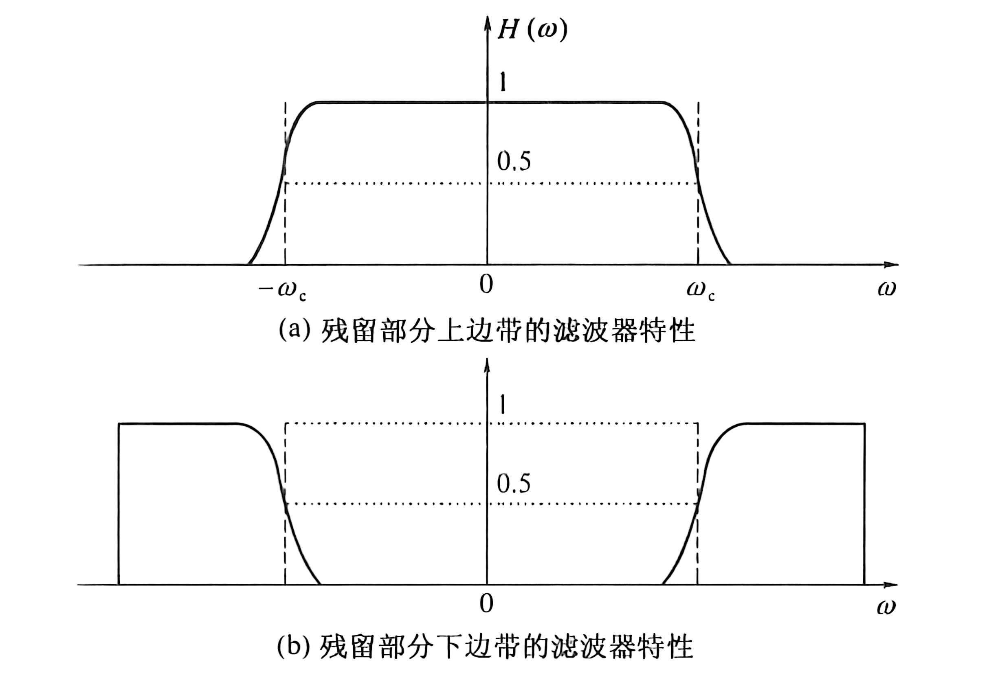
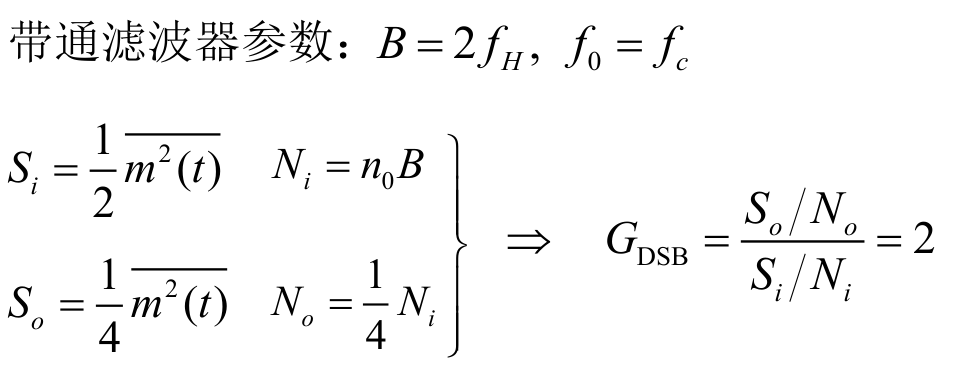
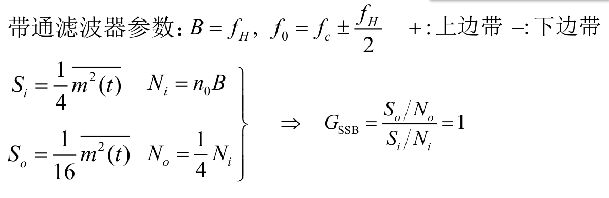
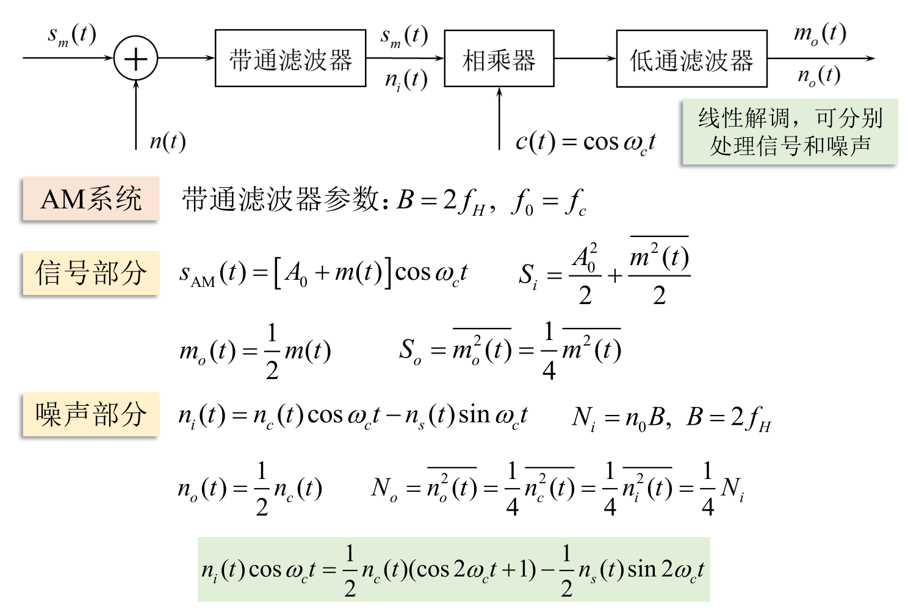

# 模拟调制系统

调制的作用:

1. 提高发射效率
2. 匹配信道特性，减小天线尺寸，提高辐射效率
3. 实现信道的多路复用，提高信道利用率
4. 扩展信号的带宽，提高系统抗干扰能力

## 线性(幅度)调制

### 调幅AM(常规双边带调制)

时域表达式:
$$
s_{\mathrm{AM}}(t)=\left[A_{0}+m(t)\right]\mathrm{cos}\omega_{\mathrm{c}}t=A_{0}\mathrm{cos}\omega_{\mathrm{c}}t+m(t)\mathrm{cos}\omega_{\mathrm{c}}t
$$
频域表达式:
$$
S_{\mathrm{AM}}(\omega)=\pi A_{0}[\delta(\omega+\omega_{\mathrm{c}})+\delta(\omega-\omega_{\mathrm{c}})]+\frac{1}{2}[M(\omega+\omega_{\mathrm{c}})+M(\omega-\omega_{\mathrm{c}})]
$$

当
$$
\mid m(t)\mid_{\max}\leqslant A_0
$$
时，$AM$波的包络和调制信号$m(t)$的形状完全一样.用包络检波的方法很容易恢复出原始调制信号

可以看出，$AM$信号的频谱由载频分量、上边带、下边带三部分组成

其带宽是基带信号带宽$f_H$的两倍
$$
B_{\mathrm{AM}}=2f_{\mathrm{H}}
$$
总功率
$$
\begin{aligned}
P_{\mathrm{AM}}&=\overline{s_{\mathrm{AM}}^{2}\left(t\right)}=\overline{\left[A_{0}+m\left(t\right)\right]^{2}\cos^{2}\omega_{\mathrm{c}}t}\\\\
&=\overline{A_0^2\mathrm{cos}^2\omega_\mathrm{c}t}+\overline{m^2(t)\mathrm{cos}^2\omega_\mathrm{c}t}+\overline{2A_0m(t)\mathrm{cos}^2\omega_\mathrm{c}t}\\\\
&=\frac{A_0^2}{2}+\frac{m^2(t)}{2}\\\\
&=P_{c}+P_{s}
\end{aligned}
$$
分为载波功率$P_{c}$和边带功率$P_{c}$

定义**调制效率**
$$
\eta_{\mathrm{AM}}=\frac{P_{\mathrm{s}}}{P_{\mathrm{AM}}}=\frac{\overline{m^{2}(t)}}{A_{0}^{2}+\overline{m^{2}(t)}}
$$
当调制信号为单音余弦信号$m\left(t\right)=A_m\mathrm{cos}\omega_mt$时，${m^2(t)}=\frac{A_m^2}{2}$

此时
$$
\eta_{\mathrm{AM}}=\frac{\overline{m^2(t)}}{A_0^2+\overline{m^2(t)}}=\frac{A_m^2}{2A_0^2+A_m^2}
$$

在满调幅时，调制效率最大值为$\frac{1}{3}$，因此$AM$信号的功率利用率比较低

$AM$调幅需满足条件
$$
\overline{m(t)}=0\\\\
\mid m(t)\mid_{\max}\leqslant A_0
$$

### 双边带调制DSB

相比于调幅，抑制了载波分量，即在$AM$模型中去除直流$A_0$得到双边带信号$DSB$ 

占用带宽与$AM$相同

$DSB$信号的包络不再与调制信号的变化规律一致，需要采用相干解调

调制效率是$100\%$

时域表达式
$$
s_{\mathrm{DSB}}(t)=m(t)\cos\omega_{\mathrm{c}}t
$$
频域表达式
$$
S_{\mathrm{DSB}}(\omega)=\frac{1}{2}[M(\omega+\omega_{\mathrm{c}})+M(\omega-\omega_{\mathrm{c}})]
$$

### 单边带调制SSB

将双边带信号中的一个边带滤掉而形成单边带信号$SSB$，占用带宽窄，且节省了发送功率

缺点:发射设备较复杂，解调也需要进行相干解调

#### 滤波法

滤波法$SSB$信号的频谱可以表示为
$$
S_{\mathrm{SSB}}(\omega)=S_{\mathrm{DSB}}(\omega)\cdot H(\omega)
$$
其中$H(\omega)$为单边带滤波器的传输函数

对于滤除下边带，保留上边带而言
$$
H(\omega)=H_{\mathrm{USB}}(\omega)=\begin{cases}1&|\omega|>\omega_{\mathrm{c}}\\\\0&|\omega|\leqslant\omega_{\mathrm{c}}&\end{cases}
$$
对于滤除上边带，保留下边带而言
$$
H(\omega)=H_{\mathrm{LSB}}(\omega)=\begin{cases}1&|\omega|<\omega_{\mathrm{c}}\\\\0&|\omega|\geqslant\omega_{\mathrm{c}}&\end{cases}
$$

滤波法形成上边带$USB$信号的频谱图如下

#### 相移法

相移法$SSB$信号的时域表达式为
$$
s_{\mathrm{SSB}}(t)=\frac{1}{2}m(t)\cos\omega_{\mathrm{c}}t\mp\frac{1}{2}\hat{m}(t)\sin\omega_{\mathrm{c}}t
$$
其中，$\hat{m}(t)$为$m(t)$的希尔伯特($Hilbert$)变换，其傅里叶变换为
$$
\hat{M}\left(\omega\right)=M\left(\omega\right)\cdot\left[-\mathrm{jsgn}\omega\right]
$$

原理框图

### 残留边带调制VSB

优点:既克服了$DSB$信号占用频带宽的缺点，又解决了$SSB$信号实现中的困难，滤波器$H(\omega)$不再要求十分陡峭的截止特性

推导$H(\omega)$:由滤波法，残留边带信号$VSB$的频谱为
$$
\begin{aligned}
S_{\mathrm{VSB}}(\omega)&=S_{\mathrm{DSB}}(\omega)\cdot H(\omega)\\\\
&=\frac{1}{2}[M(\omega+\omega_c)+M(\omega-\omega_c)]H(\omega)
\end{aligned}
$$

留空:从相干解调的过程来分析$H(\omega)$的特性

为了保证相干解调的输出无失真地恢复调制信号$m(t)$，必须要求
$$
H(\omega+\omega_\mathrm{c})+H(\omega-\omega_\mathrm{c})=\text{常数}\quad|\omega|\leqslant\omega_\mathrm{H}
$$
上式含义是:残留边带滤波器的特性$H(\omega)$在$\pm\omega_{\mathrm{c}}$处必须具有互补对称(奇对称)的特性

满足上式的残留边带滤波器特性见下图，且每一种形式的滚降特性曲线不唯一

### 线性调制的一般模型

线性调制一般输出已调信号的信号时域和频域表达式为
$$
\begin{aligned}
s_m(t)&=\left[m(t)\mathrm{cos}\omega_\mathrm{c}t\right]*h(t)\\\\
S_m(\omega)&=\frac{1}{2}[M(\omega+\omega_c)+M(\omega-\omega_c)]H(\omega)
\end{aligned}
$$

将信号时域表达式展开得
$$
s_m(t)=s_1(t)\cos\omega_\mathrm{c}t+s_\mathrm{Q}(t)\sin\omega_\mathrm{c}t
$$
其中
$$
s_{1}(t)=h_{1}(t)*m(t)\quad h_{1}(t)=h(t)\mathrm{cos}\omega_{\mathrm{c}}t\\
s_{Q}(t)=h_{Q}(t)*m(t)\quad h_{Q}(t)=h(t)\mathrm{sin}\omega_{\mathrm{c}}t
$$

### 相干解调与包络检波

**解调**是调制的逆过程，其作用是从接收的已调信号中恢复原基带信号

#### 相干解调

送入解调器的已调信号的一般表达式为
$$
s_m(t)=s_1(t)\cos\omega_\mathrm{c}t+s_\mathrm{Q}(t)\sin\omega_\mathrm{c}t
$$
与同频同相的相干载波$c(t)$相乘得
$$
\begin{aligned}s_{p}\left(t\right)&=s_m\left(t\right)\mathrm{cos}\omega_ct\\\\&=\frac{1}{2}s_1(t)+\frac{1}{2}s_1(t)\cos2\omega_ct+\frac{1}{2}s_Q(t)\sin2\omega_ct\end{aligned}
$$
经低通滤波器$LPF$后得
$$
s_{\mathrm{d}}(t)=\frac{1}{2}s_{\mathrm{l}}(t)
$$
可知
$$
s_\mathrm{d}(t)=\frac{1}{2}s_\mathrm{I}(t)\propto m(t)
$$
由此可见，相干解调器适用于所有线性调制信号的解调

实现关键:接收端要提供一个与载波信号严格同步的相干载波(同频同相)

分析:相干载波相位不同步时的解调是什么解调结果是什么

#### 非相干解调:包络检波

$AM$信号在满足条件
$$
\mid m\left(t\right)\mid_{\max}\leqslant A_{0}
$$
包络检波器通常由半波/全波整流器和低通滤波器组成，属于非相干解调

设输入$AM$信号
$$
s_{\mathrm{AM}}(t)=\left[A_{0}+m(t)\right]\mathrm{cos}\omega_{\mathrm{c}}t
$$
$RC$满足
$$
f_{H}\ll\frac{1}{RC}\ll f_{c}
$$
其中$f_{H}$为调制信号的最高频率，$f_{c}$为载波的频率

检波器的输出为
$$
s_{\mathrm{d}}(t)=A_{0}+m(t)
$$
隔去直流后即得原信号$m(t)$

## 非线性(角度)调制

角度调制信号的一般表达式为
$$
s_m(t)=A\mathrm{cos}[\omega_\mathrm{c}t+\varphi(t)]
$$
$A$为载波的恒定振幅

$[\omega_\mathrm{c}t+\varphi(t)]$为信号的瞬时相位，记为$\theta\left(t\right)$

$\varphi(t)$为相对于载波相位$\omega_\mathrm{c}t$的瞬时相位偏移

$\mathrm{d}\left[\omega_{\mathrm{c}}t+\varphi\left(t\right)\right]/\mathrm{d}t$为信号的瞬时角频率，记为$w(t)$

$\mathrm{d}\varphi(t)/\mathrm{d}t$为相对于载频$w_{c}$的顺时频偏

### 频率调制FM

指瞬时频率偏移随调制信号$m_{t}$成比例变化

$$
\frac{\mathrm{d}\varphi(t)}{\mathrm{d}t}=K_fm(t)
$$
调频信号为
$$
s_{_{\mathrm{FM}}}(t)=A\cos\left[\omega_{_{\mathrm{c}}}t+K_{_{f}}\int m(\tau)\mathrm{d}\tau\right]
$$

设调制信号为单一频率的正弦波，即
$$
m(t)=A_{m}\mathrm{cos}\omega_{m}t=A_{m}\mathrm{cos}2\pi f_{m}t
$$
$FM$调制信号为
$$
\begin{aligned}
s_{\mathrm{FM}}\left(t\right)&=A\cos\left[\omega_{\mathrm{c}}t+K_{f}A_{m}\int\mathrm{cos}\omega_{m}\tau\mathrm{d}\tau\right]\\\\
&=A\cos\left[\omega_{\mathrm{c}}t+m_{f}\mathrm{sin}\omega_{m}t\right]
\end{aligned}
$$
其中$m_{f}$为调制指数，表示最大的相位偏移  
$$
m_f=\frac{K_fA_m}{\omega_m}=\frac{\Delta\omega}{\omega_m}=\frac{\Delta f}{f_m}
$$
$\Delta\omega=K_fA_m$为最大角频偏

 $\Delta f=m_f f_m$为最大频偏

### 相位调制PM

指瞬时相位偏移随调制信号$m(t)$成比例变化
$$
\varphi(t)=K_{\mathrm{P}}m(t)
$$
调相信号为
$$
s_{_{\mathrm{PM}}}(t)=A\mathrm{cos}\left[\omega_{_{\mathrm{c}}}t+K_{_{\mathrm{P}}}m(t)\right]
$$

设调制信号为单一频率的正弦波，即
$$
m(t)=A_{m}\mathrm{cos}\omega_{m}t=A_{m}\mathrm{cos}2\pi f_{m}t
$$
$PM$调制信号为
$$
\begin{aligned}
s_{\mathrm{PM}}\left(t\right)&=A\cos\left[\omega_{\mathrm{c}}t+K_{\mathrm{P}}A_{m}\mathrm{cos}\omega_{m}t\right]\\\\
&=A\cos\left[\omega_{\mathrm{c}}t+m_{\mathrm{P}}\mathrm{cos}\omega_{m}t\right]
\end{aligned}
$$
其中$m_{\mathrm{P}}=K_{\mathrm{P}}A_{m}$称为调相系数，表示最大的相位偏移

### FM与PM关系

### 窄带调频NBFW

$FM$的最大瞬时相位偏移满足
$$
\left|K_f\int m(\tau)\mathrm{d}\tau\right|\ll\frac{\pi}{6}\quad\text{(或0.5)}
$$
由
$$
\begin{aligned}
s_{\mathrm{FM}}(t)&=A\cos\left[\omega_{\mathrm{c}}t+K_{f}\int m(\tau)\mathrm{d}\tau\right]\\&=A\cos\omega_{\mathrm{c}}t\cos\left[K_{f}\int m(\tau)\mathrm{d}\tau\right]-A\sin\omega_{\mathrm{c}}t\sin\left[K_{f}\int m(\tau)\mathrm{d}\tau\right]
\end{aligned}
$$
满足窄带调频时有
$$
\cos\left[K_{f}\int m\left(\tau\right)\mathrm{d}\tau\right]\approx1\\
\sin\left[K_{f}\int m\left(\tau\right)\mathrm{d}\tau\right]\approx K_{f}\int m\left(\tau\right)\mathrm{d}\tau
$$
于是可简化为
$$
s_{\mathrm{NBFM}}(t)\approx A\mathrm{cos}\omega_{\mathrm{c}}t-\left[AK_{f}\int m(\tau)\mathrm{d}\tau\right]\mathrm{sin}\omega_{\mathrm{c}}t
$$
频域表达式
$$
s_{\mathrm{NBFM}}\left(\omega\right)=\pi A\left[\delta(\omega+\omega_{\mathrm{c}})+\delta(\omega-\omega_{\mathrm{c}})\right]\\+\frac{AK_f}{2}\left[\frac{M(\omega-\omega_\mathrm{c})}{\omega-\omega_\mathrm{c}}-\frac{M(\omega+\omega_\mathrm{c})}{\omega+\omega_\mathrm{c}}\right]
$$
假设调制单音信号
$$
m(t)=A_m\cos\omega_mt
$$
那么
$$
\begin{aligned}S_{\mathrm{NBFM}}(t)&\approx A\cos\omega_ct-\left[AK_f\int m(\tau)\mathrm{d}\tau\right]\sin\omega_ct\\\\&=A\cos\omega_ct-\frac{AA_mK_f}{\omega_m}\sin\omega_mt\cdot\sin\omega_ct\\\\&=A\cos\omega_ct+\frac{AA_mK_f}{2\omega_m}\left[\cos(\omega_c+\omega_m)t-\cos(\omega_c-\omega_m)t\right]\end{aligned}
$$

### 宽带调频WBFM

留空:分析

### 调频信号的产生与解调

#### 产生

1. 直接调频法

用调制信号直接去控制载波振荡器的频率，使其按调制信号的规律线性地变化

2. 间接调频法

将调制信号积分，然后对载波进行调相，即可产生$NBFM$信号，再经$n$次倍频器得到$WBFM$信号

#### 解调

1. 非相干解调

要解调信号
$$
s_{\mathrm{FM}}(t)=A\mathrm{cos}\left[\omega_{\mathrm{c}}t+K_{f}\int m(\tau)\mathrm{d}\tau\right]
$$
输出应该满足
$$
m_o(t)\propto K_fm(t)
$$
完成这种转换的器件称作**鉴频器**，可分为振幅鉴频器、相位鉴频器、比例鉴频器、正交鉴频器、斜率鉴频器、频率负反馈解调器、锁相环($PLL$)鉴频器

例如下面振幅鉴频器

经过微分电路后
$$
\left.s_{\mathrm{d}}(t)=-A\left[\omega_{\mathrm{c}}+K_{f}m(t)\right]\sin\left[\omega_{\mathrm{c}}t+K_{f}\right]m(\tau)\mathrm{d}\tau\right]
$$
经过包络检波器将其幅度变换检出并滤去直流
$$
m_{_0}(t)=K_{_d}K_{_f}m(t)
$$
其中$K_{_d}$为鉴频器灵敏度

2. 相干解调

设窄带调频信号
$$
s_{_\mathrm{NBFM}}(t)=A\mathrm{cos}\omega_{_\mathrm{c}}t-A\left[K_{_f}\int m(\tau)\mathrm{d}\tau\right]\mathrm{sin}\omega_{_\mathrm{c}}t
$$
并设相干载波
$$
c(t)=-\mathrm{sin}\omega_{\mathrm{c}}t
$$
则相乘器输出
$$
s_{_p}(t)=-\frac{A}{2}\mathrm{sin}2\omega_{_\mathrm{c}}t+\frac{A}{2}\left[K_{_f}\left[m(\tau)\mathrm{d}\tau\right]\cdot(1-\mathrm{cos}2\omega_{_\mathrm{c}}t)\right.
$$
经过$LPF$得
$$
s_{\mathrm{d}}(t)=\frac{A}{2}K_{f}\int m(\tau)\mathrm{d}\tau
$$
再经微分器得
$$
m_{\mathrm{o}}(t)=\frac{AK_{f}}{2}m(t)
$$
与线性调制中的相干解调一样，要求本地载波与调制载波同步

## 线性调制系统的抗噪声性能

加性噪声被认为只对已调信号的接收产生影响，因而通信系统的抗噪声性能可以用解调器的抗噪声性能来衡量.

下面研究在信道加性高斯白噪声的背景下，各种线性调制系统的抗噪声性能

### 相干解调：DSB

### 相干解调：SSB

$DSB$系统和$SSB$系统抗噪声性能相同，不能直接通过制度增益比较抗噪声性能！

### 相干解调：AM

$100%$调幅单频正弦波$m(t)=A_m\cos\omega_mt$
$$
A_0=A_m\quad\overline{m^2(t)}=\frac{A_m^2}{2}\\
G_{\mathrm{AM}}=\frac{2\overline{m^2(t)}}{A_0^2+\overline{m^2(t)}}=\frac{2}{3}
$$

### 包络检波：AM

1. 大信噪比：（与相干解调相同）
    $$
    \left.\begin{aligned}&S_{i}=\overline{s_{\mathrm{AM}}^{2}(t)}=\frac{A_{0}^{2}}{2}+\frac{\overline{m^{2}(t)}}{2}\quad N_{i}=n_{0}B\\&S_{o}=\overline{m^{2}(t)}\quad N_{o}=\overline{n_{c}^{2}(t)}=N_{i}\end{aligned}\right\}\Rightarrow\quad G_{\mathrm{AM}}=\frac{2\overline{m^{2}(t)}}{A_{0}^{2}+\overline{m^{2}(t)}}
    $$
    
2. 小信噪比：输出信噪比急剧恶化

门限效应：由于包络检波的非线性解调作用，输出信噪比不是按比例随着输入信噪比下降，而是急剧恶化。

## 调频系统的抗噪声性能

设输入调频信号为
$$
s_{\mathrm{FM}}(t)=A\mathrm{cos}\left[\omega_{\mathrm{e}}t+K_{f}\int m(\tau)\mathrm{d}\tau\right]
$$
信号功率为
$$
S_{\mathrm{i}}=\frac{A^{2}}{2}
$$
输入噪声功率为
$$
N_{i}=n_{0}B_{\mathrm{FM}}
$$
其中
$$
B_{\mathrm{FM}}=2(m_f+1)f_m=2\Delta f+2f_m
$$
输入信噪比为
$$
\frac{S_{i}}{N_{i}}=\frac{A^{2}}{2n_{0}B_{FM}}
$$

### 大信噪比时的解调增益

制度增益
$$
G_{\mathrm{FM}}=3m_{f}^{2}(m_{f}+1)
$$

### 小信噪比时的门限效应

调频系统的门限效应

1. 门限值与调制指数$m_{f}$有关，$m_{f}$越大，门限值越高
2. 在门限值以上时，输出信噪比与输入信噪比呈线性关系，且$m_{f}$越大，输出信噪比的改善越明显
3. 在门限值以下，输出信噪比随输入信噪比的下降而急剧下降，且$m_{f}$越大，输出信噪比的下降越快

## 模拟调制系统的比较

### 抗噪声性能

WBFM最好，DSB、SSB、VSB次之，AM最差

### 频带利用率

SSB带宽最窄，频带利用率最高

FM占用带宽随调频指数$m_{f}$的增大而增大，其频带利用率最低(利用有效性换取可靠性)高质量通信$m_{f}$选大些，一般通信$m_{f}$选小些

### 特点与应用

(1) AM调制的优点是接收设备简单; 缺点是功率利用率低，抗干扰能力差。AM制式主要用于<u>中波和短波的调幅广播</u>中。

(2) DSB调制的优点是功率利用率高，且带宽与AM相同，但接收要求同步解调，设备较复杂。应用较少，一般只用于<u>点对点的专用通信</u>。

(3) SSB调制的优点是功率利用率和频带利用率都较高，抗干扰能力和抗选择性衰落能力均优于AM，而带宽只有AM的一半; 缺点是发送和接收设备都复杂。鉴于这些特点，SSB 常用于<u>频分多路复用系统</u>中。

(4) VSB的抗噪声性能和频带利用率与SSB相当。VSB的诀窍在于部分抑制了发送边带，同时又利用平缓滚降滤波器补偿了被抑制部分，这对包含有低频和直流分量的基带信号特别适合，因此，VSB在<u>电视广播</u>等系统中得到了广泛应用。

(5) FM波的幅度恒定不变，这使它对非线性器件不甚敏感，给FM带来了抗快衰落能力。利用自动增益控制和带通限幅还可以消除快衰落造成的幅度变化效应。宽带FM的抗干扰能力强，可以实现带宽与信噪比的互换，因而宽带FM广泛应用于<u>长距离高质量的通信系统</u>中，如空间和卫星通信、调频立体声广播、超短波电台等。宽带FM的缺点是频带利用率低，存在门限效应，因此在接收信号弱、干扰大的情况下宜采用窄带FM，这就是小型通信机常采用窄带调频的原因。