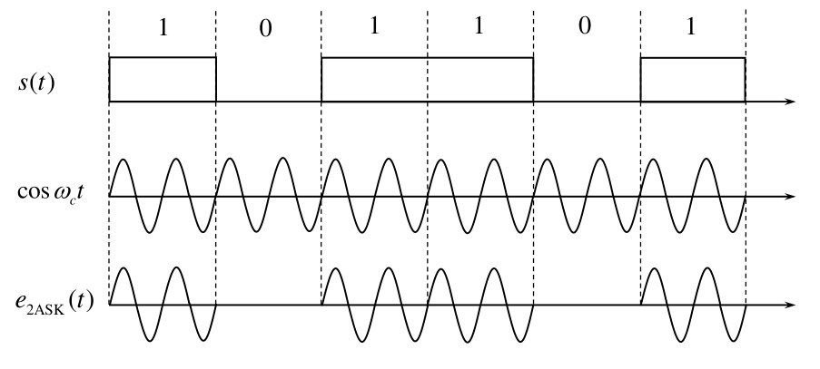
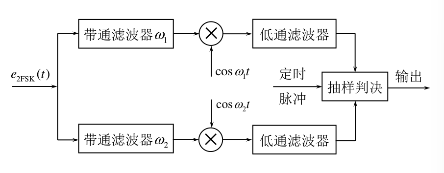
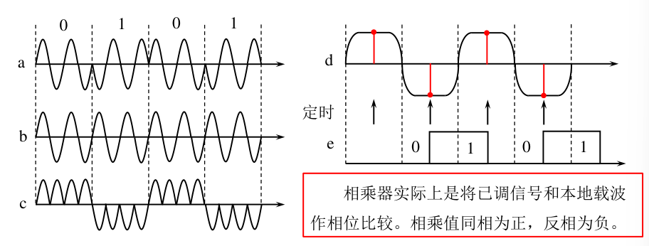
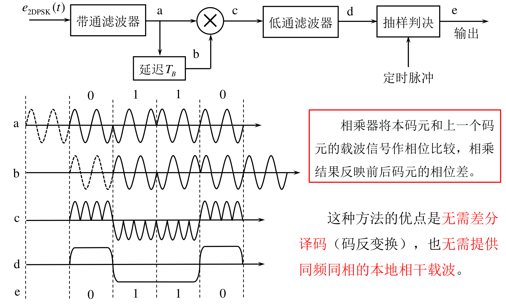
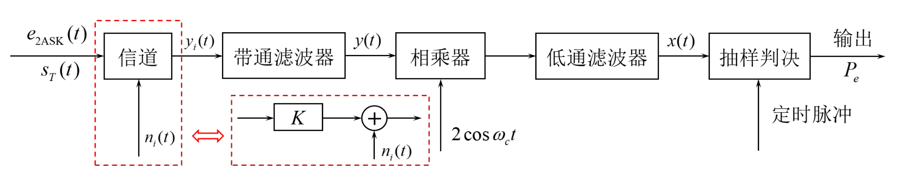
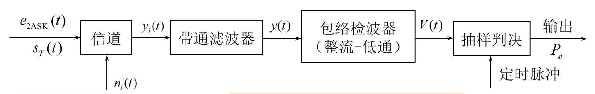
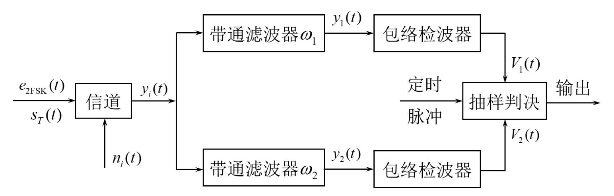
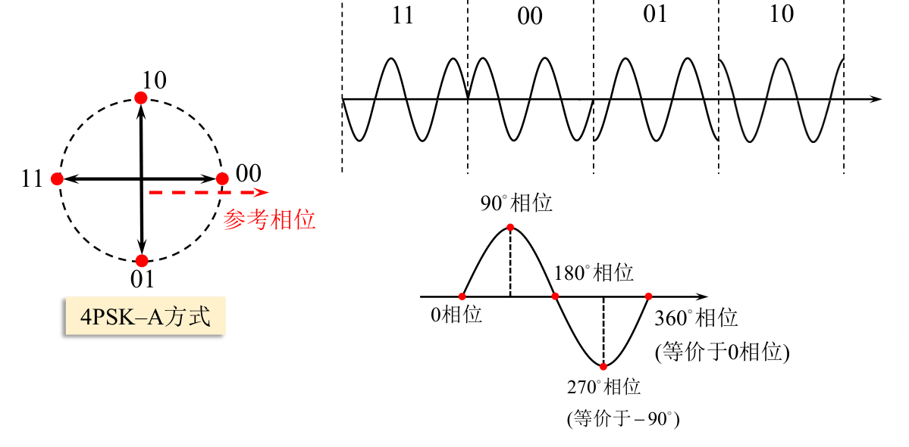
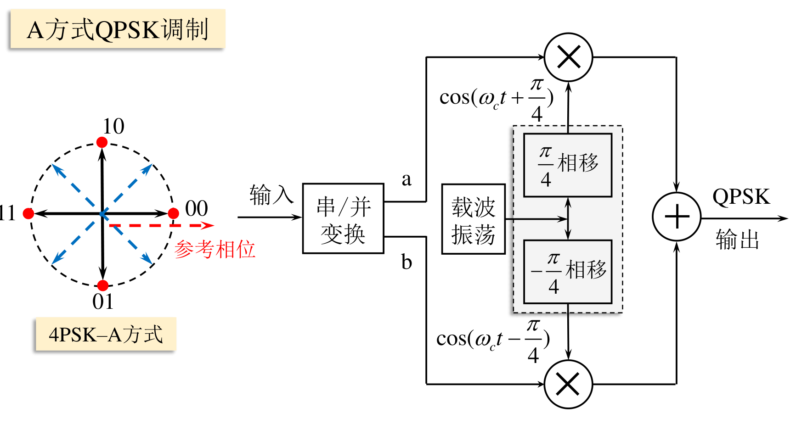
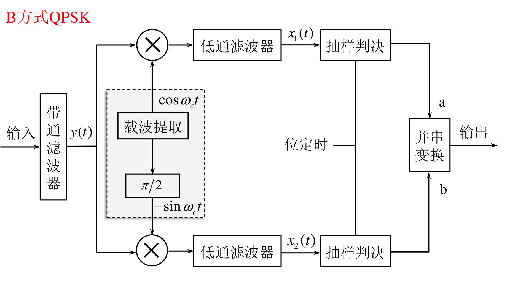

# 数字带通传输系统

## 二进制数字调制原理

调制信号是二进制数字基带信号时的调制称为**二进制数字调制**,把包括调制和解调过程的数字传输系统叫做**数字带通传输系统**

### 二进制振幅键控2ASK

利用载波的幅度变化来传递数字信息,而频率和初始相位保持不变

通-断键控$OOK$（$On-Off Keying$）
$$
e_{00K}(t)=
\begin{cases}A\mathrm{cos}\omega_\mathrm{c}t&\text{以概率 }P\text{ 发送“1” 时}\\\\0&\text{以概率 1 }-P\text{ 发送“0” 时}&
\end{cases}
$$

$2ASK$信号的一般表达式为
$$
e_{2\mathrm{ASK}}(t)=s(t)\mathrm{cos}\omega_{\mathrm{c}}t
$$
其中
$$
s(t)=\sum_{n}a_{n}g(t-nT_{_B})
$$
比如通断键控$OOK$信号就取
$$
a_n=
\begin{cases}1&\text{概率为 }P\\\\0&\text{概率为 }1-P&
\end{cases}
$$

产生方式:

解调方式:相干解调和非相干解调

与模拟信号相比,增加抽样判决器

非相干解调:

相干解调:

$$
e_{2\mathrm{ASK}}(t)\cdot c(t)=s(t)\cos\omega_{c}t\cdot\cos\omega_{c}t=s(t)\cos^{2}\omega_{c}t=\frac{1}{2}s(t)+\frac{1}{2}s(t)\cos2\omega_{c}t
$$
低通滤波后输出$\frac{1}{2}s(t)$

### 二进制频移键控2FSK

基本原理:利用载波的频率变化来传递数字信息,载波的频率随二进制基带信号在$f_{1}$和$f_{2}$间变化
$$
e_{2\mathrm{FSK}}(t)=
\begin{cases}A\cos(\omega_1t+\varphi_n)&\text{发送“1”时}\\\\A\cos(\omega_2t+\theta_n)&\text{发送“0”时}&
\end{cases}
$$

一个$2FSK$信号可以看成两个不同载频的2ASK信号的叠加,即
$$
e_{2\mathrm{FSK}}(t)=s_{1}(t)\cos(\omega_{1}t+\varphi_{n})+s_{2}(t)\cos(\omega_{2}t+\theta_{n})
$$
$\varphi_n$和$\theta_n$不携带信息,所以可简化为
$$
e_{2\mathrm{FSK}}(t)=s_{1}(t)\cos\omega_{1}t+s_{2}(t)\cos\omega_{2}t
$$

产生方法:

解调方法:非相干解调和相干解调  鉴频法 差分检测法  过零检测法

非相干解调:

相干解调:

### 二进制相移键控2PSK

基本原理:利用载波的相位变化来传递数字信息,而振幅和频率保持不变

用初始相位$0$和$\pi$来表示1和0

表述为
$$
e_{2\mathrm{PSK}}(t)=\mathrm{Acos}(\omega_{\mathrm{c}}t+\varphi_{n})
$$
$$
\varphi_n=\left\{\begin{array}{cc}0&\text{发送“0”时}\\\\\pi&\text{发送“1”时}\end{array}\right.
$$
或者
$$
e_{2\mathrm{PSK}}(t)=\begin{cases}\mathrm{Acos}\omega_{\mathrm{c}}t&\text{概率为 }P\\\\-\mathrm{Acos}\omega_{\mathrm{c}}t&\text{概率为 }1-P&\end{cases}
$$
或者
$$
e_{2\mathrm{PSK}}(t)=s(t)\cos\omega_{\mathrm{c}}t
$$

$$
s(t)=\sum_{n}a_{n}g(t-nT_{\mathrm{B}})
$$

$$
a_n=\begin{cases}1&\text{概率为 }P\\\\-1&\text{概率为 }1-P&\end{cases}
$$

产生方式:

解调方式:相干解调

180°的相位模糊度:若相干载波的相位反转180°,解调输出会完全翻转

解决:引入差分相移键控(DPSK)

### 二进制差分相移键控2DPSK

利用前后相邻码元的载波相对相位表示信息
$$
\Delta\varphi=\varphi_n-\varphi_{n-1}=\begin{cases}0&\text{编码"}0"\\\pi&\text{编码"}1"&&\end{cases}
$$
编码规则$b_n=a_n\oplus b_{n-1}$

译码规则$a_{n}=b_{n}\oplus b_{n-1}$

产生方式:

解调方式:

相干解调＋码反变换

差分相干解调

## 二进制数字调制系统的功率谱密度

### 2ASK

$$
e_{2\mathrm{ASK}}(t)=s(t)\mathrm{cos}\omega_{\mathrm{c}}t
$$

$$
P_{2\mathrm{ASK}}(f)=\frac{1}{4}\left[P_{s}(f+f_{c})+P_{s}(f-f_{c})\right]
$$

其是单极性基带信号功率谱$P_{s}(f)$的线性搬移

主瓣带宽是基带信号带宽的2倍
$$
B_{2\mathrm{ASK}}=2f_{B}=\frac{2}{T_{B}}=2R_{B}
$$

2ASK信号的功率谱含载波分量

### 2FSK

$$
e_{2\mathrm{FSK}}(t)=s_{1}(t)\cos(\omega_{1}t+\varphi_{n})+s_{2}(t)\cos(\omega_{2}t+\theta_{n})
$$

$$
P_{2\mathrm{FSK}}(f)=\frac{1}{4}\left[P_{\mathrm{sl}}\left(f-f_{1}\right)+P_{\mathrm{sl}}\left(f+f_{1}\right)\right]+\frac{1}{4}\left[P_{s2}(f-f_{2})+P_{s2}(f+f_{2})\right]
$$

带宽近似为
$$
B_{2\mathrm{FSK}}=2f_{B}+\left|f_{2}-f_{1}\right|=\frac{2}{T_{B}}+\left|f_{2}-f_{1}\right|=2R_{B}+\left|f_{2}-f_{1}\right|
$$

- 当载频差$\left|f_2-f_1\right|>2f_B$时，功率谱形状为双峰谱；
- 当载频差$\left|f_2-f_1\right|<f_B$时，功率谱形状为单峰谱
- 当载频差$f_{_B}<\left|f_2-f_1\right|<2f_B$时，功率谱形状为马鞍形

### 2PSK/2DPSK

$$
e_{2\mathrm{PSK}}(t)=s(t)\cos\omega_{\mathrm{c}}t
$$

$$
P_{2\mathrm{PSK}}(f)=\frac{1}{4}\left[P_{s}(f+f_{c})+P_{s}(f-f_{c})\right]
$$

主瓣带宽
$$
B_{\mathrm{2(D)PSK}}=2f_{B}=\frac{2}{T_{B}}=2R_{B}
$$
$2PSK/2DPSK$信号的功率谱不含载波分量

## 二进制数字调制系统的抗噪声性能

性能指标:系统误码率$P_{e}$

分析前提条件

- 恒参信道,传输系数为$K$
- 带通滤波器等效带宽为$B$
- 噪声为加性高斯白噪声,单边功率谱密度$\frac{n_0}{2}$,噪声功率 $\sigma_n^2=n_0B$

### 2ASK

- **相干解调:**

输入信号
$$
s_\mathrm{T}(t)=\begin{cases}A\cos\omega_\mathrm{c}t&\text{发送“1”时}\\\\0&\text{发送“0”时}&\end{cases}
$$
信道输出信号
$$
y_{i}(t)=\begin{cases}a\cos\omega_{c}t+n_{i}(t)&\text{发送“1”时}\\\\n_{i}(t)&\text{发送“0”时}&\end{cases}
$$
窄带滤波后
$$
y(t)=\begin{cases}a\cos\omega_ct+n(t)&\text{发送“1”时}\\\\n(t)&\text{发送“0”时}&\end{cases}
$$
其中
$$
n(t)=n_c(t)\cos\omega_ct-n_s(t)\sin\omega_ct
$$
代入得
$$
y(t)=\begin{cases}\left[a+n_c(t)\right]\cos\omega_ct-n_s(t)\sin\omega_ct&\text{发送“1”时}\\\\n_c(t)\cos\omega_ct-n_s(t)\sin\omega_ct&\text{发送“0”时}&\end{cases}
$$
乘相干载波后
$$
y(t)\cdot2\cos\omega_ct=\begin{cases}\left[a+n_c(t)\right](\cos2\omega_ct+1)-n_s(t)\sin2\omega_ct&\text{发送“1”时}\\\\n_c(t)(\cos2\omega_ct+1)-n_s(t)\sin2\omega_ct&\text{发送“0”时}&\end{cases}
$$
低通滤波后
$$
x(t)=\begin{cases}a+n_c(t)&\text{发送“1”时}\\\\n_c(t)&\text{发送“0”时}&\end{cases}
$$

所以
$$
f_{1}(x)=\frac{1}{\sqrt{2\pi}\sigma_{n}}\exp\left[-\frac{(x-a)^{2}}{2\sigma_{n}^{2}}\right]\\f_{0}(x)=\frac{1}{\sqrt{2\pi}\sigma_{n}}\exp\left[-\frac{x^{2}}{2\sigma_{n}^{2}}\right]
$$
系统总误码率
$$
\begin{aligned}P_{e}&=P(1)P(0|1)+P(0)P(1|0)\\\\&=P(1)\cdot\int_{-\infty}^{b}f_{1}(x)\mathrm{d}x+P(0)\cdot\int_{b}^{+\infty}f_{0}(x)\mathrm{d}x\end{aligned}
$$
最小时
$$
b^*=\frac{a}{2}+\frac{\sigma_n^2}{a}\ln\frac{P(0)}{P(1)}
$$
符号先验等概时
$$
b^*=\frac{a}{2}
$$
此时
$$
P_e=\frac{1}{2}erfc(\frac{a}{2\sqrt{2}\sigma_n})
$$
而输入端信噪比
$$
r=\frac{a^2}{2\sigma_n^2}
$$
所以
$$
P_{e}=\frac{1}{2}erfc\left(\sqrt{\frac{r}{4}}\right)
$$
大信噪比时(r>>1)
$$
P_{e}\approx\frac{1}{\sqrt{\pi r}}e^{-\frac{r}{4}}
$$

- **包络检波:**

输入信号
$$
s_\mathrm{T}(t)=\begin{cases}A\cos\omega_\mathrm{c}t&\text{发送“1”时}\\\\0&\text{发送“0”时}&\end{cases}
$$
信道输出信号
$$
y_{i}(t)=\begin{cases}a\cos\omega_{c}t+n_{i}(t)&\text{发送“1”时}\\\\n_{i}(t)&\text{发送“0”时}&\end{cases}
$$

窄带滤波后
$$
y(t)=\begin{cases}a\cos\omega_ct+n(t)&\text{发送“1”时}\\\\n(t)&\text{发送“0”时}&\end{cases}
$$
其中
$$
n(t)=n_c(t)\cos\omega_ct-n_s(t)\sin\omega_ct
$$
代入得
$$
y(t)=\begin{cases}\left[a+n_c(t)\right]\cos\omega_ct-n_s(t)\sin\omega_ct&\text{发送“1”时}\\\\n_c(t)\cos\omega_ct-n_s(t)\sin\omega_ct&\text{发送“0”时}&\end{cases}
$$
包络检波器输出
$$
V(t)=\begin{cases}\sqrt{\left[a+n_{c}(t)\right]^{2}+n_{s}^{2}(t)}&\text{发送“1”时}\\\\\sqrt{n_{c}^{2}(t)+n_{s}^{2}(t)}&\text{发送“0”时}&\end{cases}
$$
所以
$$
f_0(V)=\frac{V}{\sigma_n^2}e^{-\frac{V^2}{2\sigma_n^2}}\quad \\f_1(V)=\frac{V}{\sigma_n^2}I_0\left(\frac{aV}{\sigma_n^2}\right)e^{-\frac{V^2+a^2}{2\sigma_n^2}}
$$
系统总误码率
$$
\begin{aligned}P_{e}&=P(1)P(0|1)+P(0)P(1|0)\\&=P(1)\cdot\int_{-\infty}^{b}f_{1}(V)\mathrm{d}V+P(0)\cdot\int_{b}^{+\infty}f_{0}(V)\mathrm{d}V\end{aligned}
$$
最佳判决门限
$$
b^*=\frac{a}{2}
$$
系统总误码率
$$
P_e=\frac{1}{4}erfc\left(\sqrt{\frac{r}{4}}\right)+\frac{1}{2}e^{-\frac{r}{4}}
$$
信噪比无限大时的误码率下界
$$
P_e\to\frac{1}{2}e^{-\frac{r}{4}}
$$

### 2FSK

- **相干解调:**

输入信号
$$
s_T(t)=\begin{cases}A\cos\omega_1t&\text{发送“1”时}\\A\cos\omega_2t&\text{发送“0”时}&\end{cases}
$$
信道输出信号
$$
y_i(t)=\begin{cases}a\cos\omega_1t+n_i(t)&\text{发送“1”时}\\\\a\cos\omega_2t+n_i(t)&\text{发送“0”时}&\end{cases}
$$
窄带滤波后
$$
\left\{\begin{array}{ll}y_{1}(t)=\left\{\begin{array}{ll}a\cos\omega_{1}t+n_{1}(t)&\text{发送“1”时}\\n_{1}(t)&\text{发送“0”时}\end{array}\right.\\\\y_{2}(t)=\left\{\begin{array}{ll}n_{2}(t)&\text{发送“1”时}\\a\cos\omega_{2}t+n_{2}(t)&\text{发送“0”时}\end{array}\right.\end{array}\right.
$$
其中
$$
\begin{cases}n_1(t)=n_{1c}(t)\cos\omega_1t-n_{1s}(t)\sin\omega_1t\\n_2(t)=n_{2c}(t)\cos\omega_2t-n_{2s}(t)\sin\omega_2t&\end{cases}
$$
发送$1$时,代入得
$$
\begin{cases}y_{1}(t)=a\cos\omega_{1}t+n_{1}(t)=\left[a+n_{1c}(t)\right]\cos\omega_{1}t-n_{1s}(t)\sin\omega_{1}t\\\\y_{2}(t)=n_{2}(t)=n_{2c}(t)\cos\omega_{2}t-n_{2s}(t)\sin\omega_{2}t&\end{cases}
$$
乘相干载波后
$$
\begin{cases}y_1(t)\cdot2\cos\omega_1t=[a+n_{1c}(t)](\cos2\omega_1t+1)-n_{1s}(t)\sin2\omega_1t\\\\y_2(t)\cdot2\cos\omega_2t=n_{2c}(t)(\cos2\omega_2t+1)-n_{2s}(t)\sin2\omega_2t&\end{cases}
$$
发送$0$时同理

低通滤波后
$$
\begin{cases}x_1(t)=a+n_{1_c}(t)\sim N(a,\sigma_n^2)\\x_2(t)=n_{2_c}(t)\sim N(0,\sigma_n^2)&\end{cases}
$$
所以
$$
f_{x1}(x)=\frac{1}{\sqrt{2\pi}\sigma_{n}}\exp\left[-\frac{(x-a)^{2}}{2\sigma_{n}^{2}}\right]\\f_{x2}(x)=\frac{1}{\sqrt{2\pi}\sigma_{n}}\exp\left[-\frac{x^{2}}{2\sigma_{n}^{2}}\right]
$$
系统误码率
$$
P_{e}=\frac{1}{2}erfc(\frac{a}{\sqrt{2}\sigma_{z}})\overset{\sigma_{z}^{2}=2\sigma_{n}^{2}}{\operatorname*{\operatorname*{\longrightarrow}}}P_{e}=\frac{1}{2}erfc\left(\frac{a}{2\sigma_{n}}\right)\overset{r=\frac{a^{2}}{2\sigma_{n}^{2}}}{\operatorname*{\operatorname*{\longrightarrow}}}P_{e}=\frac{1}{2}erfc\left(\sqrt{\frac{r}{2}}\right)
$$
大信噪比时($r>>1$)
$$
P_e\approx\frac{1}{\sqrt{2\pi r}}e^{-\frac{r}{2}}
$$

- **包络检波**

发送$1$时,代入得
$$
\begin{cases}y_{1}(t)=a\cos\omega_{1}t+n_{1}(t)=\left[a+n_{1c}(t)\right]\cos\omega_{1}t-n_{1s}(t)\sin\omega_{1}t\\\\y_{2}(t)=n_{2}(t)=n_{2c}(t)\cos\omega_{2}t-n_{2s}(t)\sin\omega_{2}t&\end{cases}
$$
包络检波后
$$
V_1=\sqrt{\begin{bmatrix}a+n_{1c}(t)\end{bmatrix}^2+n_{1s}^2(t)}
$$

$$
V_2=\sqrt{n_{2c}^2(t)+n_{2s}^2(t)}
$$

误码率
$$
P_e=\frac{1}{2}e^{-\frac{r}{2}}
$$

### 2PSK

- **相干解调:**

输入信号
$$
s_T(t)=\begin{cases}A\cos\omega_ct&\text{发送“1”时}\\-A\cos\omega_ct&\text{发送“0”时}&\end{cases}
$$
信道输出信号
$$
y_i(t)=\begin{cases}a\cos\omega_ct+n_i(t)&\text{发送“1”时}\\\\-a\cos\omega_ct+n_i(t)&\text{发送“0”时}&\end{cases}
$$
窄带滤波后
$$
y(t)=\begin{cases}a\cos\omega_ct+n(t)\quad\text{发送“1”时}\\\\-a\cos\omega_ct+n(t)\quad\text{发送“0”时}&\end{cases}
$$
其中
$$
n(t)=n_c(t)\cos\omega_ct-n_s(t)\sin\omega_ct
$$
代入得
$$
y(t)=\begin{cases}\left[a+n_{c}(t)\right]\cos\omega_{c}t-n_{s}(t)\sin\omega_{c}t\quad\text{发送“1”时}\\\\\left[-a+n_{c}(t)\right]\cos\omega_{c}t-n_{s}(t)\sin\omega_{c}t\quad\text{发送“0”时}&\end{cases}
$$
乘相干载波后
$$
y(t)\cdot2\cos\omega_ct=\begin{cases}\left[a+n_c(t)\right](\cos2\omega_ct+1)-n_s(t)\sin2\omega_ct\quad\text{发送“1”时}\\\\\left[-a+n_c(t)\right](\cos2\omega_ct+1)-n_s(t)\sin2\omega_ct\quad\text{发送“0”时}&\end{cases}
$$
低通滤波后
$$
x(t)=\begin{cases}a+n_c(t)\sim N(a,\sigma_n^2)&\mathrm{\text{发送“1”时}}\\\\-a+n_c(t)\sim N(-a,\sigma_n^2)&\mathrm{\text{发送“0”时}}&\end{cases}
$$
所以
$$
\begin{gathered}f_{1}(x)=\frac{1}{\sqrt{2\pi}\sigma_{n}}\exp\left[-\frac{\left(x-a\right)^{2}}{2\sigma_{n}^{2}}\right]\\f_{0}(x)=\frac{1}{\sqrt{2\pi}\sigma_n}\exp\left[-\frac{\left(x+a\right)^2}{2\sigma_n^2}\right]\end{gathered}
$$
系统误码率
$$
\begin{aligned}P_{e}&=P(1)P(0|1)+P(0)P(1|0)\\&=P(1)\cdot\int_{-\infty}^{b}f_{1}(x)\mathrm{d}x+P(0)\cdot\int_{b}^{+\infty}f_{0}(x)\mathrm{d}x\end{aligned}
$$
最佳判决门限
$$
b^*=\frac{\sigma_n^2}{2a}\ln\frac{P(0)}{P(1)}
$$
符号先验等概时
$$
b^{*}=0
$$
代入得
$$
P_e=\frac{1}{2}erfc(\frac{a}{\sqrt2\sigma_n})
$$
根据输入信噪比$r=\frac{a^2}{2\sigma_n^2}$
$$
P_e=\frac{1}{2}erfc(\sqrt{r})
$$
大信噪比时($r>>1$)
$$
P_{e}\approx\frac{1}{2\sqrt{\pi r}}e^{-r}
$$

### 2DPSK

相干解调＋码反变换
$$
P_{e}^{\prime}\approx2P_{e}=\frac{1}{\sqrt{\pi r}}e^{-r}
$$
差分相干解调
$$
P_e=\frac{1}{2}e^{-r}
$$

## 二进制数字调制系统的性能比较

- 可靠性

    信噪比一定时
    $$
    P_{e-2\mathrm{PSK}}<P_{e-2\mathrm{DPSK}}<P_{e-2\mathrm{FSK}}<P_{e-2\mathrm{ASK}}\\\\P_{e\text{相干}}<P_{e\text{非相干}}
    $$
    
- 有效性:带宽和频带利用率

$$
B_{2\mathrm{ASK}}=B_{2\mathrm{PSK}}=B_{2\mathrm{DPSK}}=2f_{B}=\frac{2}{T_{B}}=2R_{B}\\
B_{2\mathrm{FSK}}=\frac{2}{T_B}+\begin{vmatrix}f_2-f_1\end{vmatrix}=2R_B+\begin{vmatrix}f_2-f_1\end{vmatrix}
$$

- 对信道变化的敏感性

  
    $$
    2FSK<2PSK<2ASK
    $$
    
- 设备复杂度

    非相干解调的设备复杂度低于相干解调。这是因为相干解调需要提取相干载波，故设备相对复杂，成本更高。

## 多进制调数字调制原理

### 概述

$$
R_B=\frac{R_b}{\log_2M}
$$

比特率$R_{_{b}}$给定时，增大调制进制数$M$ ,可降低符号率$R_{_{B}}$,从而降低信号带宽，节约传输资源。

数据率$R_{_{B}}$给定时，增大调制进制数$M$,可以提高比特率$R_{_{b}}$,从而提高频带利用率$\eta_b$ 。

代价:判决范围减小引起的系统**误码率增加**,以及系统复杂度的增加。

### 多进制振幅键控MASK

振幅有$M$种取值

**表达式：**
$$
e_{\mathrm{MASK}}(t)=s(t)\cos\omega_ct
$$

$$
s(t)=\sum_na_ng(t-nT_B),a_n=\begin{cases}0,&\text{概率}P_1\\1,&\text{概率}P_2\\\cdots\cdots\\M-1,&\text{概率}P_M&&\end{cases},\sum_{i=1}^MP_i=1
$$
**产生：**

**解调：**$MASK$的 解 调 方 法 与 $2ASK$相似,有相干非相干两种 解调方法但在结尾需添加“M-2电平转换”环节。

**功率谱：**
$$
B_{\mathrm{MASK}}=\frac{2R_b}{\log_2M}
$$

### 多进制频移键控MFSK

频率有$M$种取值

**表达式：**
$$
e_{\mathrm{MFSK}}(t)=\sum_nAg(t-nT_B)\cos(\omega_ct+2\pi i\Delta ft)
$$

**产生与解调：**

**功率谱：**
$$
B_{\mathrm{MFSK}}=\frac{2}{T_B}+\left|f_M-f_1\right|=2R_B+\left|f_M-f_1\right|
$$

### 多进制相移键控MPSK

一般讨论正交相移键控$4PSK/QPSK$

相位有$M$种取值

**表达式：**

**产生：**正交调相法：$QPSK$信号可以视为两路正交的$2PSK$信号合成。

**解调：**

**功率谱：**
$$
B_{\mathrm{MASK}}=\frac{2R_b}{\log_2M}
$$
**缺点：**

- 载波存在$90°$的相位模糊度。
- 最大相位跳变大，旁瓣对邻道干扰大。

### 多进制差分相移键控MDPSK

一般讨论四进制差分相移键控$4DPSK/QDPSK$

振幅有$M$种取值

**表达式：**

**产生：**

**解调：**

## 多进制数字调制系统的抗噪声性能

留空:$MASK$和$MFSK$的抗噪声性能分析

相干解调时，$MPSK$和$MDPSK$的误码率
$$
P_{e-\mathrm{MPSK}}=erfc\left(\sqrt{r}\sin\frac{\pi}{M}\right)
$$

$$
P_{e-\mathrm{MDPSK}}=erfc\left(\sqrt{2r}\sin\frac{\pi}{2M}\right)
$$

## 数字调制系统总结
