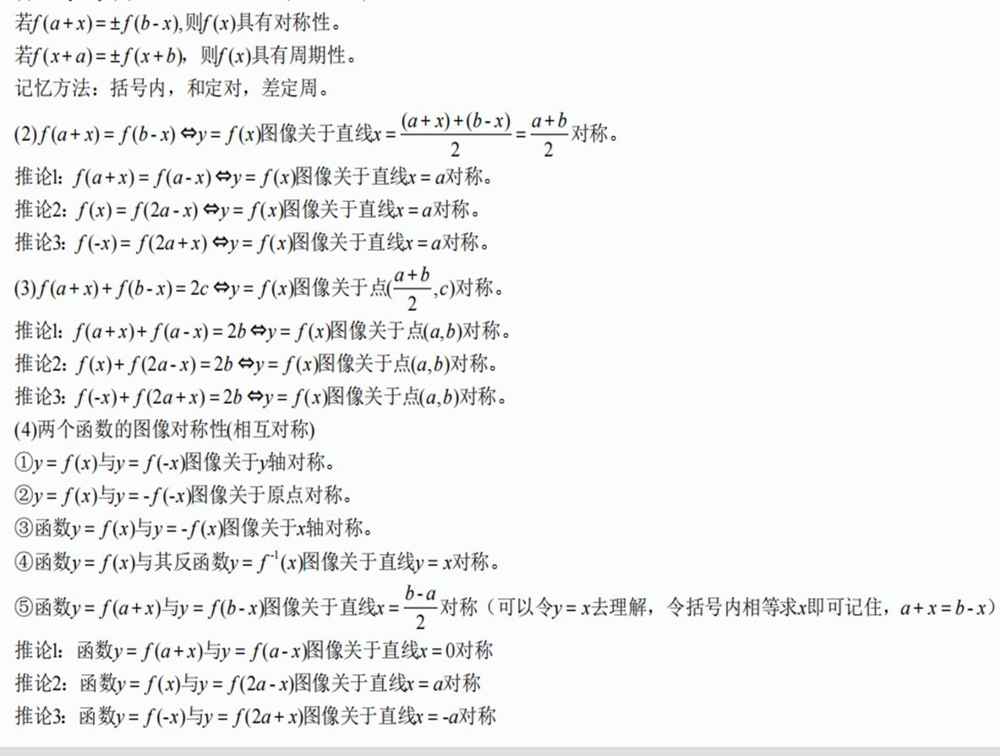
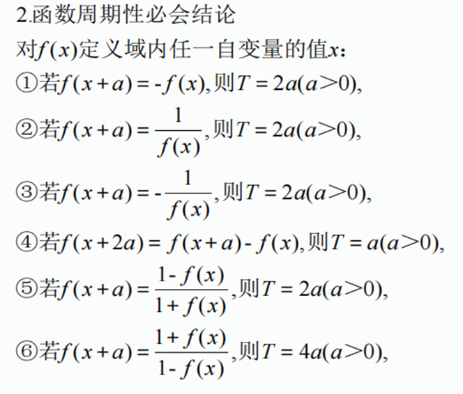
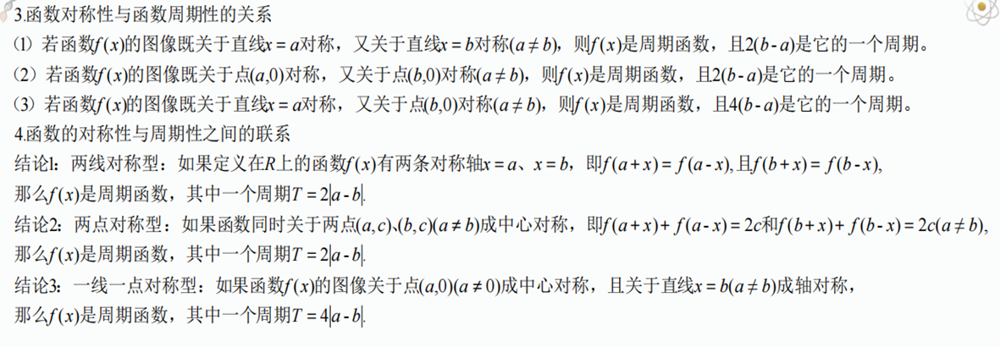
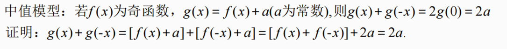
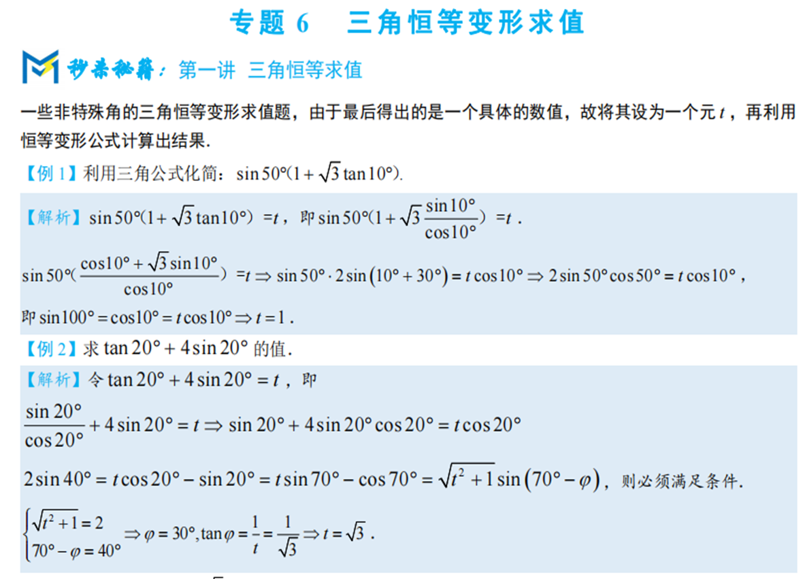

**本节主要介绍函数的一些性质及三角函数（不包括导数）****高中数学函数是重中之重，函数的基本性质也是必考一项（可易可难，可单独考可一起考）。学好指数，对数函数，幂函数，三角函数等是基础**

### **1****函数的基本性质**

### **2****函数图像**

**胸有蓝图，一路坦荡**

**函数图象的识辨可从以下方面入手:**

**①从函数的定义域，判断图象的左右位置;从函数的值域，判断图象的上下位置;**

**②从函数的单调性，判断图象的变化趋势****

**③从函数的奇偶性，判断图象的对称性**

**④从函数的周期性，判断图象的循环往复**

**⑤从函数的特征点，排除不合要求的图象。**

### **3****中值模型**

### **4三角函数**

