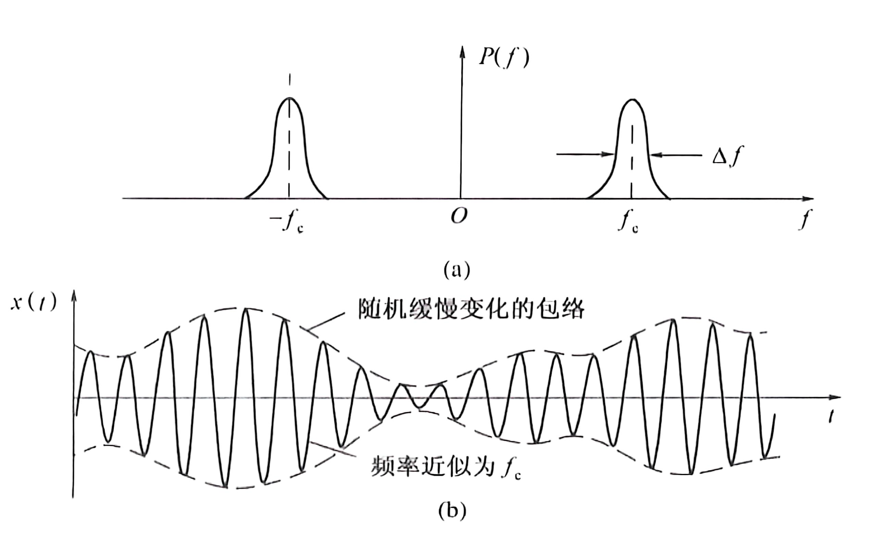
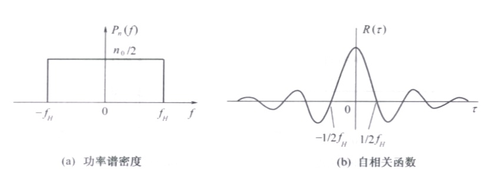
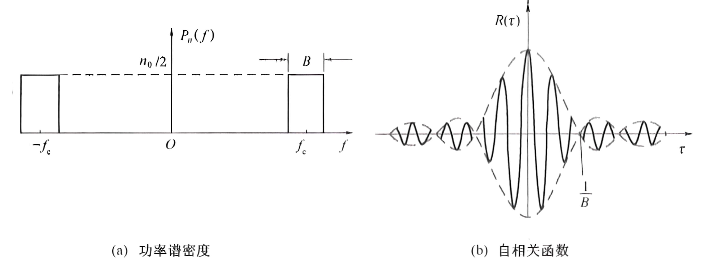

# 随机过程

## 基本概念

随机过程是在时间进程中处于不同时刻的随机变量的集合

### 分布函数/概率密度函数

设$\xi(t)$表示一个随机过程,则它在任意时刻$t_{1}$的值$\xi\left(t_{1}\right)$是一个随机变量

定义一维分布函数
$$
F_{1}\left(x_{1},t_{1}\right)=P[\xi(t_{1})\leqslant x_{1}]
$$
一维概率密度函数
$$
f_1(x_1,t_1)=\frac{\partial F_1(x_1,t_1)}{\partial x_1}
$$

定义二维分布函数
$$
F_{2}(x_{1},x_{2};t_{1},t_{2})=P|\xi(t_{1})\leqslant x_{1},\xi(t_{2})\leqslant x_{2}|
$$
二维概率密度函数
$$
f_2(x_1,x_2;t_1,t_2)=\frac{\partial^2F_2(x_1,x_2;t_1,t_2)}{\partial x_1\cdot\partial x_2}
$$

### 数字特征

#### 数学期望

定义数学期望
$$
E[\xi(t)]=\int_{-\infty}^{\infty}xf_{1}(x,t)\mathrm{d}x
$$

#### 方差

定义方差
$$
D[\xi(t)]=E\{[\xi(t)-a(t)]^{2}]
$$

可以证明:
$$
\begin{aligned}D[\xi(t)]&=E[\xi^{2}(t)-2a(t)\xi(t)+a^{2}(t)]=E[\xi^{2}(t)]-2a(t)E[\xi(t)]+a^{2}(t)\\\\
&=E[\xi^{2}(t)]-a^{2}(t)\\\\
&=\int_{-\infty}^{\infty}x^{2}f_{1}(x,t)\mathrm{d}x-[a(t)]^{2}
\end{aligned}
$$

#### 相关函数

定义相关函数
$$
R(t_{1},t_{2})=E[\xi(t_{1})\xi(t_{2})]=\int_{-\infty}^{\infty}\int_{-\infty}^{\infty}x_{1}x_{2}f_{2}\left(x_{1},x_{2};t_{1},t_{2}\right)\mathrm{d}x_{1}\mathrm{d}x_{2}
$$

同时也有互相关函数

## 平稳随机过程

### 定义

若一个随机过程$\xi(t)$的统计特性与时间起点无关，即时间平移不影响其任何统计特性，则称该随机过程是在严格意义下的平稳随机过程，简称**严平稳随机过程**。
$$
f_{n}(x_{1},x_{2},\cdots,x_{n};t_{1},t_{2},\cdots,t_{n})=\\f_{n}(x_{1},x_{2},\cdots,x_{n};t_{1}+\Delta,t_{2}+\Delta,\cdots,t_{n}+\Delta)
$$

定义**广义平稳过程**,如果随机过程$\xi(t)$满足

期望
$$
E\left[\xi(t)\right]=\int_{-\infty}^{\infty}x_{1}f_{1}\left(x_{1}\right)\mathrm{d}x_{1}=a
$$
自相关函数
$$
\begin{aligned}
R(t_{1},t_{2})&=E[\xi(t_{1})\xi(t_{1}+\tau)]\\&=\int_{-\infty}^{\infty}\int_{-\infty}^{\infty}x_{1}x_{2}f_{2}\left(x_{1},x_{2};\tau\right)\mathrm{d}x_{1}\mathrm{d}x_{2}=R(\tau)
\end{aligned}
$$

### 各态历经性

假设$x(t)$是平稳过程$\xi\left(t\right)$的任意一次实现

定义
$$
\overline{a}=x(t)=\lim_{T\to\infty}\frac{1}{T}\int_{-\frac{2}{T}}^{\frac{2}{T}} x(t)dt \\
\overline{R(\tau)}=x(t)x(t+\tau)=\lim_{T\to\infty}\frac{1}{T}\int_{-\frac{2}{T}}^{\frac{2}{T}} x(t)x(t+\tau)dt
$$
若
$$
\begin{cases}a=\overline{a}\\\\R(\tau)=\overline{R(\tau)}&\end{cases}
$$
则称该平稳过程具有各态历经性

各态历经性的含义:平稳过程中的任一次实现都经历了随机过程的所有可能状态.

充分条件:具有各态历经的随机过程一定是平稳过程.

所以,如何判断一个随机过程是否广义平稳?

只需验证下式成立与否
$$
\begin{cases}a(t)=a\\\\R(t_1,t_1+\tau)=R(\tau)&\end{cases}
$$
如何判断一个平稳过程是否各态历经?

只需验证下式成立与否
$$
\begin{cases}a=\bar{a}\\\\R(\tau)=\overline{R(\tau)}&\end{cases}
$$
留空:对应的例题

### 平稳过程的自相关函数

定义平稳过程的**自相关函数**
$$
R(\tau)=E[\xi(t)\xi(t+\tau)]
$$
性质

1. 在时域中计算平均功率$R(0)=E[\xi^2(t)]$且为最大值
1. 偶函数$R(\tau)=R(-\tau)$
1. 直流功率$R\left(\infty\right)=E^{2}\left[\xi\left(t\right)\right]=a^{2}$

因为
$$
\lim_{\tau\to\infty}R(\tau)=\lim_{\tau\to\infty}E\left[\xi(t)\xi(t+\tau)\right]=E\left[\xi(t)\right]\cdot E\left[\xi(t+\tau)\right]=E^{2}\left[\xi(t)\right]
$$
上式利用了当$\tau\to\infty$时,$\xi(t)$与$\xi(t+\tau)$没有任何依赖关系,即统计独立

4. 交流功率$R(0)-R(\infty)=\sigma^{2}$

### 平稳过程的功率谱函数

随机过程中的任一样本是一个确定的功率型信号

定义**功率谱密度**
$$
P_{x}(f)=\lim_{T\to\infty}\frac{\mid X_{T}(f)\mid^{2}}{T}
$$

**维纳-辛钦**定理:平稳过程的功率谱密度与其自相关函数是一对傅里叶变换关系
$$
\begin{cases}
P_\xi(\omega)=\int_{-\infty}^\infty R(\tau)\mathrm{e}^{-\mathrm{j}\omega\tau}\mathrm{d}\tau\\\\
R(\tau)=\frac{1}{2\pi}\int_{-\infty}^\infty P_\xi(\omega)\mathrm{e}^{\mathrm{j}\omega\tau}\mathrm{d}\omega&
\end{cases}
$$

或
$$
\begin{cases}P_\xi(f)&=\int_{-\infty}^\infty R(\tau)\mathrm{e}^{-\mathrm{j}\omega\tau}\mathrm{d}\tau\\\\R(\tau)&=\int_{-\infty}^\infty P_\xi(f)\mathrm{e}^{\mathrm{j}\omega\tau}\mathrm{d}f&\end{cases}
$$
简记为
$$
R(\tau)\Leftrightarrow P_{\xi}(f)
$$

结论

1. 在频域中计算平稳过程的平均功率:
    $$
    R(0)=\int_{-\infty}^{\infty}P_{\xi}(f)\mathrm{d}f
    $$

2. 各态历经过程的任一样本函数的功率谱密度等于过程的功率谱密度

3. 功率谱密度具有非负性$P_{\xi}(f)\geq0$和实偶性$P_{\xi}(-f)=P_{\xi}(f)$

## 高斯随机过程

定义高斯过程
$$
f_{n}(x_{1},x_{2},\cdots,x_{n};t_{1},t_{2},\cdots,t_{n})=\\
\frac{1}{(2\pi)^\frac{n}{2}\sigma_{1}\sigma_{2}\cdots\sigma_{n}\mid B\mid^\frac{1}{2}}\mathrm{exp}\left[\frac{-1}{2\mid B\mid}\sum_{j=1}^{n}\sum_{k=1}^{n}\mid B\mid_{jk}\left(\frac{x_{j}-a_{j}}{\sigma_{j}}\right)\left(\frac{x_{k}-a_{k}}{\sigma_{k}}\right)\right]
$$

性质

1. $n$维分布只依赖各个随机变量的均值、方差和归一化协方差,我们只需要研究这些数字特征
1. 广义平稳的高斯过程也是严平稳的
1. 如果高斯过程在不同时刻的取值不相关,那么它们是统计独立的
1. 高斯过程经线性变换后(输入线性系统后的输出)仍是高斯过程

### 高斯随机变量

#### 一维概率密度函数

高斯过程在任一时刻上的取值是一个正态分布的随机变量--**高斯随机变量**,其一维概率密度函数为
$$
f(x)=\frac{1}{\sqrt{2\pi}\sigma}\exp\left(-\frac{\left(x-a\right)^{2}}{2\sigma^{2}}\right)
$$
性质:

1. $f(a+x)=f(a-x)$

2. $\int_{-\infty}^{\infty}f(x)\mathrm{d}x=1$

3. 当$a=0$,$\sigma=1$时,称为标准化的正态分布
    $$
    f(x)=\frac{1}{\sqrt{2\pi}}\exp\left(-\frac{x^{2}}{2}\right)
    $$

#### 正态分布函数

定义正态分布的概率密度函数的积分为**正态分布函数**
$$
F(x)=P(\xi\leqslant x)=\int_{-\infty}^{x}\frac{1}{\sqrt{2\pi}\sigma}\mathrm{exp}\left[-\frac{(z-a)^{2}}{2\sigma^{2}}\right]\mathrm{d}z
$$

我们可以用以下几种函数来进行变量代换来方便计算

1. 使用误差函数$\operatorname{erf}(x)$

令$t=\frac{(z-a)}{\sqrt{2}\sigma}$,则$\mathrm{d}z=\sqrt{2}\sigma\mathrm{d}t$,有:
$$
F(x)=\frac{1}{2}\cdot\frac{2}{\sqrt{\pi}}\int_{-\infty}^{(x-a)/\sqrt{2}\sigma}\mathrm{e}^{-t^{2}}\mathrm{d}t=\frac{1}{2}+\frac{1}{2}\mathrm{erf}\left(\frac{x-a}{\sqrt{2}\sigma}\right)
$$
其中
$$
\mathrm{erf}(x)=\frac{2}{\sqrt{\pi}}\int_{0}^{x}\mathrm{e}^{-t^{2}}\mathrm{d}t
$$

2. 使用互补误差函数$erfc(x)$

$$
\mathrm{erfc}(x)=1-\mathrm{erf}(x)=\frac{2}{\sqrt{\pi}}\int_{x}^{\infty}\mathrm{e}^{-t^{2}}\mathrm{d}t
$$

此时
$$
F(x)=1-\frac{1}{2}\mathrm{erfc}\left(\frac{x-a}{\sqrt{2}\sigma}\right)
$$

3. 使用$Q(X)$

$$
Q\left(x\right)=\frac{1}{\sqrt{2\pi}}\int_{x}^{\infty}\mathrm{e}^{-t^{2}/2}\mathrm{d}t\quad x\geqslant0
$$

那么
$$
P(\xi>x)=Q\left(\frac{x-a}{\sigma}\right)
$$

## 平稳随机过程通过线性系统

### 关系式

$v_{\mathrm{i}}\left(t\right)$是输入随机过程的一个样本,$v_{o}\left(t\right)$是输出随机过程的一个样本,随机过程$\xi_{\mathrm{i}}\left(t\right)$的样本包括[$v_{\mathrm{i},n}\left(t\right)$ ,$n=1,2,\cdots$]

确知信号通过线性时不变系统时,可由系统的单位冲激响应表征
$$
v_{\mathrm{o}}(t)=h(t)*v_{\mathrm{i}}(t)=\int_{-\infty}^{\infty}h_{\mathrm{i}}(\tau)v_{\mathrm{i}}(t-\tau)\mathrm{d}\tau
$$
于是输入与输出随机过程也应满足
$$
\xi_{o}(t)=\int_{-\infty}^{\infty}h(\tau)\xi_{i}(t-\tau)\mathrm{d}\tau
$$

### 输出过程的统计特性

1. 输出过程$\xi_{o}(t)$的**均值**

$$
E[\xi_{\mathrm{o}}(t)]=E\left[\int_{-\infty}^{\infty}h(\tau)\xi_{i}(t-\tau)\mathrm{d}\tau\right]=\int_{-\infty}^{\infty}h(\tau)E\left[\xi_{\mathrm{i}}(t-\tau)\right]\mathrm{d}\tau
$$

输入过程是平稳的,有
$$
E\left[\xi_{\mathrm{i}}\left(t-\tau\right)\right]=E\left[\xi_{\mathrm{i}}\left(t\right)\right]=a
$$
所以
$$
E\left[\xi_{\mathrm{o}}(t)\right]=a\cdot\int_{-\infty}^{\infty}h(\tau)\mathrm{d}\tau=a\cdot H(0)
$$

上式表明输出过程的均值是一个常数,其中$H(0)$是直流增益

2. 输出过程$\xi_{o}(t)$的**自相关函数**

$$
\begin{aligned}
R_0(t_1,t_1+\tau) &= E[\xi_s(t_1)\xi_s(t_1+\tau)]\\\\
&= E\left[\int_{-\infty}^{\infty} h(\alpha)\xi_i(t_1-\alpha)d\alpha \int_{-\infty}^{\infty} h(\beta)\xi_i(t_1+\tau-\beta)d\beta\right]\\\\
&=\int_{-\infty}^{\infty}\int_{-\infty}^{\infty}h(\alpha)h(\beta)E[\xi_i(t_1-\alpha)\xi_i(t_1+\tau-\beta)]d\alpha d\beta
\end{aligned}
$$

输入过程是平稳的,有
$$
E[\xi_{\mathrm{i}}(t_{1}-\alpha)\xi_{\mathrm{i}}(t_{1}+\tau-\beta)]=R_{\mathrm{i}}(\tau+\alpha-\beta)
$$
所以
$$
R_{\mathrm{o}}(t_{1},t_{1}+\tau)=\int_{-\infty}^{\infty}\int_{-\infty}^{\infty}h(\alpha)h(\beta)R_{\mathrm{i}}(\tau+\alpha-\beta)\mathrm{d}\alpha\mathrm{d}\beta=R_{\mathrm{o}}(\tau)
$$
上式表明,若线性系统的输入过程是平稳的,那么输出过程也是平稳的

3. **功率谱密度**

对上式进行傅里叶变换
$$
P_{_o}(f)=\int_{-\infty}^{\infty}R_{_o}(\tau)\mathrm{e}^{-\mathrm{j}\omega\tau}\mathrm{d}\tau
$$

$$
=\int_{-\infty}^{\infty}\left[\int_{-\infty}^{\infty}\int_{-\infty}^{\infty}h\left(\alpha\right)h\left(\beta\right)R_{\mathrm{i}}\left(\tau+\alpha-\beta\right)\mathrm{d}\alpha\mathrm{d}\beta\right]\mathrm{e}^{-\mathrm{j}\omega\tau}\mathrm{d}\tau
$$

令$\tau^{\prime}=\tau+\alpha-\beta$
$$
P_{o}\left(f\right)=\int_{-\infty}^{\infty}h\left(\alpha\right)\mathrm{e}^{\mathrm{j}\omega\alpha}\mathrm{d}\alpha\int_{-\infty}^{\infty}h\left(\beta\right)\mathrm{e}^{-\mathrm{j}\omega\beta}\mathrm{d}\beta\int_{-\infty}^{\infty}R_{i}\left(\tau^{\prime}\right)\mathrm{e}^{-\mathrm{j}\omega\tau^{\prime}}\mathrm{d}\tau^{\prime}P_{o}\left(f\right)\\
=H^{*}\left(f\right)\cdot H\left(f\right)\cdot P_{i}\left(f\right)=\mid H\left(f\right)\mid^{2}P_{i}\left(f\right)
$$
上式表明,输出过程的功率谱密度是输入过程的功率谱密度乘系统频率响应模值的平方

4. 输出过程$\xi_{o}(t)$的**概率分布**

$$
\xi_{\mathrm{o}}\left(t\right)=\lim_{\Delta\tau_{k}\to0}\sum_{k=0}^{\infty}\xi_{\mathrm{i}}\left(t-\tau_{k}\right)h\left(\tau_{k}\right)\Delta\tau_{k}
$$

上式表明,高斯过程经线性变换后的过程仍为高斯过程

## 窄带随机过程

若随机过程$\xi(t)$的谱密度集中在中心频率$f_\mathrm{c}$附近相对窄的频带范围$\Delta f$内，即满足$\Delta f\ll f_{\mathrm{c}}$条件 ,且$f_\mathrm{c}$远离零频率，则称该$\xi(t)$为**窄带随机过程**

一个典型的窄带随机过程的频谱密度和波形

窄带随机过程$\xi(t)$可表示为
$$
\xi(t)=a_{\xi}(t)\cos\left[\omega_{\mathrm{c}}t+\varphi_{\xi}(t)\right]\quad a_{\xi}(t)\geqslant0
$$

其中$a_{\xi}(t)$称为窄带随机过程$\xi(t)$的随机包络  $\varphi_{\xi}(t)$称为随机相位  $\omega_{\mathrm{c}}$称为中心频率

上式展开得
$$
\xi(t)=\xi_{\mathrm{c}}(t)\cos\omega_{\mathrm{c}}t-\xi_{\mathrm{s}}(t)\sin\omega_{\mathrm{c}}t
$$
其中
$$
\xi_{\mathrm{c}}(t)=a_{\xi}(t)\cos\varphi_{\xi}(t)
$$

$$
\xi_{s}(t)=a_{\xi}(t)\sin\varphi_{\xi}(t)
$$

分别称为$\xi\left(t\right)$的同相分量和正交分量

### 统计特性

现研究典型窄带随机过程$\xi(t)$的统计特性,其中$\xi(t)$是一个均值为0,方差为$\sigma_{\xi}^{2}$的平稳高斯窄带随机过程

1. $\xi_c(t)$和$\xi_s(t)$的统计特性

留空:证明下面结论

若窄带过程$\xi(t)$是平稳的,则$\xi_c(t)$和$\xi_s(t)$也是**平稳**的

2. $a_\xi\left(t\right)$和$\varphi_\xi\left(t\right)$的统计特性

留空:证明下面结论

此$\xi(t)$的窄带平稳高斯过程的包络$a_\xi\left(t\right)$的一维分布是瑞利分布,相位$\varphi_\xi\left(t\right)$的一维分布是均匀分布,且就一维分布而言**二者统计独立**

## 正弦波加窄带高斯噪声

带通滤波器的输出是正弦波已调信号与窄带高斯噪声的混合波形

设正弦波加窄带高斯噪声的混合信号为
$$
r(t)=A\cos(\omega_{\mathrm{c}}t+\theta)+n(t)
$$
其中$n(t)$为窄带高斯噪声,其均值为0 方差为$\sigma_{n}^{2}$
$$
n(t)=n_{\mathrm{c}}(t)\cos\omega_{\mathrm{c}}t-n_{\mathrm{s}}(t)\sin\omega_{\mathrm{c}}t
$$
于是
$$
\begin{aligned}
r(t)&=\left[A\mathrm{cos}\theta+n_\mathrm{c}(t)\right]\mathrm{cos}\omega_\mathrm{c}t-\left[A\mathrm{sin}\theta+n_\mathrm{s}(t)\right]\mathrm{sin}\omega_\mathrm{c}t\\\\
&=z_{\mathrm{c}}(t)\cos\omega_{\mathrm{c}}t-z_{\mathrm{s}}(t)\sin\omega_{\mathrm{c}}t\\\\
&=z(t)\cos\left[\omega_{\mathrm{c}}t+\varphi(t)\right]\\
\end{aligned}
$$
其中
$$
z_{\mathrm{c}}(t)=A\mathrm{cos}\theta+n_{\mathrm{c}}(t)
$$

$$
z_s(t)=A\mathrm{sin}\theta+n_s(t)
$$

$r(t)$的包络和相位分别为
$$
z(t)=\sqrt{z_{\mathrm{c}}^{2}(t)+z_{\mathrm{s}}^{2}(t)}\quad z\geqslant0
$$

$$
\varphi(t)=\arctan\frac{z_\mathrm{s}(t)}{z_\mathrm{c}(t)}\quad0\leqslant\varphi\leqslant2\pi
$$

留空:分析$r(t)$包络和相位的统计特性

## 高斯白噪声和带限白噪声

### 白噪声

定义**白噪声**:噪声的功率谱密度在所有频率上均为一常数,即其双边功率谱密度为:
$$
P_n(f)=\frac{n_0}{2}\quad(-\infty<f<+\infty)
$$
或单边功率谱密度为:
$$
P_n(f)=n_0\quad(0<f<+\infty)
$$
取傅里叶反变换得白噪声的自相关函数
$$
R(\tau)=\frac{n_0}{2}\delta(\tau)
$$

上式表明

1. 白噪声仅在$\tau=0$时相关,而在任意两个时刻的随机变量都不相关
2. 白噪声的平均功率无穷大,即$R(0)=\frac{n_0}{2}\delta(0)=\infty$

如果白噪声取值的概率服从高斯分布,则称为**高斯白噪声**,其通常用来作为通信信道中的噪声模型

### 低通白噪声

定义**低通白噪声**:白噪声通过理想矩形的低通滤波器或理想低通信道,则输出的噪声称为低通白噪声

假设理想低通滤波器传输特性:模为 1 ,截止频率为$|f|\leqslant f_{H}$

则低通白噪声的功率谱密度
$$
P_n(f)=
\begin{cases}\frac{n_0}{2}&|f|\leqslant f_H\\\\0&其他&
\end{cases}
$$
自相关函数为
$$
R(\tau)=n_0f_H\frac{\sin2\pi f_H\tau}{2\pi f_H\tau}
$$

此低通白噪声通常称作带限白噪声,其在$\tau=\frac{k}{2f_{H}}(k=1,2,3)$上得到的随机变量不相关

### 带通白噪声

定义**带通白噪声**:白噪声通过理想矩形的带通滤波器或理想带通信道,则输出的噪声称为带通白噪声

假设理想带通滤波器的传输特性为:
$$
H(f)=\begin{cases}1&f_c-\frac{B}{2}\leqslant\mid f\mid\leqslant f_c+\frac{B}{2}\\\\0&\text{其他}&\end{cases}
$$
则带通白噪声的功率谱密度
$$
P_n(f)=
\begin{cases}\frac{n_0}{2}&f_\mathrm{c}-\frac{B}{2}\leqslant\mid f\mid\leqslant f_\mathrm{c}+\frac{B}{2}\\\\0&\text{其他}&
\end{cases}
$$
自相关函数
$$
\begin{aligned}
R\left(\tau\right)&=\int_{-\infty}^{\infty}P_{n}\left(f\right)\mathrm{e}^{\mathrm{j}2\pi f\tau}\mathrm{d}f\\\\
&=\int_{-f_{c}-\frac{B}{2}}^{-f_{c}+\frac{B}{2}}\frac{n_{0}}{2}\mathrm{e}^{\mathrm{j}2\pi f\tau}\mathrm{d}f+\int_{f_{c}-\frac{B}{2}}^{f_{c}+\frac{B}{2}}\frac{n_{0}}{2}\mathrm{e}^{\mathrm{j}2\pi f\tau}\mathrm{d}f\\\\
&=n_0B\frac{\sin\pi B\tau}{\pi B\tau}\mathrm{cos}2\pi f_\mathrm{c}\tau
\end{aligned}
$$

通常,带通滤波器$B\ll f_{c}$ 因此称为窄带滤波器,相应地把带通白噪声称为窄带高斯白噪声,其统计特性与前面描述的窄带随机过程相同,因此有
$$
n(t)=n_{\mathrm{c}}(t)\cos\omega_{\mathrm{c}}t-n_{\mathrm{s}}(t)\sin\omega_{\mathrm{c}}t
$$

$$
E[n(t)]=E[n_\mathrm{c}(t)]=E[n_\mathrm{s}(t)]=0
$$

$$
\sigma_n^2=\sigma_\mathrm{c}^2=\sigma_\mathrm{s}^2
$$

参考上式,平均功率为
$$
N=n_0B
$$
