# 数字基带传输系统

数字基带传输系统:在某些具有低通特性的有线信道中,基带信号可以不经过载波调制而直接进行传输

数字带通传输系统:包括调制和解调过程的传输系统

## 数字基带信号及其频谱特性

### 基本波形

- **单极性波形**

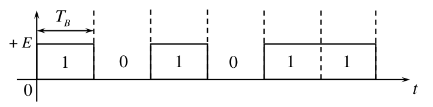

特点:极性单一,含有直流分量,在长连1或0时无同步信息

- **双极性波形**

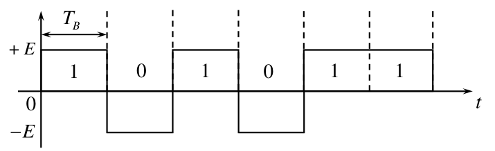

特点：当0、1等概出现时无直流分量，在长连0或长连1时无同步信息。

- **单极性归零波形**

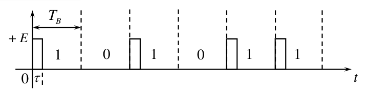

特点：相邻脉冲之间以零电平间隔，有利于同步信息的提取。

- **双极性归零波形**

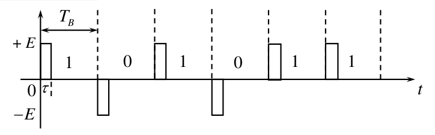

特点：相邻脉冲之间以零电平间隔，有利于同步信息的提取。

- **差分波形**

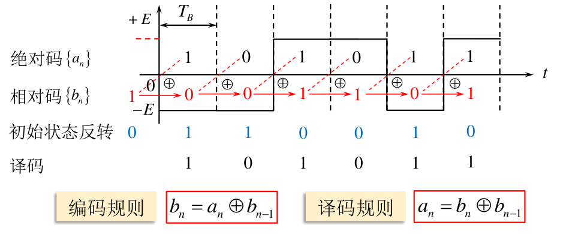

特点:极性单一,含有直流分量,在长连1或0时无同步信息

- **多电平波形**

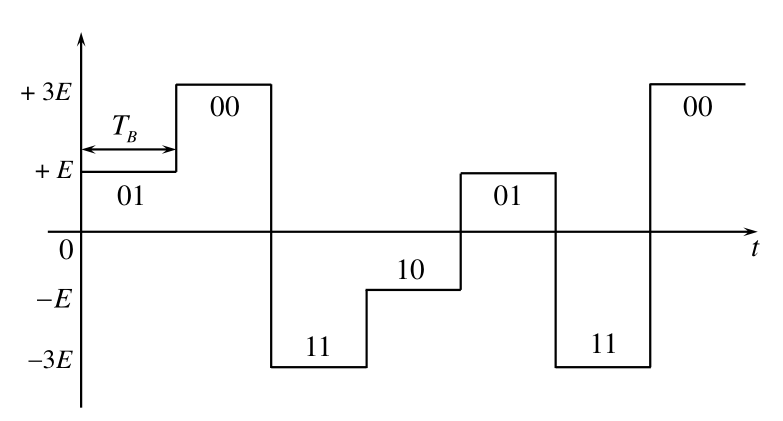

特点：一个电平对应多位二进制代码，频带利用率高。

### 频谱特性分析思路

设一个二级制的随机脉冲序列
$$
s(t)=\sum_{n=-\infty}^{\infty}s_{n}(t)
$$
其中在任一码元时间$T_{B}$内$g_1(t)$和$g_2(t)$出现的概率分别为$P$和$1-P$,如在第n个码元
$$
s_n(t)=\begin{cases}g_1(t-nT_\mathrm{B})&\text{以概率 }P\text{ 出现}\\\\g_2(t-nT_\mathrm{B})&\text{以概率}(1-P)\text{ 出现}&\end{cases}
$$
$g_1(t)$和$g_2(t)$可以分别代表0和1,或者分别代表$g(t)$和$-g(t)$

为了方便研究频谱特性,我们把$s\left(t\right)$分解成稳态波$v(t)$和交变波$u(t)$,即
$$
s(t)=v(t)+v(t)
$$
其中稳态波$v(t)$定义为随机序列$s(t)$的统计平均分量,交变波$u(t)$定义为二者之差,即
$$
v(t)=\sum_{n=-\infty}^{\infty}\left[Pg_{1}(t-nT_{\mathrm{B}})+(1-P)g_{2}(t-nT_{\mathrm{B}})\right]=\sum_{n=-\infty}^{\infty}v_{n}(t)
$$

$$
u(t)=s(t)-v(t)
$$

那么
$$
P_{s}(f)=P_{\nu}(f)+P_{u}(f)
$$
下面研究$v(t)$和$u(t)$的功率谱,以此来推出$s(t)$的功率谱

### 稳态波$v(t)$的功率谱密度$P_v\left(f\right)$

$$
v\left(t\right)=\sum_{n=-\infty}^{\infty}\left[Pg_{1}\left(t-nT_{\mathrm{B}}\right)+\left(1-P\right)g_{2}\left(t-nT_{\mathrm{B}}\right)\right]
$$

可以展开为傅里叶级数

$$
v(t)=\sum_{m=-\infty}^{\infty}C_{m}\mathrm{e}^{\mathrm{j}2\pi mf_{\mathrm{B}}t}
$$
其中
$$
f_{_B}=\frac{1}{T_{B}}
$$

$$
C_m=\frac{1}{T_\mathrm{B}}\int_{-\frac{T_\mathrm{B}}{2}}^{\frac{T_\mathrm{B}}{2}}v(t)\mathrm{e}^{-\mathrm{j}2\pi mf_\mathrm{B}t}\mathrm{d}t
$$

在一个周期范围内,例如选取$(-T_{_B}/2,T_{_B}/2)$,相当于在$n=0$时
$$
v\left(t\right)=Pg_{1}\left(t\right)+\left(1-P\right)g_{2}\left(t\right)
$$
代入$C_{m}$得
$$
C_{m}=\frac{1}{T_{\mathrm{B}}}\int_{-\frac{T_{\mathrm{B}}}{2}}^{\frac{T_{\mathrm{B}}}{2}}[Pg_{1}\left(t\right)+(1-P)g_{2}\left(t\right)]\mathrm{e}^{-\mathrm{j}2\pi mf_{\mathrm{B}}t}\mathrm{d}t
$$
上式只存在于$(-T_{_B}/2,T_{_B}/2)$,所以积分限可改为
$$
C_m=\frac{1}{T_B}\int_{-\infty}^{\infty}\left[Pg_1(t)+(1-P)g_2(t)\right]\mathrm{e}^{-\mathrm{j}2\pi mf_Bt}\mathrm{d}t
$$
令
$$
\begin{aligned}
G_1\left(mf_\mathrm{B}\right)&=\int_{-\infty}^{\infty}g_1\left(t\right)\mathrm{e}^{-\mathrm{j}2\pi mf_\mathrm{B}t}\mathrm{d}t\\
G_{2}\left(mf_{\mathrm{B}}\right)&=\int_{-\infty}^{\infty}g_{2}\left(t\right)\mathrm{e}^{-\mathrm{j}2\pi mf_{\mathrm{B}}t}\mathrm{d}t
\end{aligned}
$$
那么
$$
C_{m}=f_{\mathrm{B}}\left[PG_{1}(mf_{\mathrm{B}})+(1-P)G_{2}(mf_{\mathrm{B}})\right]
$$
由
$$
P(f)=\sum_{n=-\infty}^{\infty}\mid C(f)\mid^{2}\delta(f-nf_{0})
$$
可得
$$
P_v(f)=\sum_{m=-\infty}^{\infty}\left|f_{\mathrm{B}}[PG_{1}(mf_{\mathrm{B}})+(1-P)G_{2}(mf_{\mathrm{B}})\right]|^{2}\delta(f-mf_{\mathrm{B}})
$$

### 交变波$u(t)$的功率谱密度$P_u\left(f\right)$

设截取时间T

$$
T=(2N+1)T_{_B}
$$
其中N为一个足够大的整数,那么
$$
P_u(f)=\lim_{N\to\infty}\frac{E[|U_\mathrm{T}(f)|^2]}{(2N+1)T_\mathrm{B}}
$$
而
$$
u_{\mathrm{T}}(t)=\sum_{n=-N}^{N}u_{n}(t)=\sum_{n=-N}^{N}a_{n}[g_{1}(t-nT_{\mathrm{B}})-g_{2}(t-nT_{\mathrm{B}})]
$$

所以
$$
\begin{aligned}
U_{\mathrm{T}}(f)&=\int_{-\infty}^{\infty} u_{\mathrm{T}}(t) \mathrm{e}^{-\mathrm{j}2\pi ft} \mathrm{d}t\\
&=\sum_{n=-N}^{N} a_{n} \int_{-\infty}^{\infty} \left[g_{1}(t-nT_{\mathrm{B}})-g_{2}(t-nT_{\mathrm{B}})\right] \mathrm{e}^{-\mathrm{j}2\pi ft} \mathrm{d}t\\
&=\sum_{n=-N}^{N} a_{n} \mathrm{e}^{-\mathrm{j}2\pi fnT_{\mathrm{B}}} \left[G_{1}(f)-G_{2}(f)\right]
\end{aligned}
$$

所以
$$
\mid U_{\mathrm{T}}(f)\mid^{2}=\sum_{m=-Nn=-N}^{N}\sum_{m}^{N}a_{m}a_{n}\mathrm{e}^{\mathrm{j}2\pi f(n-m)T_{\mathrm{B}}}\left[G_{1}\left(f\right)-G_{2}\left(f\right)\right]\left[G_{1}\left(f\right)-G_{2}\left(f\right)\right]^{*}
$$
其统计平均为
$$
E\left[|U_{\mathrm{T}}(f)|^{2}\right]=\sum_{m=-Nn=-N}^{N}E(a_{m}a_{n})\mathrm{e}^{j2\pi f(n-m)T_{\mathrm{B}}}\left[G_{1}(f)-G_{2}(f)\right]\left[G_{1}^{*}(f)-G_{2}^{*}(f)\right]
$$
统计平均值仅在$m=n$时存在
$$
\begin{aligned}E[|U_{\mathrm{T}}(f)|^{2}]&=\sum_{n=-N}^{N}E[a_{n}^{2}]|G_{1}(f)-G_{2}(f)|^{2}\\&=(2N+1)P(1-P)\mid G_1(f)-G_2(f)\mid^2\end{aligned}
$$
代入得
$$
P_{u}\left(f\right)=\lim_{N\to\infty}\frac{\left(2N+1\right)P(1-P)\mid G_{1}\left(f\right)-G_{2}\left(f\right)\mid^{2}}{\left(2N+1\right)T_{\mathrm{B}}}=f_{\mathrm{B}}P(1-P)\mid G_{1}(f)-G_{2}(f)\mid^{2}
$$

### $s(t)$的功率谱密度$P_s\left(f\right)$

将上面两个求出的结果相加,即可得到$s(t)$的功率谱密度
$$
\begin{aligned}
P_{s}(f)&=P_{u}(f)+P_{v}(f)=f_{B}P(1-P)|G_{1}(f)-G_{2}(f)|^{2}+\\&\sum_{m=-\infty}^{\infty}\left|f_{\mathrm{B}}\left[PG_{1}\left(mf_{\mathrm{B}}\right)+\left(1-P\right)G_{2}\left(mf_{\mathrm{B}}\right)\right]\right|^{2}\delta(f-mf_{\mathrm{B}})
\end{aligned}
$$
分析此式得到

二进制随机脉冲序列的功率谱可能包含连续谱和离散谱,连续谱总是存在,离散谱是否存在取决于两个信号波形g(t)及其出现概率P

写成单边功率谱密度得
$$
\begin{aligned}P_{s}(f)&=2f_{B}P(1-P)\mid G_{1}(f)-G_{2}(f)\mid^{2}+f_{B}^{2}\mid PG_{1}(0)+(1-P)G_{2}(0)\mid^{2}\delta(f)+\\&2f_{B}^{2}\sum_{m=1}^{\infty}\mid PG_{1}\left(mf_{B}\right)+\left(1-P\right)G_{2}\left(mf_{B}\right)\mid^{2}\delta(f-mf_{B})\quad f\geqslant0\end{aligned}
$$
特点:除了直流其他都乘2

### 常见二级制基带信号性质归纳:

单极性二进制信号:$g_1(t)=g(t),g_2(t)=0$
$$
P_{s}(f)=f_{B}^{2}\sum_{m=-\infty}^{+\infty}\left|PG(mf_{B})\right|^{2}\delta(f-mf_{B})+f_{B}P(1-P)\left|G(f)\right|^{2}
$$
对于单极性二进制等概信号,P=1/2
$$
P_{s}(f)=\frac{1}{4}f_{B}^{2}\sum_{m=-\infty}^{+\infty}\left|G(mf_{B})\right|^{2}\delta(f-mf_{B})+\frac{1}{4}f_{B}\left|G(f)\right|^{2}
$$

在等概情况下,当脉冲为矩形脉冲时

单极性非归零

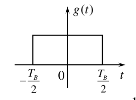
$$
G(mf_B)=T_BSa(m\pi)=\begin{cases}T_B&m=0\\0&m\neq0&\end{cases}
$$

$$
P_{s}(f)=\frac{1}{4}\delta(f)+\frac{T_{B}}{4}Sa^{2}(\pi fT_{B})
$$

特点:有直流 无定时

单极性归零,$\tau=\frac{1}{2}T_B$

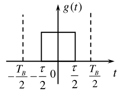
$$
G(mf_B)=\frac{T_B}{2}Sa\left(\frac{m\pi}{2}\right)
$$

$$
P_{s}(f)=\frac{1}{16}\sum_{m=-\infty}^{+\infty}Sa^{2}\left(\frac{m\pi}{2}\right)\delta(f-mf_{B})+\frac{T_{B}}{16}Sa^{2}\left(\frac{\pi fT_{B}}{2}\right)
$$

特点:有直流 有定时

双极性二进制信号:$g_1(t)=g(t),g_2(t)=-g(t)$
$$
P_{s}(f)=f_{B}^{2}\sum_{m=-\infty}^{+\infty}\left|(2P-1)G(mf_{B})\right|^{2}\delta(f-mf_{B})+4f_{B}P(1-P)\left|G(f)\right|^{2}
$$
对于双极性二进制等概信号,P=1/2
$$
P_s(f)=f_B\left|G(f)\right|^2
$$

在等概情况下,当脉冲为矩形脉冲时

双极性非归零

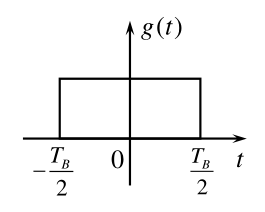
$$
G(f)=T_BSa(\pi fT_B)
$$

$$
P_s(f)=T_BSa^2(\pi fT_B)
$$

特点:无离散谱

双极性归零,$\tau=\frac{1}{2}T_B$

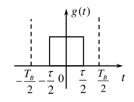
$$
G(f)=\frac{T_B}{2}Sa\left(\frac{\pi fT_B}{2}\right)
$$

$$
P_{s}(f)=\frac{T_{B}}{4}Sa^{2}\left(\frac{\pi fT_{B}}{2}\right)
$$

特点:无离散谱

**总结**:等概情况下矩形脉冲信号的功率谱

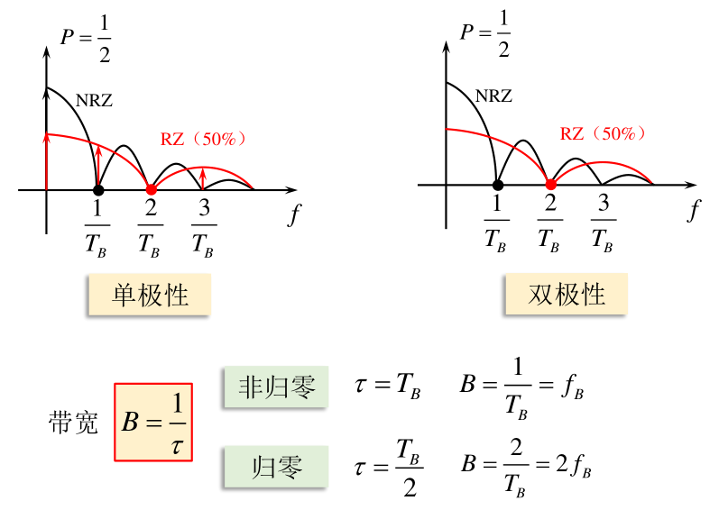

## 基带传输的常用码型

### 码型选择原则

1. 功率谱:不含直流,低频分量尽量少,信号占带宽小
2. 定时:含有丰富的定时信息,以便从接收码流中提取定时信号
4. 透明性:不受信息源统计特性的影响,即能适应于信息源的变化
5. 性能检测:具有内在的检错能力,即码型应具有一定规律性,以便利用这一规律性进行宏观监测
6. 设备复杂性:编译码简单,以降低通信延时和成本

### 常用的传输码型

- $AMI$码(传号交替反转码)

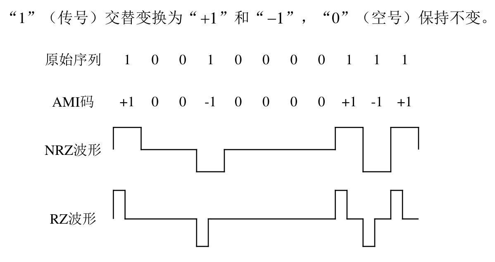

- $\mathrm{HDB}_3$码(三阶高密度双极性码)

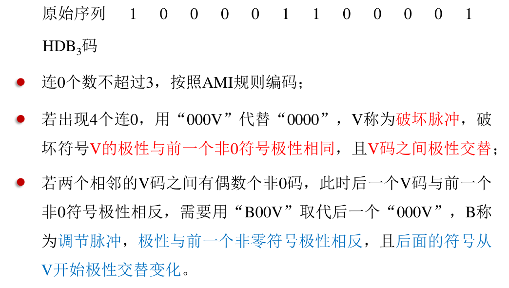

- 双相码

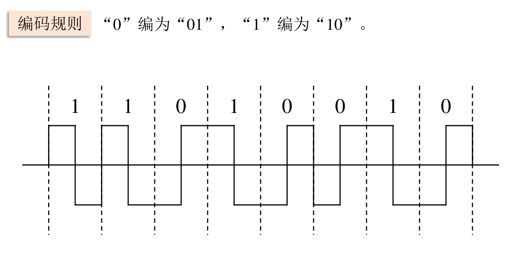

- 差分双相码

- $CMI$码(传号反转码)

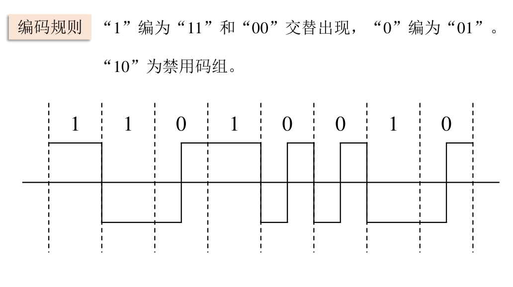

- 块编码

## 数字基带信号传输与码间串扰

### 数字基带信号传输系统的分析

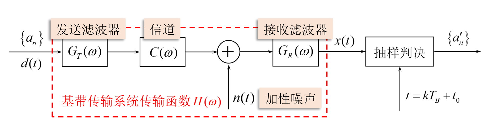

传递函数
$$
H(\omega)=G_T(\omega)\cdot C(\omega)\cdot G_R(\omega)
$$
冲激响应
$$
h(t)=\frac{1}{2\pi}\int_{-\infty}^{+\infty}H(\omega)e^{j\omega t}\mathrm{d}\omega
$$

## 无码间串扰的基带传输特性

ISI:Inter-symbol interference 码间串扰

### 基本思想

$$
\sum_{n\neq k}a_nh\left[(k-n)T_\mathrm{B}+t_0\right]=0
$$

无码间串扰的**时域条件:**
$$
h\left(kT_{_B}\right)=
\begin{cases}1&k=0\\\\0&k\text{为其他整数}&
\end{cases}
$$

意义:基带系统单位冲激响应$h(t)$在在本码元抽样时刻$(m=0)$有值,其他码元抽样时刻$mT_{_B}\left(m\neq0\right)$为0.

无码间串扰的**频域条件:**(奈奎斯特准则)
$$
\sum_iH\left(\omega+\frac{2\pi i}{T_\mathrm{B}}\right)=T_\mathrm{B}\quad|\omega|\leqslant\frac{\pi}{T_\mathrm{B}}
$$
意义:若一个实际的基带传输特性可以等效于一个理想低通滤波器，则以$R_{_B}=\frac{1}{T_{_B}}$的速率传输时，无码间干扰。

几何意义:分段,平移,叠加,常数

留空:时域条件的构思

留空:频域条件的推导

### 设计

1. 理想低通特性

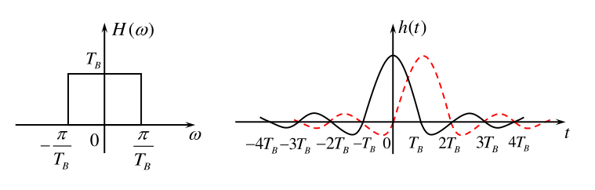

即
$$
H(\omega)=
\begin{cases}T_\mathrm{B}&\mid\omega\mid\leqslant\frac{\pi}{T_\mathrm{B}}\\\\0&\mid\omega\mid>\frac{\pi}{T_\mathrm{B}}&
\end{cases}
$$

$$
h(t)=\frac{\sin\frac{\pi}{T_\mathrm{B}}t}{\frac{\pi}{T_\mathrm{B}}t}=\mathrm{Sa}(\frac{\pi t}{T_\mathrm{B}})
$$

特点:频率特性陡峭,不容易实现;时域尾部收敛慢

2. 余弦滚降特性

在奈奎斯特带宽的频率$f_{_N}$处按照奇对称条件进行“圆滑滚降”。

$$
\begin{aligned}H(\omega)&=\begin{cases}T_\mathrm{B}&0\leqslant|\omega|<\frac{(1-\alpha)\pi}{T_\mathrm{B}}\\\\\frac{T_\mathrm{B}}{2}\left[1+\sin\frac{T_\mathrm{B}}{2\alpha}\left(\frac{\pi}{T_\mathrm{B}}-\omega\right)\right]&\frac{(1-\alpha)\pi}{T_\mathrm{B}}\leqslant|\omega|<\frac{(1+\alpha)\pi}{T_\mathrm{B}}\\\\0&|\omega|\geqslant\frac{(1+\alpha)\pi}{T_\mathrm{B}}&\end{cases}\end{aligned}
$$

$$
h(t)=\frac{\sin{\pi}t/T_\mathrm{B}}{\pi t/T_\mathrm{B}}\cdot\frac{\cos{\alpha}{\pi}t/T_\mathrm{B}}{1-4\alpha^2t^2/T_\mathrm{B}^2}
$$

滚降系数
$$
\alpha=\frac{f_{\Delta}}{f_{N}}\in(0,1)
$$
带宽
$$
B=f_N+f_\Delta=(1+\alpha)f_N
$$

升余弦滚降特性$\alpha=1$时的讨论

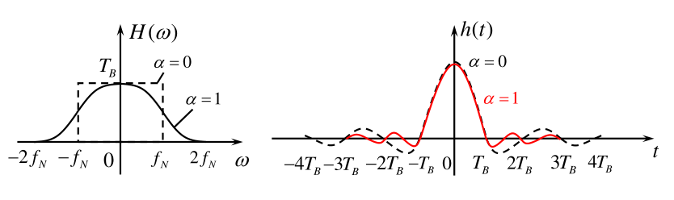

$$
H(\omega)=\begin{cases}\frac{T_B}{2}\left(1+\cos\frac{\omega T_B}{2}\right)\quad|\omega|\leq\frac{2\pi}{T_B}\\\\0\quad|\omega|<\frac{2\pi}{T_B}&\end{cases}
$$

$$
h(t)=\frac{\sin\pi t/T_B}{\pi t/T_B}\cdot\frac{\cos\pi t/T_B}{1-4t^2/T_B^2}
$$

特点:频率特性易实现;时域尾部收敛快;带宽增大

## 基带传输系统的抗噪声性能

输入噪声是均值为$0的平稳高斯噪声
$$
P_n(f)=\frac{n_0}{2}\mid G_{\mathrm{R}}(f)\mid^2
$$
平均功率(方差)为
$$
\sigma_{n}^{2}=\int_{-\infty}^{\infty}\frac{n_{0}}{2}|G_{R}(f)|^{2}\mathrm{d}f
$$
其瞬时取值为
$$
f\left(V\right)=\frac{1}{\sqrt{2\pi}\sigma_n}\mathrm{e}^{-V^2/2\sigma_n^2}
$$

### 二进制双极性基带系统

假设二进制双极性信号在抽样时刻的取值为$+A$或$-A$

那么
$$
x(kT_\mathrm{B})=\begin{cases}A+n_\mathrm{R}(kT_\mathrm{B})&\text{发送“1”时}\\\\-A+n_\mathrm{R}(kT_\mathrm{B})&\text{发送“0”时}&\end{cases}
$$

那么
$$
f_{1}(x)=\frac{1}{\sqrt{2\pi}\sigma_{n}}\exp\left[-\frac{(x-A)^{2}}{2\sigma_{n}^{2}}\right]\\
f_{0}(x)=\frac{1}{\sqrt{2\pi}\sigma_{n}}\exp\left[-\frac{(x+A)^{2}}{2\sigma_{n}^{2}}\right]
$$
确定判决门限为$V_d$,根据判决规则
$$
\begin{cases}x(kT_B)>V_d&\text{判“1”}\\\\x(kT_B)<V_d&\text{判“0”}&\end{cases}
$$
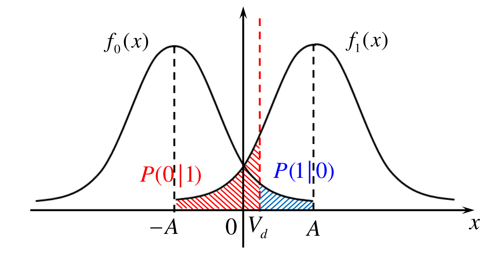

可知判决错误概率
$$
\text{发1判0：}P(0|1) = P(x < V_d) = \int _{- \infty }^{V_d}f_1( x)d x==\frac{1}{2}+\frac{1}{2}erf(\frac{V_{d}-A}{\sqrt{2}\sigma_{n}})\\
\text{发0判1：}P(1|0) = P(x > V_d) = \int _{V_d}^{+ \infty }f_0( x)dx==\frac{1}{2}+\frac{1}{2}erf(\frac{V_{d}+A}{\sqrt{2}\sigma_{n}})
$$
误码率
$$
\begin{aligned}P_{e}&=P(1)P(0|1)+P(0)P(1|0)\\\\
&=P(1)\cdot\int_{-\infty}^{V_{d}}f_{1}(x)\mathrm{d}x+P(0)\cdot\int_{V_{d}}^{+\infty}f_{0}(x)\mathrm{d}x\\\\
&=P(1)\left[\frac{1}{2}+\frac{1}{2}erf(\frac{V_{d}-A}{\sqrt{2}\sigma_{n}})\right]+P(0)\left[\frac{1}{2}-\frac{1}{2}erf(\frac{V_{d}+A}{\sqrt{2}\sigma_{n}})\right]
\end{aligned}
$$
根据
$$
\frac{\partial P_e}{\partial V_d}=0\quad P(1)f_1(V_d^*)-P(0)f_0(V_d^*)=0
$$
得出最佳判决门限
$$
{V_{d}^{*}=\frac{\sigma_{n}^{2}}{2A}\ln\frac{P(0)}{P(1)}}
$$
符号先验等概时
$$
V_d^*=0
$$
代入得
$$
P_{e}=\frac{1}{2}erfc(\frac{A}{\sqrt{2}\sigma_{n}})
$$

### 二进制单极性基带系统

假设二进制双极性信号在抽样时刻的取值为$+A$或0

那么
$$
x(kT_\mathrm{B})=\begin{cases}A+n_\mathrm{R}(kT_\mathrm{B})&\text{发送“1”时}\\\\n_\mathrm{R}(kT_\mathrm{B})&\text{发送“0”时}&\end{cases}
$$

那么
$$
f_{1}(x)=\frac{1}{\sqrt{2\pi}\sigma_{n}}\exp\left[-\frac{(x-A)^{2}}{2\sigma_{n}^{2}}\right]\\
f_{0}(x)=\frac{1}{\sqrt{2\pi}\sigma_{n}}\exp\left[-\frac{x^{2}}{2\sigma_{n}^{2}}\right]
$$
确定判决门限为$V_d$,根据判决规则
$$
\begin{cases}x(kT_B)>V_d&\text{判“1”}\\\\x(kT_B)<V_d&\text{判“0”}&\end{cases}
$$
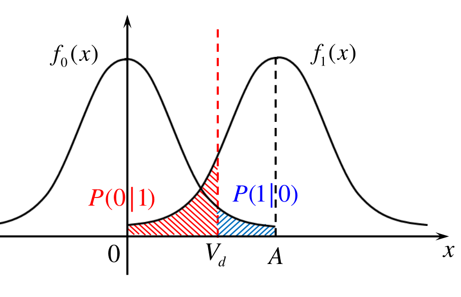

可知判决错误概率
$$
\text{发1判0：}P(0|1) = P(x < V_d) = \int _{- \infty }^{V_d}f_1( x)d x==\frac{1}{2}+\frac{1}{2}erf(\frac{V_{d}-A}{\sqrt{2}\sigma_{n}})\\
\text{发0判1：}P(1|0) = P(x > V_d) = \int _{V_d}^{+ \infty }f_0( x)dx==\frac{1}{2}+\frac{1}{2}erf(\frac{V_{d}}{\sqrt{2}\sigma_{n}})
$$
误码率
$$
\begin{aligned}P_{e}&=P(1)P(0|1)+P(0)P(1|0)\\\\
&=P(1)\cdot\int_{-\infty}^{V_{d}}f_{1}(x)\mathrm{d}x+P(0)\cdot\int_{V_{d}}^{+\infty}f_{0}(x)\mathrm{d}x\\\\
&=P(1)\left[\frac{1}{2}+\frac{1}{2}erf(\frac{V_{d}-A}{\sqrt{2}\sigma_{n}})\right]+P(0)\left[\frac{1}{2}-\frac{1}{2}erf(\frac{V_{d}}{\sqrt{2}\sigma_{n}})\right]
\end{aligned}
$$
根据
$$
\frac{\partial P_e}{\partial V_d}=0\quad P(1)f_1(V_d^*)-P(0)f_0(V_d^*)=0
$$
得出最佳判决门限
$$
V_{d}^{*}=\frac{A}{2}+\frac{\sigma_{n}^{2}}{A}\ln\frac{P(0)}{P(1)}
$$
符号先验等概时
$$
V_d^*=\frac{A}{2}
$$
代入得
$$
P_{e}=\frac{1}{2}erfc(\frac{A}{2\sqrt{2}\sigma_{n}})
$$

总结

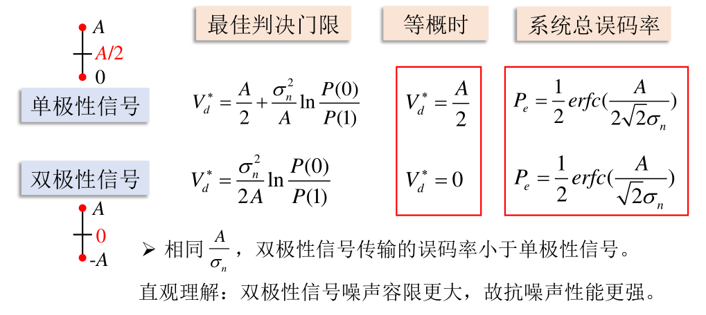

## 眼图

眼图可以反映码间干扰和噪声强弱，从而估计系统性能的优劣，还可以指示接收滤波器的调整，以减小码间干扰，改善系统性能。

- 眼睛张开大小:反映了码间干扰的强弱。“眼睛”张得越大，越端正，ISI越小。
- 眼睛迹线清晰与否:反映了噪声大小，“眼睛”越清晰，噪声越小。

## 部分响应和时域均衡

### 部分响应

通过相关编码有控制地在某些抽样时刻引入码间串扰ISI，引入的ISI是确知的某种规则，在接收端根据规则可以剔除ISI。

#### 第1类部分响应系统

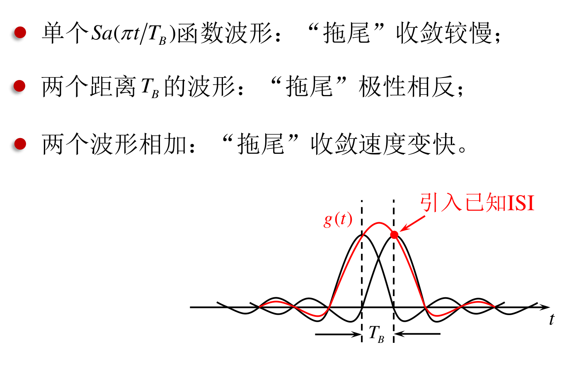

#### 部分响应的一般形式

### 时域均衡

#### 横向滤波器

在基带系统和抽样判决器之间级联均衡器。均衡器为可调或不可调的滤波器，用于校正或补偿系统特性，减小码间干扰。

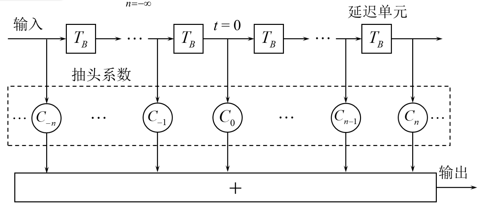

横向滤波器的冲激响应
$$
h_{\mathrm{T}}(t)=\sum_{n=-\infty}^{\infty}C_{n}\delta(t-nT_{\mathrm{B}})
$$
输出信号
$$
y(t)=x(t)*h_T(t)=\sum_{n=-\infty}^{+\infty}C_nx(t-nT_B)
$$
无限多抽头的横向滤波器可以完全消除码间干扰，但物理不可实现，受体积、成本、抽头系数精度调整等制约。

一般实际采用2N + 1抽头的横向滤波器
$$
e(t)=\sum_{i=-N}^NC_i\delta(t-iT_B)
$$
输出信号
$$
y(t)=x(t)*e(t)={\sum_{i=-N}^N}C_ix(t-iT_B)
$$
在抽样时刻$t=kT_{_B}$上有
$$
y(kT_{\mathrm{B}})=\sum_{i=-N}^{N}C_{i}x(kT_{\mathrm{B}}-iT_{\mathrm{B}})=\sum_{i=-N}^{N}C_{i}x\left[(k-i)T_{\mathrm{B}}\right]
$$
简写为
$$
y_k=\sum_{i=-N}^NC_ix_{k-i}
$$
此关系式只能调整 2$N+1$个系数，无法满足无穷多个$y_k=0$,因此有限长横向滤波器可以减小码间干扰，但不能完全消除码间干扰

#### 均衡效果衡量

峰值失真
$$
D=\frac{1}{y_0}\sum_{k\neq0}\lvert y_k\rvert
$$
均方失真
$$
e^2=\frac{1}{y_0^2}\sum_{k\neq0}y_k^2
$$
峰值失真或均方失真越小，均衡效果越好，当峰值失真或均方失真为0时，无码间干扰。

均衡器的设计目标就是按照某种算法或者准则，求出均衡器的抽头系数，使本码元之外的所有样值$y_k(k\neq0)$为0或者趋近于0，从而消除或减小码间干扰。

- 最小峰值---迫零调整法

可证：当 $D_{0} < 1$ 时，当 $D$ 达到最小值时，抽头系数满足下列方程组：
$$
y_{k} =
\begin{cases}
0 & k = \pm 1, \pm 2, \cdots, \pm N \\
1 & k = 0
\end{cases}
$$

$$
\begin{gathered}\\\begin{bmatrix}x_0&x_{-1}&\cdots&x_{-2N}\\\vdots&\vdots&\cdots&\vdots\\x_N&x_{N-1}&\cdots&x_{-N}\\\vdots&\vdots&\cdots&\vdots\\x_{2N}&x_{2N-1}&\cdots&x_0\end{bmatrix}\begin{bmatrix}C_{-N}\\C_{-N+1}\\\vdots\\C_0\\\vdots\\C_{N-1}\\C_N\end{bmatrix}=\begin{bmatrix}0\\\vdots\\0\\1\\0\\\vdots\\0\end{bmatrix}\end{gathered}
$$

当$D_0<1$时，按照以上方程组调整各个抽头增益，迫使本码元前后各有$N$个零抽样值，此时峰值失真$D$最小。

- 最小均方失真法自适应均衡器
