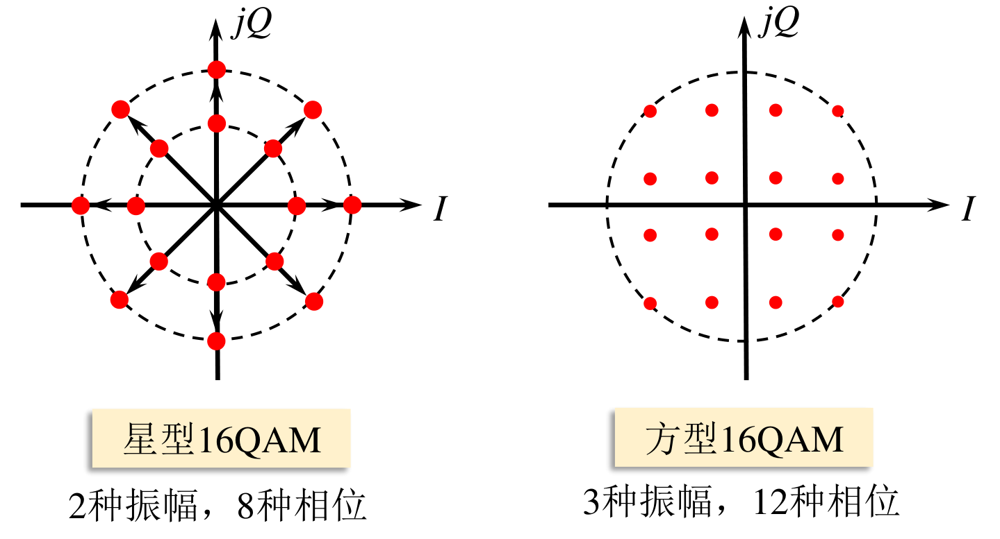
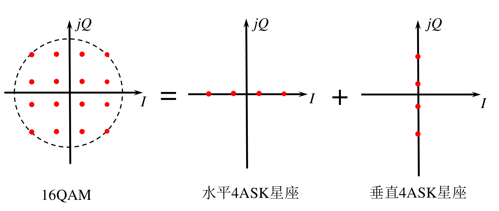
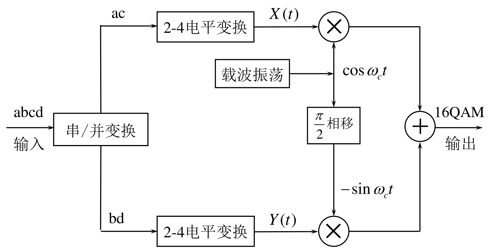
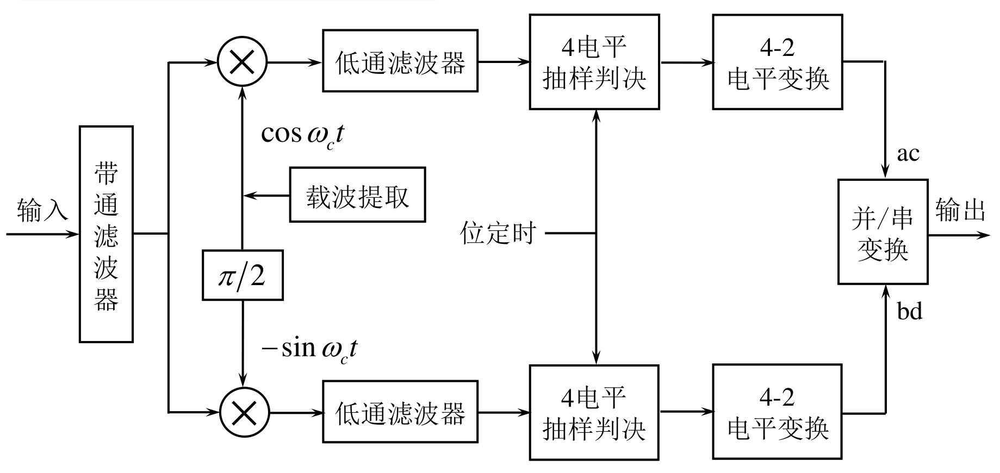

# 新型数字带通调制技术

## 正交振幅调制QAM

在MPSK调制中，提高进制数 M 可以有效提高频带利用率，但是由于相邻信号点的距离减小，故噪声容限降低，难以保证误码性能。需要一种有效的调制方式，来改善高进制情况下系统的抗噪声性能，提高频带利用率。

### 16QAM信号

$$
\begin{aligned}s_{k}(t)&=A_{k}\cos(\omega_{0}t+\theta_{k})\\\\&=A_{k}\cos\theta_{k}\cdot\cos\omega_{0}t-A_{k}\sin\theta_{k}\cdot\sin\omega_{0}t\\\\&=X_k\cos\omega_0t-{Y_k}\sin\omega_0t\quad kT_B<t\leq(k+1)T_B\end{aligned}
$$
其中
$$
X_k=A_k\cos\theta_k
$$

$$
Y_k=A_k\sin\theta_k
$$

$X_k,Y_k,A_k,\theta_k$取多个离散值

16QAM调制可看作两路正交的4ASK信号之和，符合正交调制特性。

16QAM信号的调制原理框图

16QAM信号的解调原理框图

### MQAM信号的功率谱

带宽
$$
B_{\mathrm{MQAM}}=\frac{2}{T_B}=2R_B=\frac{2R_b}{\log_2M}
$$
频带利用率
$$
\eta=\frac{R_b}{B}=\frac{R_B\log_2L}{B}=\frac{1}{2}\log_2L
$$

$$
\eta_b=2\times\frac{1}{2}\log_2L=\frac{1}{2}\log_2L^2=\frac{1}{2}\log_2M\mathrm{(bps/Hz)}
$$

### 16QAM与16PSK的性能比较

## 最小频移键控和高斯最小频移键控

## 正交频分复用

OFDM:Orthogonal Frequency Division Multiplexing

