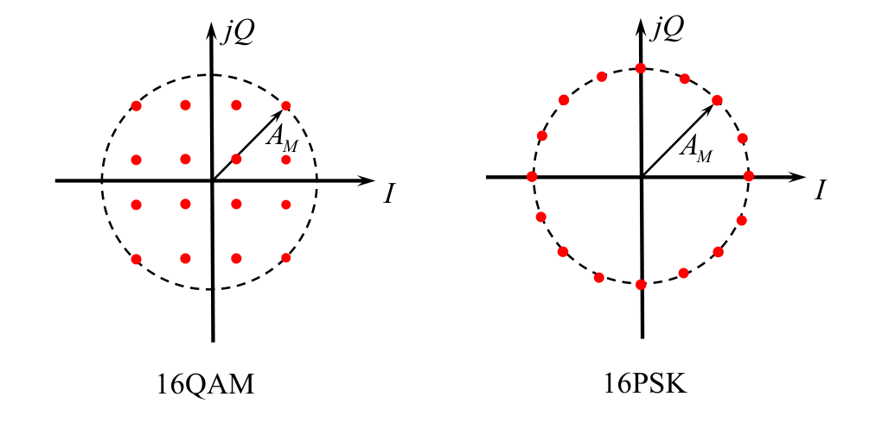
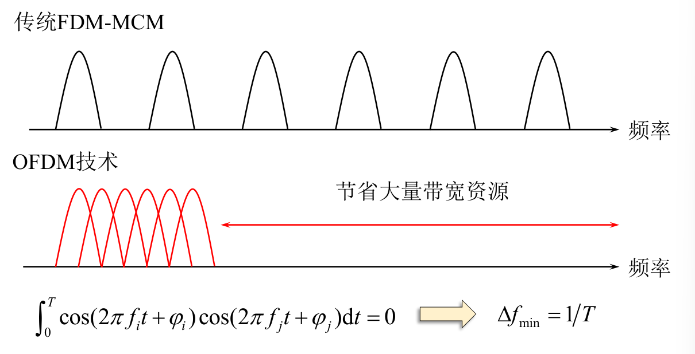

# 新型数字带通调制技术

## 正交振幅调制QAM

在$MPSK$调制中,提高进制数$M$ 可以有效提高频带利用率,但是由于相邻信号点的距离减小,故噪声容限降低,难以保证误码性能。需要一种有效的调制方式,来改善高进制情况下系统的抗噪声性能,提高频带利用率。

### 16QAM信号

$$
\begin{aligned}s_{k}(t)&=A_{k}\cos(\omega_{0}t+\theta_{k})\\\\&=A_{k}\cos\theta_{k}\cdot\cos\omega_{0}t-A_{k}\sin\theta_{k}\cdot\sin\omega_{0}t\\\\&=X_k\cos\omega_0t-{Y_k}\sin\omega_0t\quad kT_B<t\leq(k+1)T_B\end{aligned}
$$
其中
$$
X_k=A_k\cos\theta_k
$$

$$
Y_k=A_k\sin\theta_k
$$

$X_k,Y_k,A_k,\theta_k$取多个离散值

16$QAM$调制可看作两路正交的$4ASK$信号之和,符合正交调制特性。

调制原理框图

解调原理框图

### MQAM信号的功率谱

带宽
$$
B_{\mathrm{MQAM}}=\frac{2}{T_B}=2R_B=\frac{2R_b}{\log_2M}
$$
频带利用率
$$
\eta=\frac{R_b}{B}=\frac{R_B\log_2L}{B}=\frac{1}{2}\log_2L
$$

$$
\eta_b=2\times\frac{1}{2}\log_2L=\frac{1}{2}\log_2L^2=\frac{1}{2}\log_2M\mathrm{(bps/Hz)}
$$

### 16QAM与16PSK的性能比较

最大功率相同时,$16QAM$所需消耗的平均功率小于16PSK,噪声容限更大,抗噪声性能更强。

## 最小频移键控和高斯最小频移键控

最小频移键控

$MSK：Minimum Shift Keying$

$MSK$就是一种包络恒定、相位连续、频差最小,并且严格正交的$2FSK(CPFSK)$信号。故称最小频移键控,也称快速频移键控。

正交：指两个频率的信号互不相关,即两信号$\cos2\pi f_\text{ı}t$ 和$\cos2\pi f_0t$的互相关系数为零,即：$\rho=0$。

## 正交频分复用

正交频分复用

$OFDM:Orthogonal Frequency Division Multiplexing$

$OFDM$是一种子载波互相混叠且互相正交的多载波调制技术,可被视为一种频分复用技术,构成了多个低速率符号并行发送的传输系统。$OFDM$的基本原理是将发送的高速数据流分散到多个子载波上, 使各子载波的信号速率大为降低,从而提高抗多径和抗衰落的能力。

